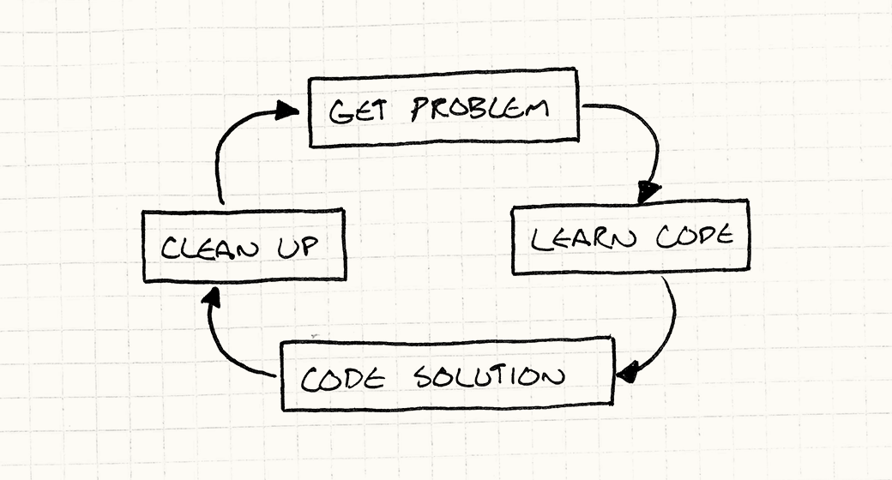

# 架构、性能与游戏

在一头扎进那堆模式之前，我想先和你聊聊我对软件架构的理解，以及它如何作用于游戏开发。这或许能帮你更好地理解本书的其余部分。退一万步说，下次你被卷进一场关于设计模式和软件架构究竟是好是坏的争论时，至少手里有些论据可用。

> 我没有预设你站哪一边。就像任何军火商一样，我的货，各方交战势力都欢迎来买。

## 什么是软件架构？

如果你把这本书从头读到尾，你不会因此掌握 3D 图形背后的线性代数，也不会学到游戏物理背后的微积分。它不会告诉你如何对 AI 搜索树做 alpha-beta 剪枝，也不会教你如何在音频回放中模拟房间混响。

> 哇，这段话要是放在书的宣传页上，简直是自毁形象。

这本书讲的是夹在这一切**之间**的代码——与其说是关于如何**写**代码，不如说是关于如何**组织**代码。每个程序都有某种组织方式，哪怕只是"把所有东西塞进 `main()` 然后走着瞧"，所以我更感兴趣的是：什么才算是**好的**组织？我们怎么分辨好架构和坏架构？

这个问题我琢磨了大约五年。当然，和你一样，我对好设计有自己的直觉。我们都曾被迫在烂到家的代码库里熬过来，那种代码，你能为它做的最好的事，就是把它带到后院，让它入土为安。

> 说实话，我们大多数人自己就制造过几个这样的废物。

少数幸运儿有过截然相反的体验——有机会在设计精良的代码里工作。那种代码库感觉就像一家布置考究的豪华酒店，礼宾人员随时候命，等着满足你的每一个需求。两者之间的差距究竟在哪里？

### 什么是*好的*软件架构？

对我来说，好设计意味着：当我需要做一处改动时，感觉整个程序从一开始就是为了迎接这次改动而精心设计的。我只需要几行选准的函数调用，它们完美嵌入，在代码那平静的表面上连一丝涟漪都不留。

听起来很美，但不太好落地。"就写成改动不会扰动其平静表面的代码。"好，谢谢，非常有用。

让我拆解一下。第一个关键点是：**架构关乎变化**。总得有人修改代码库。如果没有人碰这些代码——不管是因为它已经完美无缺，还是因为烂得没人愿意打开文本编辑器——那架构好坏根本无所谓。衡量一个设计的标准，是它能多轻松地承载变化。没有变化，它就是一个永远站在起跑线上的跑者。

### 如何做出一处改动？

在修改代码之前——无论是新增功能、修复 bug，还是其他什么让你打开编辑器的原因——你必须先理解现有代码在做什么。当然，你不需要了解整个程序，但你需要把相关的部分**加载**进你那颗灵长类动物的大脑。

> 想想看，这从字面上就是一个 OCR 过程，还挺奇妙的。

我们往往忽略这个步骤，但它常常是编程中最耗时的部分。如果你觉得从磁盘把数据分页加载到内存很慢，试试通过一对视神经把它分页加载进猿类大脑。

一旦你把所有相关上下文装进了你的"湿件"，你思考片刻，找到解决方案。这中间或许有来回反复，但通常来说这一步相对直接。一旦理解了问题和涉及的代码，实际的编码有时反而是最简单的部分。

你用肉乎乎的手指敲打键盘一阵，屏幕上终于亮起了正确颜色的光点，大功告成——对吧？还没呢！在你写测试、提交代码审查之前，通常还需要一些收尾工作。

> 我说"写测试"了？没错，我说了。为游戏代码写单元测试确实困难重重，但大量代码库是完全可测的。我不想在这里长篇大论，但还是要问你：难道你真的没有比一遍遍手动验证更值得做的事吗？

你往游戏里塞了更多代码，但你不想让下一个人被你留下的褶皱绊倒。除非改动很小，通常都需要一些整理工作，让新代码无缝融入程序的其余部分。如果做得好，下一个看代码的人根本看不出某行代码是什么时候写的。

简言之，编程的流程大概是这样的：

> 仔细想想，这个循环根本没有出口，有点让人不安。

### 解耦有什么用？

虽然不那么显而易见，但我认为软件架构的大部分内容都围绕着"读懂代码"这个阶段。把代码加载进神经元实在太慢了，以至于值得想尽一切办法压缩需要加载的量。本书有一整节专门讲[解耦模式](decoupling-patterns.html)，而《设计模式》的相当大一部分也在讨论同一件事。

"解耦"可以有很多种定义，但我的理解是：如果两段代码是耦合的，你就无法只理解其中一段而不理解另一段。一旦将它们**解耦**，你就可以独立地对任意一方进行推理。这很好，因为如果只有一方与你的问题相关，你只需要把那一方装进猴脑，而不是两方都装进去。

对我来说，这是软件架构的核心目标：**将你在取得进展之前需要在颅内保有的知识量降到最低。**

后续阶段当然也有作用。解耦的另一个定义是：对一段代码的修改不会迫使另一段代码也跟着修改。我们显然总要改动某些东西，但耦合越少，那次改动在游戏其余部分引发的涟漪就越小。

## 代价几何？

听起来很美，对吧？把一切解耦，你就能以风驰电掣的速度写代码。每次改动只需触及一两个精挑细选的方法，你就能在代码库的表面轻盈掠过，连影子都不留。

正是这种感觉，让人们对抽象、模块化、设计模式和软件架构如此着迷。架构良好的程序确实是一种令人愉悦的工作体验，而每个人都喜欢效率更高的感觉。好架构对生产力的影响是巨大的，很难夸大它能带来多深远的改变。

但正如生活中的一切，这并非免费的午餐。好架构需要真正的努力与自律。每次改动或实现功能时，你都必须费心思将其优雅地融入程序的其余部分。你既要费心组织好代码，还要在开发周期中数以千计的小改动里持续维护这种组织。

> 后半部分——维护设计——尤其值得重视。我见过很多程序一开始漂漂亮亮，然后随着程序员一次次地加入"就这么一个小小的临时方案"，最终千刀万剐地死去。就像园艺一样，种下新植物还不够，还得除草、修剪。

你必须思考程序的哪些部分应当解耦，并在这些地方引入抽象。同样，你还要判断哪些地方需要设计成可扩展的，以便将来的修改更轻松。

人们对此往往热情高涨。他们幻想未来的开发者（或者只是未来的自己）走进代码库，发现它开放、强大、浑身散发着"快来扩展我"的气息。他们脑海中浮现出那个统御一切的游戏引擎。

然而问题就从这里开始变得棘手。每当你添加一层抽象，或者一处支持扩展性的设计，你都是在猜测将来会需要那种灵活性。你在给游戏增加代码和复杂度，而这些都需要时间去开发、调试和维护。

如果你猜对了，日后果真触及了那段代码，这些努力就得到了回报。但预测未来很难，一旦那些模块化设计最终派不上用场，它就会迅速从无用变成有害——毕竟，那还是一堆你必须应付的代码。

> 有人创造了"YAGNI"这个词——[You aren't gonna need it](http://en.wikipedia.org/wiki/You_aren%27t_gonna_need_it)（你不会需要它的）——作为对抗这种过度预测冲动的咒语。

当人们在这方面过于激进时，代码库的架构就会彻底失控。到处都是接口和抽象。插件系统、抽象基类、虚函数满天飞，各种扩展点层出不穷。

你要在所有这些脚手架里追踪半天，才能找到真正干活的代码。需要改动时，那里大概是有个接口可以帮你，但祝你好运找到它。理论上，所有这些解耦意味着你需要理解的代码更少，但层层叠叠的抽象本身就塞满了你脑内的暂存空间。

这类代码库，正是让人们对软件架构、乃至设计模式产生反感的根源。人们很容易陷入代码本身而忘记：你真正要做的是交付一款游戏。可扩展性的塞壬之歌已经迷倒了无数开发者，他们年复一年地打磨一个"引擎"，却始终没想清楚这个引擎究竟是为什么服务的。

## 性能与速度

软件架构和抽象还面临着另一种批评，在游戏开发领域尤其常见：它们会损害游戏性能。许多让代码更灵活的模式依赖虚函数分发、接口、指针、消息传递以及其他机制，而这些机制都有一定的运行时开销。

> C++ 中的模板是一个有趣的反例。模板元编程有时能让你获得接口那样的抽象，却不带任何运行时损耗。
>
> 这里存在一个灵活性的光谱。当你写代码去调用某个类的具体方法时，你在编写时就固定了那个类——你已经把要调用哪个类硬编码进去了。当你通过虚函数或接口调用时，被调用的类要到运行时才能确定，灵活得多，但也意味着一定的运行时开销。模板元编程介于两者之间：你在编译时实例化模板的那一刻就做出了调用哪个类的决定。

这背后是有原因的。软件架构的大量工作都是为了让程序更灵活，减少修改它所需的代价。这意味着在程序中编码更少的假设。你使用接口，让代码能与任何实现了该接口的类协作，而不是只能与当前这一个类绑定。你使用[观察者](observer.html)和[消息传递](event-queue.html)，让游戏中的两个模块能相互通信，这样明天要变成三个或四个也毫无难度。

但性能优化的核心恰恰是依赖假设。优化实践的精髓在于利用具体的约束条件：我们可以放心假设敌人数量永远不超过 256 个吗？太好了，ID 可以塞进一个字节。某处的方法只会在一个具体类型上调用吗？好，可以做静态分发或内联。所有实体都是同一个类吗？太好了，可以给它们建一个整齐的[连续数组](data-locality.html)。

但这并不意味着灵活性是坏事！灵活性让我们能快速迭代游戏，而开发速度对于打磨出有趣的体验至关重要。没有人——哪怕是威尔·赖特（Will Wright）——能在纸上凭空设计出一款均衡的游戏。它需要反复迭代和试验。

你能越快地验证想法、感受效果，就能尝试越多，也就越有可能找到真正出色的东西。即便找到了正确的玩法机制，还需要大量时间调整平衡。一点点失衡就能毁掉一款游戏的乐趣。

这里没有简单的答案。让程序更灵活以便快速原型验证，会有一定的性能代价；优化代码，则会让它变得不那么灵活。

我的经验是：把一款有趣的游戏做快，比把一款跑得快的游戏做有趣要容易得多。一个折中的办法是：在游戏设计尘埃落定之前保持代码的灵活性，等设计稳定后再拆掉部分抽象层来提升性能。

## 烂代码的价值

这把我引向下一个话题：不同的编码风格各有其适用的时机与场景。本书的大部分内容都在讨论如何写出可维护的、干净的代码，所以我明显偏向于"做正确的事"，但潦草的代码也有它的价值。

写出架构良好的代码需要认真思考，而思考需要时间。更重要的是，在一个项目的整个生命周期中维护良好的架构需要持续的努力。你必须像一个好露营者对待营地那样对待你的代码库：时刻争取让它比你找到时更好一点。

这在你要长期生活和工作在这段代码中时是对的。但就像我前面提到的，游戏设计需要大量的试验和探索。尤其在早期，写下你明知道最终要扔掉的代码是很常见的事。

如果你只是想验证某个玩法想法是否行得通，把它设计得漂漂亮亮意味着在真正上屏幕、得到反馈之前多烧掉大量时间。如果最终发现行不通，那些花在让代码优雅上的时间，随着你删掉它一起付诸东流了。

原型开发——拼凑出刚好够用、能回答一个设计问题的代码——是完全合理的编程实践。但这里有一个非常重要的前提：如果你打算写扔掉的代码，你必须确保自己真的能把它扔掉。我见过糟糕的管理者一次又一次地玩这套把戏：

> **老板：** "嘿，我们有个想法想验证一下。就是个原型，不用做得多好。你多快能糊出来？"
>
> **开发者：** "好吧，如果我省掉很多步骤，不写测试，不写文档，允许有一堆 bug，几天内我能给你一段临时代码。"
>
> **老板：** "太棒了！"
>
> *几天后……*
>
> **老板：** "嘿，这个原型很不错。现在能不能花几小时稍微收拾一下，我们就把它当正式版本用了？"

你必须确保使用这段"临时代码"的人明白：它看起来能跑，但**无法维护**，**必须重写**。如果存在任何被迫留用它的可能，你也许就不得不防御性地好好写了。

> 确保原型代码不会被强制转正的一个技巧是：用与游戏本身不同的语言来写原型。这样，在它能进入正式游戏之前，必然要经历一次重写。

## 寻求平衡

我们面临几股相互角力的力量：

1. 我们想要良好的架构，让代码在项目生命周期内更易理解。
2. 我们想要运行时的高性能。
3. 我们想要快速完成今天的功能。

> 我觉得有意思的是，这三点说的都是某种速度：长期开发速度、游戏执行速度，以及短期开发速度。

这些目标至少部分是相互矛盾的。好的架构能提升长期生产力，但维护它意味着每次改动都需要多花一点力气来保持整洁。

写起来最快的实现，很少是运行起来最快的。优化需要大量的工程时间，一旦完成，代码往往趋于固化——高度优化的代码缺乏灵活性，极难修改。

"今天的活今天做完，其他的明天再说"的压力始终存在。但如果我们只顾堆砌功能，代码库就会变成一堆补丁、bug 和不一致性的大杂烩，蚕食我们未来的生产力。

这里没有简单的答案，只有权衡。从我收到的邮件来看，这让很多人灰心丧气，尤其是那些只想做出一款游戏的新手，听到"没有正确答案，只有不同口味的错误答案"，难免心生怯意。

但对我来说，这恰恰令人兴奋！看看任何一个人们愿意用一生去精进的领域，你总会在它的核心发现一组相互交织的约束。毕竟，如果有一个简单的答案，大家早就都那么做了。一周就能掌握的领域，说到底是无聊的。你不会听说有人在挖沟这一行干出一番卓越的事业来。

> 也许还真有；我没去考证这个类比。说不定真有热衷挖沟的爱好者群体、挖沟年会，以及一整个围绕它的亚文化。我有什么资格评判呢？

在我看来，这和游戏本身有很多共通之处。国际象棋之所以永远无法被彻底征服，正是因为所有棋子之间的制衡如此精妙。这意味着你可以用一生去探索那片广阔的可行策略空间。设计糟糕的游戏会坍缩成一种一遍遍被复制的必胜套路，直到你腻了、退出为止。

## 简洁

最近，我越来越觉得，如果说有什么方法能缓解这些约束之间的矛盾，那就是**简洁**。我现在写代码时，会努力写出针对问题最干净、最直接的解法——那种你读完之后，准确知道它在做什么，且再也想不出其他解法的代码。

我追求先把数据结构和算法想对（大致按这个优先顺序），然后再往后走。我发现，只要能保持简洁，代码总量就会更少，这意味着需要装进脑子里的代码也更少。

它往往也跑得更快，因为开销更小，需要执行的代码更少。（当然，这并非总是如此——你也可以在少量代码里塞进大量的循环和递归。）

不过要注意，我说的**不是**简洁的代码**写起来**更省时。你也许会这么认为，毕竟代码总量更少——但好的解法不是代码的堆积，而是代码的**蒸馏**。

> 布莱士·帕斯卡（Blaise Pascal）有句名言，出自他信末的一段话："我本可以把这封信写得更短，但我没有足够的时间。"
>
> 另一句精彩的话来自安托万·德·圣埃克苏佩里（Antoine de Saint-Exupéry）："完美不是无可添加，而是无可删减。"
>
> 近一点说，我注意到每次修订本书的某章，它就会变短一点。有些章节到最终定稿时缩短了 20%。

我们很少遇到条件清晰的优雅问题，面对的往往是一堆用例：你想让 X 在 Z 条件下执行 Y，但在 A 条件下执行 W，诸如此类——也就是一长串不同的示例行为。

最省脑力的解法，就是把这些用例一个一个地硬编码进去。看看新手程序员，他们通常就是这么做的：针对脑子里浮现的每一种情形，写出大量的条件逻辑。

但这毫无优雅可言，而且这类风格的代码，一旦遇到与编写者考虑过的示例略有不同的输入，往往就会崩掉。当我们谈到优雅的解法时，脑海中往往有的是一种通用的解法：一小段逻辑，能正确覆盖大量的用例空间。

找到这样的解法，有点像模式识别，又像解谜。透过零散的示例用例，看穿隐藏在背后的内在规律，是需要下功夫的。但当你真的做到了，那种感觉棒极了。

## 好了，说正事吧

几乎所有人都会跳过前言章节，所以你能读到这里，我要向你致敬。回报你的耐心，我没什么好东西，只有几条我希望能对你有用的建议：

- 抽象和解耦能让你的程序更易演进，但除非你确信相关代码真的需要那种灵活性，否则不要花时间在上面。

- 在整个开发周期中都要考虑性能、为性能做设计，但把那些把假设锁死在代码里的底层、细粒度优化，尽量推迟到最后再做。

  > 相信我，距离发布还有两个月，绝对不是你开始担心"游戏只能跑到 1 帧每秒"这个烦人小问题的好时机。

- 快速探索你的游戏设计空间，但别快到在身后留下一片狼藉。毕竟，你还要在那里生活。

- 如果你打算扔掉某段代码，就别浪费时间把它写漂亮了。摇滚明星砸烂酒店房间，是因为他们知道明天就要退房。

- 但最重要的是：**如果你想做出有趣的东西，那就享受做它的过程。**
