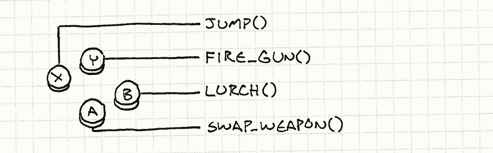
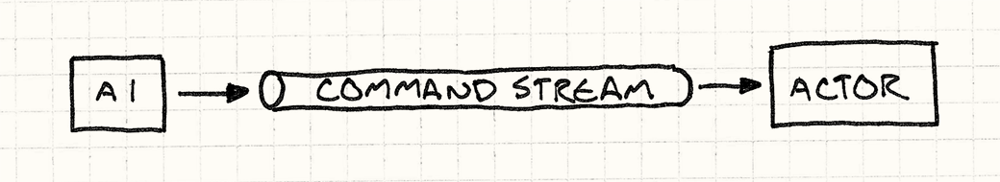

# 命令模式

> 所属部分：重访设计模式

命令模式是我最喜欢的模式之一。我写的大多数大型程序——不管是游戏还是其他项目——最终都会在某处用上它。每当我把它用在恰当的地方，它都能漂亮地解开一些真正盘根错节的代码。对于这样一个出色的模式，四人帮给出的描述却出人意料地晦涩：

> 将一个请求封装为一个对象，从而使你可以用不同的请求对客户进行参数化，对请求排队或记录请求日志，以及支持可撤销的操作。

我想我们都同意，这是一句糟糕的表述。首先，它把自己想建立的比喻搅得一团糟。在软件这个词语可以随意曲解的奇异世界之外，"客户"是一个人——和你做生意的那种人。上次我查了一下，人类是无法被"参数化"的。

至于这句话的后半段，不过是列出了一堆你"也许有可能"会用这个模式做到的事。除非你的用例恰好在那个列表里，否则根本看不出什么门道。我对命令模式的精辟一句话总结是：

**命令是一个具体化的方法调用。**

> "Reify"（具体化）来自拉丁语 *res*（物），加上英语后缀 *-fy*。所以它基本上的意思是"把某物变成物"，说实话，这个说法反而更好玩。

当然，"精辟"往往意味着"让人看不懂的简短"，所以这未必算进步。让我展开说说。"具体化"，如果你没听过这个词，意思是"使之成真"。另一个相关说法是把某样东西变成"一等（first-class）"的。

> 某些语言中的反射系统（Reflection systems）允许你在运行时以命令式的方式操作程序中的类型。你可以得到一个代表某对象所属类的对象，然后用它来探索这个类型能做什么。换句话说，反射就是一个具体化的类型系统。

这两种说法的意思是一样的：取某个概念，把它变成一段数据——一个对象——你可以把它存进变量、传入函数等等。所以说命令模式是"具体化的方法调用"，意思是：它是一个被包装进对象的方法调用。

这听起来很像"回调（callback）""一等函数（first-class function）""函数指针（function pointer）""闭包（closure）"或"部分应用函数（partially applied function）"，取决于你来自哪种语言背景——确实，这些都是同一个圈子里的东西。四人帮后来也说了：

> 命令是回调的面向对象替代品。

这句话比他们最初选的那句好多了。

但以上这一切还是太抽象、太飘。我喜欢用具体的东西开头，可我把这章开头搞砸了。为了弥补，从这里开始，全都是命令模式大显身手的实际例子。

## 配置输入

每个游戏里都有一段代码，负责读取原始用户输入——按键、键盘事件、鼠标点击，诸如此类。它接收每个输入，将其转化为游戏中有意义的动作：



最简单的实现大概长这样：

```cpp
void InputHandler::handleInput()
{
  if (isPressed(BUTTON_X)) jump();
  else if (isPressed(BUTTON_Y)) fireGun();
  else if (isPressed(BUTTON_A)) swapWeapon();
  else if (isPressed(BUTTON_B)) lurchIneffectively();
}
```

> 专业建议：B 键少按。

这个函数通常由[游戏循环](game-loop.html)每帧调用一次，它在做什么我相信你一眼就能看出来。如果我们愿意把用户输入和游戏动作硬编码绑定，这段代码完全可以用。但很多游戏允许玩家**自定义**按键映射。

为了支持这一点，我们需要把对 `jump()` 和 `fireGun()` 的直接调用，变成可以随时替换的东西。"可替换"听起来很像给变量赋值，所以我们需要一个**对象**来表示游戏动作。命令模式，登场。

我们定义一个基类，表示一个可触发的游戏命令：

```cpp
class Command
{
public:
  virtual ~Command() {}
  virtual void execute() = 0;
};
```

> 当你有一个只有单个无返回值方法的接口时，很有可能它就是命令模式。

然后，为每种不同的游戏动作创建子类：

```cpp
class JumpCommand : public Command
{
public:
  virtual void execute() { jump(); }
};

class FireCommand : public Command
{
public:
  virtual void execute() { fireGun(); }
};

// 以此类推……
```

在输入处理器中，为每个按键存储一个指向命令的指针：

```cpp
class InputHandler
{
public:
  void handleInput();

  // 用于绑定命令的方法……

private:
  Command* buttonX_;
  Command* buttonY_;
  Command* buttonA_;
  Command* buttonB_;
};
```

现在，输入处理只需委托给对应的命令对象：

```cpp
void InputHandler::handleInput()
{
  if (isPressed(BUTTON_X)) buttonX_->execute();
  else if (isPressed(BUTTON_Y)) buttonY_->execute();
  else if (isPressed(BUTTON_A)) buttonA_->execute();
  else if (isPressed(BUTTON_B)) buttonB_->execute();
}
```

> 注意这里没有检查 `NULL`？这里默认每个按键都绑定了某个命令。
>
> 如果想支持"按下某键什么都不做"而又不想显式地检查 `NULL`，可以定义一个 `execute()` 方法什么都不做的命令类。这样就不是把按键处理器设为 `NULL`，而是让它指向那个空操作对象。这个模式叫做[空对象（Null Object）](http://en.wikipedia.org/wiki/Null_Object_pattern)。

原来每个输入直接调用一个函数，现在多了一层间接：


这就是命令模式的精髓。如果你已经看到它的价值，接下来的内容都是额外的收获。

## 为角色发号施令

我们刚才定义的命令类，在前面的例子里没问题，但有个局限：它们假设存在顶层的 `jump()`、`fireGun()` 等函数，而这些函数隐式地知道如何找到玩家角色并控制他。

这种隐式耦合限制了命令的用途。`JumpCommand` 只能让玩家跳跃。让我们放宽这个限制——不再调用自己去寻找被控制对象的函数，而是把我们想要下令的对象**传进来**：

```cpp
class Command
{
public:
  virtual ~Command() {}
  virtual void execute(GameActor& actor) = 0;
};
```

这里，`GameActor` 是我们的"游戏对象"类，代表游戏世界中的一个角色。我们把它传入 `execute()`，这样派生命令就可以在我们选择的角色上调用方法，比如：

```cpp
class JumpCommand : public Command
{
public:
  virtual void execute(GameActor& actor)
  {
    actor.jump();
  }
};
```

现在，我们可以用这一个类让游戏中的任意角色蹦来蹦去了。还缺少的，是输入处理器和命令之间的那段胶水代码——它负责取到命令、在正确的对象上调用。首先，修改 `handleInput()` 使它**返回**命令：

```cpp
Command* InputHandler::handleInput()
{
  if (isPressed(BUTTON_X)) return buttonX_;
  if (isPressed(BUTTON_Y)) return buttonY_;
  if (isPressed(BUTTON_A)) return buttonA_;
  if (isPressed(BUTTON_B)) return buttonB_;

  // 没有按键，什么也不做。
  return NULL;
}
```

这里无法立即执行命令，因为还不知道要传入哪个角色。这正是命令作为具体化调用的优势所在——我们可以**延迟**调用的执行时机。

然后，我们需要一段代码，取出命令并在代表玩家的角色上运行它，类似这样：

```cpp
Command* command = inputHandler.handleInput();
if (command)
{
  command->execute(actor);
}
```

假设 `actor` 是玩家角色的引用，这就能根据用户输入正确地驱动他了，行为回到了第一个例子的样子。但在命令和执行它的角色之间加入这层间接，给了我们一个小而精妙的能力：**现在只需改变执行命令的角色，就可以让玩家控制游戏中的任意角色。**

实际上，这个功能本身并不常见，但有一个相似的使用场景却频繁出现。到目前为止，我们只考虑了玩家驱动的角色，但游戏世界里其他所有角色呢？它们由游戏的 AI 驱动。我们可以用同样的命令模式作为 AI 引擎和角色之间的接口——AI 代码只需源源不断地发出 `Command` 对象。

AI 选择命令和角色代码执行命令之间的这种解耦，给了我们极大的灵活性。不同的角色可以使用不同的 AI 模块，也可以为不同行为混搭 AI。想要更具攻击性的对手？只需插入一个更激进的 AI 来为它生成命令。事实上，我们甚至可以给**玩家**角色挂上 AI，这在演示模式（demo mode）下很有用——游戏需要自动运行。

通过把控制角色的命令变成一等对象，我们去掉了直接方法调用的紧耦合。不妨把它想象成一条命令队列或命令流：

> 关于队列能为你做什么，参见[事件队列](event-queue.html)。



> 为什么我觉得有必要画一张"流"的示意图？而且为什么它看起来像一根管子？

某些代码（输入处理器或 AI）**生产**命令并放入流中，另一些代码（调度器或角色本身）**消费**命令并执行。把这条队列夹在中间，就把生产端和消费端解耦了。

> 如果把这些命令做成**可序列化**的，就可以通过网络发送这条命令流。把玩家的输入推送到网络另一端的机器上，再在那里重播，这正是网络多人游戏实现的一个重要组成部分。

## 撤销与重做

最后这个例子，是命令模式最广为人知的用途。如果一个命令对象能**执行**某件事，那让它能**撤销**这件事，也不过是一小步。撤销功能在某些策略游戏中有用，可以回滚不满意的操作；在用于**创作**游戏的工具中，撤销更是**标配**。让你的关卡编辑器无法撤销手滑操作，是让游戏设计师恨你的最稳妥方式。

> 我说的这些也许来自亲身经历。

没有命令模式，实现撤销难得出乎意料；有了它，就是小菜一碟。假设我们在做一款单人回合制游戏，想让玩家能撤销走棋，把更多精力放在策略上，而不是在猜测上。

我们已经在用命令来抽象输入处理了，所以玩家的每一步棋都已经被封装在命令对象里了。比如，移动一个单位可能长这样：

```cpp
class MoveUnitCommand : public Command
{
public:
  MoveUnitCommand(Unit* unit, int x, int y)
  : unit_(unit),
    x_(x),
    y_(y)
  {}

  virtual void execute()
  {
    unit_->moveTo(x_, y_);
  }

private:
  Unit* unit_;
  int x_, y_;
};
```

注意这和前面的命令有些不同。上一个例子里，我们想把命令从它所修改的角色**抽象**出来；这里，我们明确地想把命令**绑定**到被移动的单位上。这个命令的实例不是一个可以在多种场合复用的通用"移动某物"操作，而是游戏回合序列中一次具体的走法。

这凸显了命令模式实现方式上的一种变体。在某些情况下，比如我们前面的例子，命令是一个可复用的对象，代表**一件可以做的事**；我们的输入处理器持有单个命令对象，每当正确的按键被按下就调用它的 `execute()`。

而这里，命令更具体——它代表某个特定时间点可以做的事。这意味着输入处理代码每次玩家选择走法时都要**创建**一个新实例，类似这样：

```cpp
Command* handleInput()
{
  Unit* unit = getSelectedUnit();

  if (isPressed(BUTTON_UP)) {
    // 单位向上移动一格。
    int destY = unit->y() - 1;
    return new MoveUnitCommand(unit, unit->x(), destY);
  }

  if (isPressed(BUTTON_DOWN)) {
    // 单位向下移动一格。
    int destY = unit->y() + 1;
    return new MoveUnitCommand(unit, unit->x(), destY);
  }

  // 其他走法……

  return NULL;
}
```

> 当然，在 C++ 这样没有垃圾回收的语言里，这意味着执行命令的代码也要负责释放它们的内存。

命令的一次性特点马上就会派上用场。为了让命令可撤销，我们为每个命令类定义另一个需要实现的操作：

```cpp
class Command
{
public:
  virtual ~Command() {}
  virtual void execute() = 0;
  virtual void undo() = 0;
};
```

`undo()` 方法反转对应 `execute()` 方法所做的游戏状态改变。下面是加入撤销支持后的移动命令：

```cpp
class MoveUnitCommand : public Command
{
public:
  MoveUnitCommand(Unit* unit, int x, int y)
  : unit_(unit),
    xBefore_(0),
    yBefore_(0),
    x_(x),
    y_(y)
  {}

  virtual void execute()
  {
    // 记录移动前的位置，以便恢复。
    xBefore_ = unit_->x();
    yBefore_ = unit_->y();

    unit_->moveTo(x_, y_);
  }

  virtual void undo()
  {
    unit_->moveTo(xBefore_, yBefore_);
  }

private:
  Unit* unit_;
  int xBefore_, yBefore_;
  int x_, y_;
};
```

注意我们给类添加了更多状态。单位移动后，它就忘记自己原来在哪里。如果想撤销这次移动，我们需要自己记住单位之前的位置，`xBefore_` 和 `yBefore_` 就是干这个的。

> 这里看起来像是[备忘录（Memento）](http://en.wikipedia.org/wiki/Memento_pattern)模式的用武之地，但我发现它并不好用。由于命令往往只修改对象状态的一小部分，对其余数据做快照是一种内存浪费。手动只存储你改动的那些位，代价更低。
>
> [持久化数据结构（Persistent data structures）](http://en.wikipedia.org/wiki/Persistent_data_structure)是另一种选择。对于这类结构，每次修改对象都会返回一个新对象，原对象保持不变。通过巧妙的实现，新对象与旧对象共享数据，因此代价远比克隆整个对象低。
>
> 使用持久化数据结构时，每个命令存储命令执行前对象的引用，撤销只需切换回旧对象。

为了让玩家能撤销走法，我们保存他们最后执行的命令。当他们猛按 Ctrl+Z，就调用那个命令的 `undo()` 方法。（如果他们已经撤销过了，它就变成"重做"，再次执行那个命令。）

支持多级撤销也没复杂多少。不再只记住最后一个命令，而是维护一个命令列表，并保存一个指向"当前"命令的引用。玩家执行命令时，把它追加到列表并将"当前"指向它。


玩家选择"撤销"时，撤销当前命令并将当前指针向前移一步；选择"重做"时，指针向后移一步，然后执行那个命令。如果玩家在撤销了几步之后执行新命令，列表中当前命令之后的所有内容都会被丢弃。

第一次在关卡编辑器里实现这个功能时，我感觉自己是个天才。它如此直接、效果如此好，让我惊叹不已。确保每次数据修改都经过命令需要一些自律，但一旦做到了，其余的一切都水到渠成。

> "重做"在游戏中不那么常见，但**重播**很常见。一种简单的实现是每帧记录整个游戏状态以便重播，但那会占用太多内存。
>
> 许多游戏转而记录每帧每个实体执行的命令集合。重播时，引擎只需运行正常的游戏模拟，按序执行预先录制的命令即可。

## 有"类"，却无"函数"？

> *原标题 "Classy and Dysfunctional?" 是一个双关：classy 既指"基于类（class）的"，又指"优雅的"；dysfunctional 既指"没有函数（function）式"，又指"功能失调的"。*

前面我说命令类似于一等函数或闭包，但这里展示的所有例子都用了类定义。如果你熟悉函数式编程，大概正在纳闷：函数呢？

我这样写，是因为 C++ 对一等函数的支持相当有限。函数指针没有状态，函数对象（functor）用起来有些别扭且仍然需要定义类，而 C++11 的 lambda 由于需要手动管理内存，使用起来也颇为麻烦。

这并不是说你在其他语言里实现命令模式时不应该用函数。如果你用的语言有真正的闭包，那就尽管用吧！从某种意义上说，命令模式就是在没有闭包的语言中模拟闭包的一种方式。

> 我说"某种意义上"，是因为即便在有闭包的语言里，为命令定义实际的类或结构体有时仍然有用。如果你的命令需要多个操作（比如可撤销的命令），把它映射成单个函数就很别扭。
>
> 定义一个带有字段的真实类，也方便读者清楚地看到命令持有什么数据。闭包是自动包裹状态的绝妙简洁方式，但它可能自动到让人看不清究竟持有了什么状态。

例如，如果我们用 JavaScript 开发游戏，可以这样创建一个移动单位的命令：

```javascript
function makeMoveUnitCommand(unit, x, y) {
  // 这个函数就是命令对象：
  return function() {
    unit.moveTo(x, y);
  }
}
```

用一对闭包也可以支持撤销：

```javascript
function makeMoveUnitCommand(unit, x, y) {
  var xBefore, yBefore;
  return {
    execute: function() {
      xBefore = unit.x();
      yBefore = unit.y();
      unit.moveTo(x, y);
    },
    undo: function() {
      unit.moveTo(xBefore, yBefore);
    }
  };
}
```

如果你对函数式风格很熟悉，这种写法会感觉很自然。如果还不熟悉，我希望这一章多少带你走了一段路。对我来说，命令模式的实用性恰恰说明了函数式范式对许多问题的强大适应力。

## 另请参阅

- 你可能最终会有许多不同的命令类。为了让它们更容易实现，通常可以定义一个具体的基类，提供一批高层的便利方法，让派生命令通过组合这些方法来定义自己的行为。这样，命令的主 `execute()` 方法就变成了一个[子类沙箱](subclass-sandbox.html)。

- 在我们的例子里，我们明确选择了哪个角色处理命令。在某些情况下——尤其是对象模型有层级结构时——这个问题可能没那么清楚。一个对象可以响应命令，也可以把它转交给某个下级对象处理。这样做，你就得到了一个[职责链（Chain of Responsibility）](http://en.wikipedia.org/wiki/Chain-of-responsibility_pattern)。

- 某些命令是纯粹无状态的行为块，比如第一个例子里的 `JumpCommand`。对于这类命令，拥有多个实例是一种浪费，因为所有实例都是等价的。[享元模式](flyweight.html)正是为此而生。

  > 你也可以把它做成[单例](singleton.html)，但朋友之间不应该互相鼓励创建单例。
