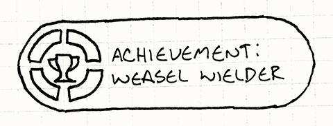
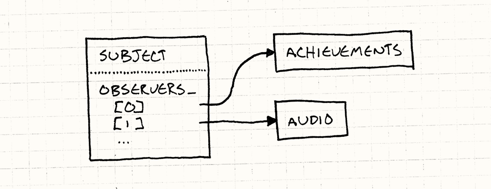
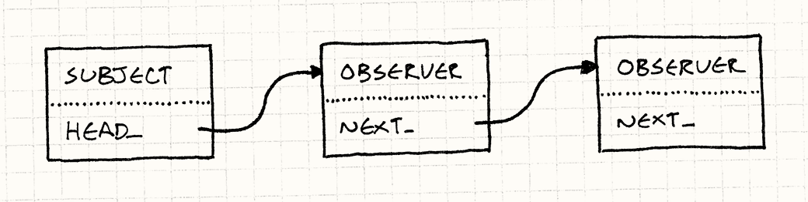
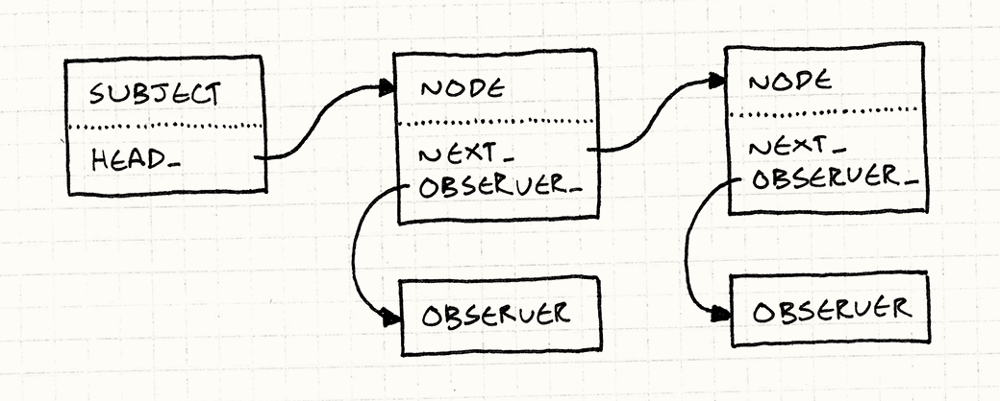

# 观察者模式

> **重访设计模式**

在软件世界里，随手一扔，砸中的几乎都是基于[模型-视图-控制器（MVC）][MVC]架构构建的应用，而 MVC 的底层正是**观察者模式**（Observer Pattern）。观察者模式的应用之广，连 Java 都把它塞进了核心库（[`java.util.Observer`][java]），C# 更是把它直接烘进了**语言**本身（[`event`][event] 关键字）。

[MVC]: http://en.wikipedia.org/wiki/Model%E2%80%93view%E2%80%93controller
[java]: http://docs.oracle.com/javase/7/docs/api/java/util/Observer.html
[event]: http://msdn.microsoft.com/en-us/library/8627sbea.aspx

> MVC 和软件界许多东西一样，是 Smalltalk（一种早期的面向对象编程语言）社区的程序员在七十年代发明的。Lisp 程序员大概会声称他们六十年代就想到了，只是懒得写下来。

观察者模式是四人帮原书中使用最广泛、知名度最高的模式之一。但游戏开发圈有时候颇为与世隔绝，所以这些对你来说也许都是新鲜事。如果你确实一直在修道院里闭关，让我用一个具体的例子带你入门。

## 成就解锁

假设我们要给游戏加一套**成就**系统，里面有数十种徽章，玩家通过完成特定里程碑来解锁，比如"击杀 100 只猴子恶魔"、"从桥上掉落"，或者"只用一只死黄鼠狼通关"。

> 
>
> 我发誓画这个的时候没有别的意思。

这个系统很难写得整洁——成就种类繁多，解锁条件五花八门，横跨各种不同的游戏行为。一不小心，成就系统的触角就会蔓延进代码库的每一个角落。"从桥上掉落"固然和物理引擎有关，但我们真的想在碰撞解算算法的线性代数代码正中央，看到一句 `unlockFallOffBridge()` 的调用吗？

> 这是一个修辞性反问。任何一个有自尊的物理引擎程序员，都绝不会让这种**游戏玩法**相关的俗务玷污他那一片纯洁的数学领地。

我们一直以来的追求，是把关注同一方面的代码好好归拢在一起。难点在于，成就的触发分散在游戏的各个角落。怎么才能在不把成就代码和所有这些代码耦合在一起的前提下实现这一点？

观察者模式正是为此而生。它让某段代码宣告"有件有趣的事发生了"，却完全**不关心谁来接收这条通知**。

举个例子：我们有一段处理重力、追踪物体是否落地的物理代码。要实现"从桥上掉落"这个成就，最简单粗暴的做法是直接把成就代码塞进去——但那会乱成一团。换一种做法，我们只需这样写：

```cpp
void Physics::updateEntity(Entity& entity)
{
  bool wasOnSurface = entity.isOnSurface();
  entity.accelerate(GRAVITY);
  entity.update();
  if (wasOnSurface && !entity.isOnSurface())
  {
    notify(entity, EVENT_START_FALL);
  }
}
```

> 物理引擎确实需要决定发送哪些通知，所以它并非完全解耦。但在架构设计中，我们追求的往往是把系统做得**更好**，而不是**完美**。

这段代码所做的，只是说："呃，我不知道有没有人在意，但这个东西刚刚掉下去了。随便你们怎么处理吧。"

成就系统则注册自己，让物理引擎每次发出通知时都能收到。它再检查一下掉落的是不是我们那个不太优雅的主角，以及他之前站着的地方是不是一座桥。如果是，就解锁对应的成就，放烟火、奏乐庆祝——而整个过程，物理引擎完全不知情。

事实上，我们甚至可以随意修改成就列表，或者把整个成就系统彻底拆掉，而不需要动物理引擎一行代码。它照旧发出通知，丝毫不知道已经没有人在接收了。

> 当然，如果我们**永久**移除了成就系统，而且再也没有其他代码监听物理引擎的通知，那顺带把通知代码也删了也无妨。但在游戏持续迭代的过程中，拥有这种灵活性还是很美妙的。

## 工作原理

如果你还不知道这个模式怎么实现，光看前面的描述大概也能猜个七八分。不过为了省事，我还是快速过一遍。

### 观察者

我们先从那个八卦的类说起——它迫不及待地想知道另一个对象做了什么有趣的事。这类好奇心旺盛的对象由下面这个接口定义：

```cpp
class Observer
{
public:
  virtual ~Observer() {}
  virtual void onNotify(const Entity& entity, Event event) = 0;
};
```

> `onNotify()` 的参数由你来定，这也是为什么这是观察者**模式**，而不是你可以直接粘贴进游戏的现成代码。常见的参数是发出通知的对象，加上一个塞了其他细节的通用"数据"参数。
>
> 如果你用的语言支持泛型或模板，这里大概可以用上。但针对你的具体场景定制也完全没问题。这里我直接硬编码为接受一个游戏实体和一个描述事件类型的枚举值。

任何实现了这个接口的具体类都成了观察者。在我们的例子中，那就是成就系统：

```cpp
class Achievements : public Observer
{
public:
  virtual void onNotify(const Entity& entity, Event event)
  {
    switch (event)
    {
    case EVENT_ENTITY_FELL:
      if (entity.isHero() && heroIsOnBridge_)
      {
        unlock(ACHIEVEMENT_FELL_OFF_BRIDGE);
      }
      break;

      // 处理其他事件，更新 heroIsOnBridge_……
    }
  }

private:
  void unlock(Achievement achievement)
  {
    // 如果尚未解锁则解锁……
  }

  bool heroIsOnBridge_;
};
```

### 被观察者

通知方法由被观察的对象调用。四人帮的说法里，这个对象叫做"主题"（subject）。它有两项职责：首先，它维护着一份观察者列表，这些观察者正在耐心等待它的消息：

```cpp
class Subject
{
private:
  Observer* observers_[MAX_OBSERVERS];
  int numObservers_;
};
```

> 在真实代码里，你应该用动态大小的容器代替这个简陋的数组。这里用最基础的写法，是为了照顾那些来自其他语言、还不熟悉 C++ 标准库的读者。

重要的是，被观察者暴露了一套**公有** API 来修改这个列表：

```cpp
void addObserver(Observer* observer)
{
  // 添加到数组……
}

void removeObserver(Observer* observer)
{
  // 从数组中移除……
}
```

这让外部代码可以控制谁来接收通知。被观察者与观察者通信，却不**耦合**于它们。在我们的例子里，物理引擎的代码里不会出现任何与成就相关的字眼，却依然能与成就系统对话。这正是这个模式聪明的地方。

被观察者维护一个**列表**而不是单个观察者，也很关键。这确保了观察者之间不会隐式地相互耦合。举个例子：假设音频引擎也在监听坠落事件，以便播放合适的音效。如果被观察者只支持单个观察者，音频引擎注册时就会把成就系统**注销**掉。这意味着两个系统会互相干扰——而且是一种特别恶劣的方式，因为后者会把前者直接禁用掉。支持观察者列表，才能保证每个观察者独立运作，互不影响。在它们各自看来，自己是世界上唯一一双盯着这个被观察者的眼睛。

被观察者的另一项职责是发送通知：

```cpp
void notify(const Entity& entity, Event event)
{
  for (int i = 0; i < numObservers_; i++)
  {
    observers_[i]->onNotify(entity, event);
  }
}
```

> 注意，这段代码假设观察者不会在 `onNotify()` 方法里修改列表。更健壮的实现需要防止或优雅地处理这类并发修改。

### 可观察的物理引擎

现在，我们只需要把这一切接入物理引擎，让它能发出通知，让成就系统能接收通知。按照《设计模式》原书的做法，我们继承 `Subject`：

```cpp
class Physics : public Subject
{
public:
  void updateEntity(Entity& entity);
};
```

这样我们可以把 `Subject` 里的 `notify()` 设为 `protected`，让派生的物理引擎类能调用它发通知，而外部代码不能直接调用。与此同时，`addObserver()` 和 `removeObserver()` 是公有的，任何能拿到物理系统的代码都可以注册观察它。

> 在真实代码中，我会避免在这里使用继承。更好的做法是让 `Physics` **拥有**一个 `Subject` 的实例。被观察的不是物理引擎本身，而是一个代表"坠落事件"的独立对象。观察者可以像这样注册：
>
> ```cpp
> physics.entityFell()
>   .addObserver(this);
> ```
>
> 在我看来，这就是"观察者"系统和"事件"系统的区别。前者观察的是**做了有趣事情的那个对象**，后者观察的是**代表那件有趣事情本身的对象**。

现在，每当物理引擎做了值得关注的事，就像之前的动机示例那样调用 `notify()`，它会遍历观察者列表，逐一通知。



很简单，对吧？一个类维护着指向某个接口若干实例的指针列表。很难相信，如此直接了当的东西，竟是无数程序和应用框架的通信骨架。

但观察者模式并非没有批评者。每当我问其他游戏程序员对这个模式的看法，他们总会提出几点抱怨。让我们来看看能否回应这些质疑。

## "太慢了"

这话我听了太多遍，说这话的人往往并不真正了解这个模式的细节。他们有一种默认预设：任何带着"设计模式"气息的东西，必然堆满了类、堆满了间接调用，以及各种创意十足地浪费 CPU 时钟周期的手段。

观察者模式的名声尤其受损，因为它常和几个声名狼藉的伙伴混在一起："事件"、"消息"，甚至"数据绑定"。其中某些系统**确实**很慢——往往是刻意如此，且有其原因。它们可能需要排队，或者为每条通知做动态内存分配。

> 这正是我认为记录模式很重要的原因。当术语变得模糊，我们就失去了清晰简洁地沟通的能力。你说"观察者"，对方听到的是"事件"或"消息"——因为要么没人写下这些概念的区别，要么他们碰巧没读到。这正是我写这本书的原因之一。为了全面覆盖，我专门写了一章讲事件和消息：[事件队列](event-queue.html)。

但既然你已经看到了这个模式的实际实现，就会知道并非如此。发出通知，不过是遍历一个列表、调用几个虚函数。确实比静态分派的调用**慢一点点**，但在最性能敏感的代码路径之外，这点开销可以忽略不计。

我发现这个模式最适合用在热代码路径之外，所以动态分派的代价通常是负担得起的。除此之外，几乎没有额外开销：不需要为消息分配对象，没有队列，只是一个同步方法调用上的一层间接。

### 太快了？

事实上，你反而需要注意，观察者模式**是**同步的。被观察者直接调用它的观察者——这意味着在所有观察者都从通知方法返回之前，被观察者自己的工作无法继续。一个慢吞吞的观察者会阻塞被观察者。

听起来很吓人，但实际上并不是世界末日，只是需要留意。长期做事件驱动编程的 UI 程序员有一句经久流传的格言："不要阻塞 UI 线程。"

如果你在同步响应一个事件，就需要尽快完成并交还控制权，免得 UI 卡死。如果有耗时的工作，把它推到另一个线程或任务队列里去。

不过，把观察者和线程、显式锁混用时要小心。如果某个观察者试图获取被观察者已经持有的锁，游戏就会死锁。在高度多线程的引擎里，用[事件队列](event-queue.html)做异步通信可能是更好的选择。

## "动态分配太多了"

相当一部分程序员——包括很多游戏开发者——已经迁移到带垃圾回收器的语言，动态分配不再是曾经那个让人闻风丧胆的恶灵。但对游戏这类性能敏感的软件来说，内存分配依然不可忽视，哪怕是在托管语言中。动态分配需要时间，回收内存也需要时间，哪怕这一切是自动发生的。

> 很多游戏开发者不太担心分配本身，更担心的是**内存碎片**。当你的游戏需要连续运行数天不崩溃才能通过认证，日益严重的堆碎片化可能让你根本无法发版。[对象池](object-pool.html)一章会详细讲这个问题以及一种常见的规避手段。

在之前的示例代码里，我用了固定大小的数组，只是为了尽量简单。在真实实现中，观察者列表几乎总是一个动态大小的容器，随着观察者的添加和移除不断伸缩。这种内存抖动让一些人感到不安。

当然，首先要注意的是，只有在观察者接入的时候才会分配内存。**发送**通知完全不需要内存分配——就是一个方法调用。如果你在游戏启动时注册好观察者之后就不怎么动它，分配量其实微乎其微。

如果仍然是个问题，我来演示一种完全不需要动态分配就能实现观察者添加和移除的方法。

### 链式观察者

在目前的代码里，`Subject` 持有一份指向每个正在观察它的 `Observer` 的指针列表。`Observer` 类本身没有对这份列表的引用，它只是一个纯虚接口。接口比具体的有状态的类更受欢迎，这通常是好事。

但如果我们愿意在 `Observer` 里存一点状态，就可以把被观察者的列表**穿过观察者本身**来解决分配问题。不再让被观察者维护一个独立的指针集合，而是让观察者对象自身成为链表的节点：



为此，首先去掉 `Subject` 里的数组，换成指向观察者链表头部的指针：

```cpp
class Subject
{
  Subject()
  : head_(NULL)
  {}

  // 方法……
private:
  Observer* head_;
};
```

然后在 `Observer` 里扩展一个指向链表下一个观察者的指针：

```cpp
class Observer
{
  friend class Subject;

public:
  Observer()
  : next_(NULL)
  {}

  // 其他内容……
private:
  Observer* next_;
};
```

这里我们同时把 `Subject` 声明为友元类。添加和移除观察者的 API 由被观察者来维护，但被管理的链表现在存在于 `Observer` 类内部。让被观察者能够操作这个链表的最简单方式，就是把它设为友元。

注册一个新观察者，只需把它接入链表。我们选择最简单的方案：插入头部：

```cpp
void Subject::addObserver(Observer* observer)
{
  observer->next_ = head_;
  head_ = observer;
}
```

另一种选择是插入链表尾部，但这需要多一点复杂度——`Subject` 要么遍历整个列表找到尾部，要么维护一个始终指向最后一个节点的 `tail_` 指针。

插入头部更简单，但有一个副作用：遍历列表向每个观察者发出通知时，**最近**注册的观察者会**最先**收到通知。因此，如果你按 A、B、C 的顺序注册观察者，它们收到通知的顺序是 C、B、A。

理论上，这无关紧要。良好的观察者纪律要求：观察同一个被观察者的两个观察者，不应有先后顺序上的依赖。如果顺序**真的**重要，说明这两个观察者之间存在某种微妙的耦合，迟早会咬你一口。

再来处理移除：

```cpp
void Subject::removeObserver(Observer* observer)
{
  if (head_ == observer)
  {
    head_ = observer->next_;
    observer->next_ = NULL;
    return;
  }

  Observer* current = head_;
  while (current != NULL)
  {
    if (current->next_ == observer)
    {
      current->next_ = observer->next_;
      observer->next_ = NULL;
      return;
    }

    current = current->next_;
  }
}
```

> 从链表中移除节点，通常需要对移除第一个节点的情况做一些丑陋的特殊处理，就像这里一样。用"指向指针的指针"有一种更优雅的解法。
>
> 这里我没有采用，因为一半看到这个写法的人都会一脸懵。不过这是个值得自己动手做的练习：它能让你真正用指针的方式去思考。

因为是单向链表，移除时需要遍历才能找到目标节点。如果用普通数组的话也一样。如果改成**双向**链表——每个观察者既有指向后一个节点的指针，也有指向前一个节点的指针——就可以在常数时间内完成移除。如果是真正的生产代码，我会这么做。

最后还剩一件事：发送通知。遍历链表就好：

```cpp
void Subject::notify(const Entity& entity, Event event)
{
  Observer* observer = head_;
  while (observer != NULL)
  {
    observer->onNotify(entity, event);
    observer = observer->next_;
  }
}
```

> 这里我们遍历整个链表，通知每一个观察者。这保证所有观察者享有同等优先级，互相独立。
>
> 也可以做一个调整：当某个观察者被通知时，它可以返回一个标志，表示被观察者是否应该继续遍历还是就此停止。这样做的话，你就很接近[责任链](http://en.wikipedia.org/wiki/Chain-of-responsibility_pattern)模式了。

还不错，对吧？被观察者可以拥有任意数量的观察者，不需要动态内存的半点气息。注册和注销的速度和简单数组一样快。不过我们确实牺牲了一个小特性。

由于我们用观察者对象本身作为链表节点，这意味着它只能出现在一个被观察者的观察者列表里。换句话说，一个观察者同一时间只能观察单个被观察者。在传统实现里，每个被观察者维护自己独立的列表，观察者可以同时出现在多个列表里。

你也许可以接受这个限制。我发现更常见的情况是一个**被观察者**有多个**观察者**，而不是反过来。如果这对你确实是个问题，还有一种更复杂的方案既不需要动态分配，又能解决这个问题。篇幅所限，这里不展开，我勾勒出思路，留给你自己填充细节……

### 链表节点池

和之前一样，每个被观察者都有一条观察者链表。但链表的节点不再是观察者对象本身，而是单独的小"列表节点"对象，每个节点包含一个指向观察者的指针和指向下一个节点的指针。



多个节点可以同时指向同一个观察者，这意味着一个观察者可以同时出现在多个被观察者的列表里。我们重新拥有了同时观察多个被观察者的能力。

> 链表有两种流派。学校里教的那种，节点对象包含数据。在之前的链式观察者例子里，情况反过来了：**数据**（观察者）包含了**节点**（`next_` 指针）。
>
> 后者被称为"侵入式"链表，因为把对象放进链表这件事"侵入"了对象本身的定义，使侵入式链表的灵活性降低，但正如我们所见，也因此更高效。在 Linux 内核这类对此取舍情有独钟的地方，侵入式链表非常流行。

规避动态分配的方法很简单：由于所有节点大小和类型相同，预先分配一个[对象池](object-pool.html)。这给你一个固定大小的节点储备，按需取用和归还，完全绕开内存分配器。

## 遗留问题

我想我们已经驱散了用来吓退人们的三个妖怪。如我们所见，观察者模式简单、高效，还可以与内存管理和平共处。但这是否意味着应该到处使用观察者？

这是另一个问题了。和所有设计模式一样，观察者模式不是万能药。就算实现正确且高效，它也未必是最合适的解法。设计模式被诟病的根源，往往是把好模式用在了错误的问题上，结果越来越糟。

还有两个挑战尚存，一个是技术层面的，一个更接近可维护性层面。先说技术层面的，因为那个总是更容易。

### 销毁被观察者和观察者

我们走过的示例代码是扎实的，但它回避了一个重要问题：当你删除一个被观察者或一个观察者时，会发生什么？如果你粗心地 `delete` 了某个观察者，某个被观察者可能仍然持有指向它的指针。那现在是一个指向已释放内存的悬空指针。当被观察者尝试发送通知时……嗯，我只能说你不会有好日子过。

> 不是要指责谁，但我要说明，《设计模式》对这个问题只字未提。

销毁**被观察者**稍微容易一些，因为在大多数实现里，观察者不持有对它的引用。但即便如此，把被观察者的内存交还给内存管理器也可能引发问题——那些观察者可能仍在期待日后收到通知，却不知道这永远不会发生了。它们其实早就不是真正的观察者了，只是自以为还是。

应对方式有几种。最简单的是像我做的那样——把责任推出去。观察者自己的职责是在被删除时从它所有的被观察者那里注销。大多数情况下，观察者**确实**知道自己在观察谁，所以通常只需在析构函数里加一句 `removeObserver()` 就搞定了。

> 往往难的不是做这件事，而是**记得**做这件事。

如果你不想让观察者在被观察者消亡时被晾在那里，也很好解决——只需让被观察者在销毁前发出最后一条"临终遗言"通知。这样任何观察者都能接收到，并做出它认为合适的处理。

> 致哀、送花、作挽歌，等等。

人——哪怕是我们这些在机器旁边泡久了、多少沾染了些精确习性的人——在可靠性这件事上向来糟糕透顶。这正是我们发明计算机的原因：它不会犯我们那么常犯的错误。

更安全的做法是让观察者在自身被销毁时，自动从它观察的每一个被观察者那里注销。如果在基类里实现这个逻辑，所有使用者就不必费心自己记了。不过这会增加一些复杂度：每个**观察者**需要维护一份它在观察的**被观察者**的列表。结果双向的指针都有了。

### 别担心，我有 GC

正在用时髦的现代垃圾回收语言的各位，你们现在大概在窃笑——觉得自己从不手动 delete，所以不用操心这些？再想想！

设想这样一个场景：你有一个 UI 界面，展示玩家角色的各种属性，比如生命值之类。玩家打开界面，你实例化一个对应的对象；玩家关闭界面，你忘掉这个对象，交给垃圾回收器（GC）清理。

每次角色挨了一拳（或者其他部位，我猜），它就发出一条通知。UI 界面观察到后，更新那个小小的血条。很好。现在，当玩家关掉界面，但你**没有注销观察者**，会发生什么？

UI 界面不再可见了，但它不会被垃圾回收，因为角色的观察者列表里还有对它的引用。每次打开界面，都会往那张越来越长的列表里再加一个新实例。

整个玩家游玩、跑动、打架的过程中，角色持续发出通知，被**所有**那些界面接收。它们不在屏幕上，却在接收通知，浪费 CPU 时钟周期更新看不见的 UI 元素。如果它们还做了播放音效之类的操作，你会注意到明显的错误行为。

这种问题在通知系统里如此普遍，以至于有了自己的名字：**失效监听者问题**（lapsed listener problem）。由于被观察者持有对监听者的引用，你最终会有僵尸 UI 对象游荡在内存里。这里的教训是：注销要自律。

> 它的重要性还有一个更有力的佐证：它有[维基百科词条](http://en.wikipedia.org/wiki/Lapsed_listener_problem)。

### 发生了什么？

观察者模式更深层次的问题，是它的设计初衷本身带来的直接后果。我们使用它，是因为它帮助我们松开两段代码之间的耦合。它让被观察者无需静态绑定，就能间接地与某个观察者通信。

当你只需要理解被观察者的行为时，这是真正的收益，而那些旁枝末节只会令人分心。你在研究物理引擎的时候，真的不想让编辑器——或者你的大脑——被一堆成就相关的东西塞满。

但另一方面，如果程序出了问题，而 bug 跨越了一条观察者链，要理清这段通信流就困难多了。如果是显式耦合，只需查一下被调用的方法，对于 IDE 来说这是小菜一碟，因为耦合是静态的。

但如果耦合是通过观察者列表发生的，要知道谁会收到通知，只能看**运行时**那个列表里碰巧有哪些观察者。你无法**静态地**推理程序的通信结构，只能推理它**命令式的、动态的**行为。

我的应对准则很简单：如果你经常需要同时考虑某段通信的**两端**才能理解程序的某个部分，就不要用观察者模式来表达这种联系，选择更显式的东西。

在一个大型程序里干活，你往往会把它分成若干团块，每次集中处理其中一块。我们用很多术语来描述这件事——"关注点分离"、"内聚与耦合"、"模块化"——但说到底就是"这些东西放一起，和那些东西不放一起"。

观察者模式是让这些大致无关的团块互相通话的好方法，同时又不让它们融合成一个大团块。在一个专注于单一功能或方面的代码团块**内部**，它就没那么有用了。

这也是它适合我们这个例子的原因：成就系统和物理引擎几乎是完全不相干的领域，很可能由不同的人来实现。我们希望它们之间的通信尽量少，让处理其中一个时不需要太多了解另一个。

## 当今的观察者

《设计模式》出版于 1994 年。那一年，面向对象编程是**那个**炙手可热的范式。地球上每个程序员都想"30 天学会 OOP"，中层管理者按他们创建的类的数量发工资，工程师以继承层次的深度衡量自己的功力。

> 同年，Ace of Base（1990 年代的瑞典流行音乐组合）一口气拿了三首热门单曲——也许这说明了些什么，关于我们当时的品味与鉴别力。

观察者模式在那个时代风头正盛，以类为重心也就不足为奇了。但如今主流开发者对函数式编程更加游刃有余。为了接收一条通知就要实现整个接口，已经不符合现代审美。

这感觉**沉重**而死板。它确实沉重而死板。比如，你不可能有一个类，针对不同的被观察者使用不同的通知方法。

> 这正是被观察者通常把自身作为参数传给观察者的原因。由于观察者只有一个 `onNotify()` 方法，如果它在观察多个被观察者，就需要知道是哪一个调用了它。

更现代的做法是把"观察者"做成对方法或函数的一个引用。在支持一等函数、尤其是支持**闭包**的语言里，这是更为普遍的实现方式。

> 如今几乎**每种**语言都支持闭包。C++ 克服了在没有垃圾回收器的语言里实现闭包的挑战，就连 Java 最终也在 JDK 8 里把它搞定了。

比如，C# 把"事件"烘入了语言本身。用那套机制，你注册的观察者是一个"委托"——那门语言里对方法引用的叫法。在 JavaScript 的事件系统里，观察者**可以**是实现了特定 `EventListener` 协议的对象，但也可以仅仅是函数。后者几乎是大家无一例外的选择。

如果我今天来设计一个观察者系统，我会把它做成**基于函数**而不是基于类的。就算是 C++，我也倾向于构建一套允许你把成员函数指针注册为观察者的系统，而不是某个 `Observer` 接口的实例。

> [这里][delegate]有一篇有趣的博客文章，介绍了在 C++ 中实现这一点的一种方法。

[delegate]: http://molecularmusings.wordpress.com/2011/09/19/generic-type-safe-delegates-and-events-in-c/

## 未来的观察者

事件系统和其他类似观察者的模式，如今极为普遍，早已是一条被走烂的路。但如果你用它们写过几个大型应用，就会开始注意到一件事：观察者里的大量代码看起来如出一辙，通常大致是这样：

1. 收到某个状态已改变的通知。
2. 命令式地修改某块 UI 来反映新的状态。

全都是"哦，英雄的生命值现在是 7 了？让我把血条的宽度设成 70 像素。"时间久了，这件事越来越无聊。计算机科学学术界和软件工程师为了消灭这种无聊，已经努力了**很长时间**，尝试了各种不同的名称："数据流编程"、"函数式响应式编程"，等等。

虽然在音频处理或芯片设计等有限领域取得了一些成果，但圣杯仍未找到。与此同时，一种更务实的方案开始获得关注——许多近期的应用框架开始采用"数据绑定"。

数据绑定不像那些更激进的模型，它不试图彻底消灭命令式代码，也不试图把整个应用架构在一张巨大的声明式数据流图上。它只是自动化了那些繁琐的体力活：把 UI 元素或计算属性调整成与某个值的变化保持同步。

和其他声明式系统一样，数据绑定大概过于缓慢和复杂，不适合放进游戏引擎的核心。但如果它开始向游戏中不那么关键的区域——比如 UI——渗透，我一点也不会惊讶。

与此同时，我们这个好老的观察者模式依然在这里等着我们。没错，它不像那些把"函数式"和"响应式"都塞进名字里的热门技术那样令人兴奋，但它极其简单，而且管用。对我来说，这往往是衡量一个方案最重要的两条标准。
