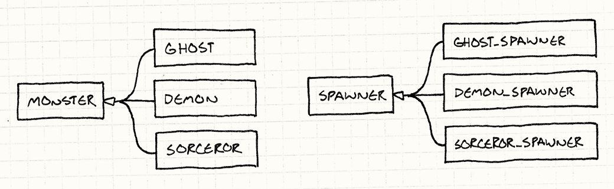
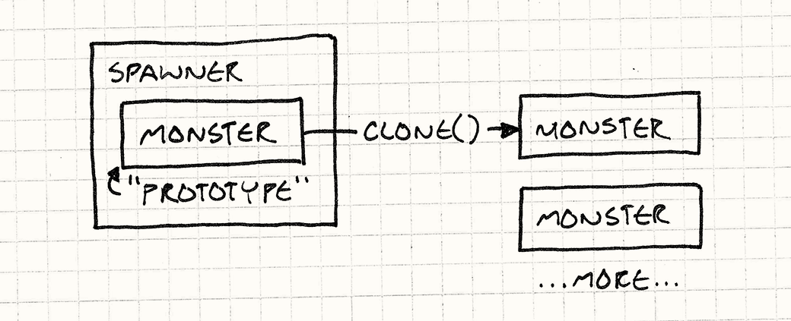
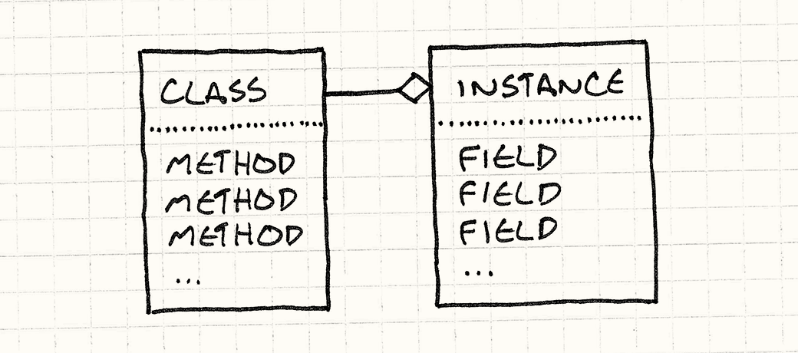
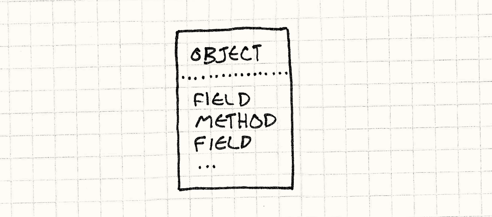
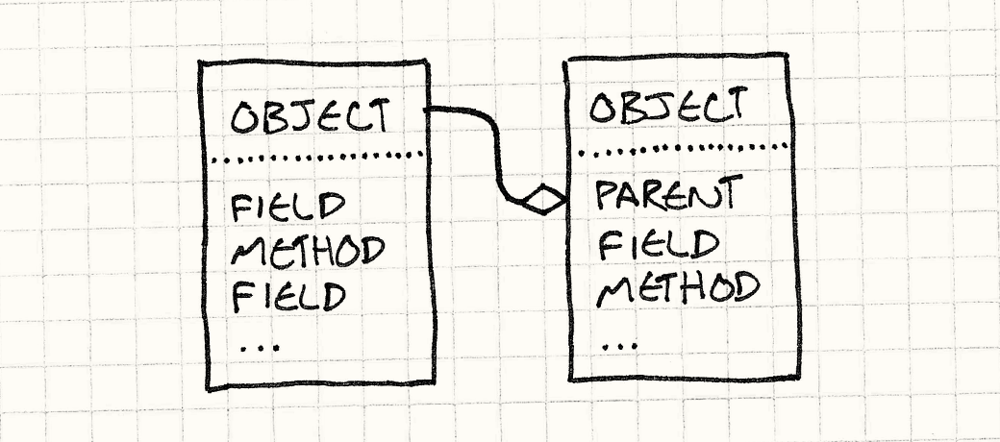
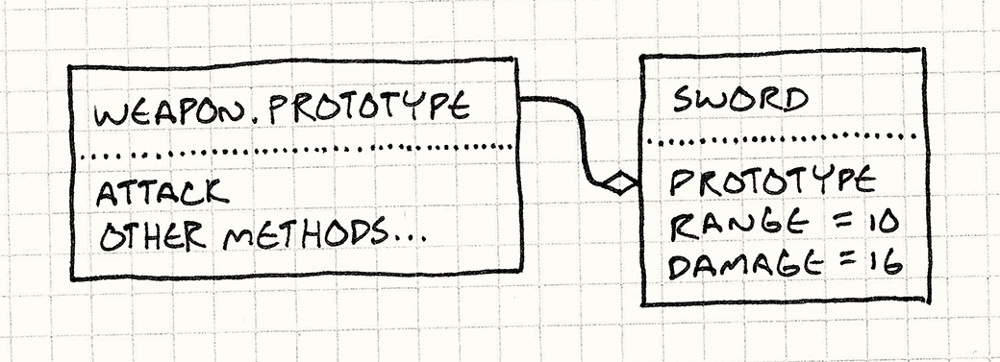

# 原型模式

> **重访设计模式**

我第一次听到"prototype"（原型）这个词，是在《设计模式》里。如今，这个词好像人人都在说，但他们谈的往往不是那个[设计模式](http://en.wikipedia.org/wiki/Prototype_pattern)。本章会覆盖那个模式，但我也想带你看看"原型"这个词及其背后的概念，还在哪些更有趣的地方冒过头。不过，让我们先重温一下这个原版模式。

> 这里的"原版"我并非随口一说。《设计模式》把 Ivan Sutherland（伊万·萨瑟兰）1963 年传奇性的 [Sketchpad](http://en.wikipedia.org/wiki/Sketchpad)（萨瑟兰于 1963 年开发的早期交互式计算机图形系统）项目，列为这个模式最早的现实案例之一。当别人都在听迪伦和甲壳虫乐队的时候，萨瑟兰正忙着发明 CAD（计算机辅助设计）、交互式图形以及面向对象编程的基础概念。
>
> 去看看[这个演示](http://www.youtube.com/watch?v=USyoT_Ha_bA)，准备好被震撼。

## 原型设计模式

假设我们正在做一款风格类似 Gauntlet（一款 1985 年的街机地下城游戏）的游戏。各种生物和恶魔围着英雄乱转，争抢属于自己那份血肉。这些令人倒胃口的饭桌伙伴通过"生成器"进入竞技场，每种敌人对应一个生成器。

就这个例子而言，假设游戏里每种怪物都有对应的类——`Ghost`、`Demon`、`Sorcerer` 等，就像这样：

```cpp
class Monster
{
  // 内容……
};

class Ghost : public Monster {};
class Demon : public Monster {};
class Sorcerer : public Monster {};
```

生成器负责构造某一种特定类型的怪物。为了支持游戏里的每种怪物，我们可以蛮力地为每个怪物类创建一个生成器类，形成平行的类层次：



> 为了画这张图，我翻出了一本蒙尘已久的 UML 书。图中  表示"继承自"。

实现起来大概是这样：

```cpp
class Spawner
{
public:
  virtual ~Spawner() {}
  virtual Monster* spawnMonster() = 0;
};

class GhostSpawner : public Spawner
{
public:
  virtual Monster* spawnMonster()
  {
    return new Ghost();
  }
};

class DemonSpawner : public Spawner
{
public:
  virtual Monster* spawnMonster()
  {
    return new Demon();
  }
};

// 以此类推……
```

除非你是按代码行数计薪，否则这种写法显然不好玩。一大堆类、一大堆样板代码、一大堆冗余、一大堆重复……

原型模式提供了一种解法。核心思想是：**一个对象可以生成与自身相似的其他对象**。有了一只幽灵，就能复制出更多幽灵；有了一个恶魔，就能复制出更多恶魔。任何怪物都可以充当**原型**怪物，用来生成自身的其他版本。

为此，我们给基类 `Monster` 增加一个抽象的 `clone()` 方法：

```cpp
class Monster
{
public:
  virtual ~Monster() {}
  virtual Monster* clone() = 0;

  // 其他内容……
};
```

每个怪物子类都提供一个实现，返回一个在类和状态上与自身完全相同的新对象。例如：

```cpp
class Ghost : public Monster {
public:
  Ghost(int health, int speed)
  : health_(health),
    speed_(speed)
  {}

  virtual Monster* clone()
  {
    return new Ghost(health_, speed_);
  }

private:
  int health_;
  int speed_;
};
```

一旦所有怪物都支持这个方法，我们就不再需要为每种怪物单独创建一个生成器类了。只需定义唯一一个生成器：

```cpp
class Spawner
{
public:
  Spawner(Monster* prototype)
  : prototype_(prototype)
  {}

  Monster* spawnMonster()
  {
    return prototype_->clone();
  }

private:
  Monster* prototype_;
};
```

它内部持有一只怪物——一只深藏不露的怪物，存在的唯一意义就是充当模板，让生成器不断复刻出同类，有点像一只永远不离巢的蜂后。



要创建一个幽灵生成器，先创建一个原型幽灵实例，再用这个原型创建生成器：

```cpp
Monster* ghostPrototype = new Ghost(15, 3);
Spawner* ghostSpawner = new Spawner(ghostPrototype);
```

这个模式有一个精妙之处：它不仅克隆原型的**类**，也克隆它的**状态**。这意味着只需创建不同的原型幽灵，就能轻松得到快速幽灵、虚弱幽灵或迟缓幽灵的生成器。

这个模式让我觉得既优雅又出乎意料。我想象不出自己会独立想到它，但一旦知道了，就无法想象不知道它的感觉。

### 效果如何？

好，我们不需要为每种怪物单独创建生成器类了——这是好事。但我们**确实**需要在每个怪物类里实现 `clone()`，代码量和写那堆生成器差不多。

而且，当你认真坐下来尝试写一个正确的 `clone()` 时，会踩进一些语义上的深坑：它应该是深拷贝还是浅拷贝？换句话说，如果一个恶魔手持一把干草叉，克隆恶魔时要不要连干草叉一起克隆？

另外，这道题本身就是个刻意构造的例子，原型模式在这里省不了多少代码，而"为每种怪物单独设一个类"这个前提，如今也早就不是大多数游戏引擎的惯常做法了。

我们大多数人已经吃过大型类层次的苦头，知道它有多难管理。这也是为什么现在我们更倾向于用[组件模式](component.html)和[类型对象](type-object.html)这样的模式，来建模不同类型的实体，而不是把每种实体都固化为一个独立的类。

### 生成函数

就算我们确实为每种怪物设了独立的类，也有其他方式来给这只 Felis catus（家猫的拉丁学名，即对"另辟蹊径"的戏称）剥皮。与其为每种怪物创建单独的生成器**类**，不如改用生成**函数**：

```cpp
Monster* spawnGhost()
{
  return new Ghost();
}
```

这比单独写一整个构造某种怪物的类省事得多。然后那唯一的生成器类只需存储一个函数指针：

```cpp
typedef Monster* (*SpawnCallback)();

class Spawner
{
public:
  Spawner(SpawnCallback spawn)
  : spawn_(spawn)
  {}

  Monster* spawnMonster()
  {
    return spawn_();
  }

private:
  SpawnCallback spawn_;
};
```

创建幽灵生成器，就是这样：

```cpp
Spawner* ghostSpawner = new Spawner(spawnGhost);
```

### 模板

如今大多数 C++ 开发者都熟悉模板了。我们的生成器类需要构造某种类型的实例，但我们不想硬编码某个具体的怪物类。自然的解法是把它做成**类型参数**，模板正好能做到：

> 我说不准 C++ 程序员是真的爱上了模板，还是模板把一些人彻底吓跑了。不管怎样，我见到的今天还在用 C++ 的人，都在用模板。

```cpp
class Spawner
{
public:
  virtual ~Spawner() {}
  virtual Monster* spawnMonster() = 0;
};

template <class T>
class SpawnerFor : public Spawner
{
public:
  virtual Monster* spawnMonster() { return new T(); }
};
```

使用起来是这样：

```cpp
Spawner* ghostSpawner = new SpawnerFor<Ghost>();
```

> 这里保留 `Spawner` 基类，是为了那些不关心生成器创建的是哪种怪物的代码，可以直接使用它并用 `Monster*` 指针来工作。
>
> 如果只有 `SpawnerFor<T>` 这个模板类，它的各个实例化版本之间就没有公共的基类，那么任何能处理任意怪物类型生成器的代码，本身也得带一个模板参数。

### 一等类型

前面两种方案，都是在解决如何让 `Spawner` 类接受一个类型参数的问题。在 C++ 中，类型通常不是一等公民，所以需要一些技巧。

> 从某种角度看，[类型对象](type-object.html)模式也是对一等类型缺失的一种变通。不过即便是在支持一等类型的语言里，这个模式仍然有用——因为它让**你**来定义什么是"类型"，你可能需要与语言内建类不同的语义。

但如果你用的是 JavaScript、Python 或 Ruby 这样的动态类型语言，类本身就是可以随意传递的普通对象，解决这个问题就直接得多了。创建生成器时，直接传入它应该构造的那个怪物类——一个代表怪物类型的真实运行时对象即可。简单如馅饼。

综合以上几种方案，老实说，我还没遇到过让我觉得原型**设计模式**是最佳答案的情况。也许你的经历会不同。不过现在先把这个放一边，聊点别的：**作为语言范式的原型**。

## 原型语言范式

很多人认为"面向对象编程"等同于"类"。关于 OOP 的定义总是像不同宗教教义的信条之争，但有一个争议较少的说法是：*OOP 让你定义"对象"，将数据和代码捆绑在一起。* 相比 C 这样的结构化语言或 Scheme（一种函数式编程语言）这样的函数式语言，OOP 的决定性特征是把状态和行为紧紧绑在一起。

你或许认为类是实现这一点的唯一方式，但 Dave Ungar 和 Randall Smith 等一批人对此持异议。他们在八十年代创造了一门叫做 Self（一种基于原型的编程语言）的语言。它完全是面向对象的，却没有类。

### Self

从纯粹的意义上说，Self 比基于类的语言**更**面向对象。我们通常认为 OOP 就是状态与行为的结合，但有类的语言实际上在两者之间划了一道分隔线。

想想你最喜欢的基于类的语言的语义：访问对象上的某个状态，要在对象实例的内存里查找。状态**存放**在实例里。

但是调用一个方法，则要先找到实例的类，再在**类**里查找那个方法。行为存放在**类**里。获取一个方法永远需要经过这一层间接，这意味着字段和方法是不同的东西。



> 例如，在 C++ 中调用虚函数，要先在实例里找到指向虚函数表（vtable）的指针，再在那里查找对应的方法。

Self 消除了这种区别。查找**任何东西**，都只需在对象本身上找。一个实例可以同时包含状态和行为，你可以有一个拥有完全属于自己的独特方法的单一对象。



> 没有哪座孤岛是真正孤立的，但这个对象是。

如果 Self 只有这些，会很难用。基于类的语言里的继承，尽管有种种缺陷，却提供了一种复用多态代码、避免重复的有效机制。为了在没有类的情况下实现类似的效果，Self 引入了**委托**（delegation）。

在某个对象上查找字段或调用方法时，先在对象自身查找。如果找到了，搞定。如果没找到，就在对象的**父对象**上找——那只是对另一个对象的引用。在第一个对象上找不到的属性，就委托给它的父对象，再委托给父对象的父对象，以此类推。换句话说，查找失败会**委托**给对象的父对象。

> 这里我做了简化。Self 实际上支持多个父对象。父对象只是一些特殊标记的字段，这意味着你可以继承父对象甚至在运行时更改它们，从而实现所谓的**动态继承**。



父对象让我们可以在多个对象之间复用行为（还有状态），这覆盖了类的部分用途。类做的另一件关键的事是提供创建实例的方式——需要一个新 thingamabob，直接 `new Thingamabob()` 就好，不管你喜欢的语言语法是什么。类是自身实例的工厂。

没有类，我们怎么创建新对象？特别是，怎么批量创建有共同特征的新对象？正如在设计模式里一样，Self 里的做法就是**克隆**。

在 Self 里，就好像每个对象都自动支持原型设计模式。任何对象都可以被克隆。要批量创建相似对象，你需要：

1. 把一个对象捏成你想要的形状。可以克隆系统内置的基础 `Object`，然后往里塞字段和方法。
2. 克隆它，想复制多少份……呃……克隆就复制多少份。

这带来了原型设计模式的优雅，却不需要自己费力实现 `clone()`——它是系统内置的。

这是个如此漂亮、聪明、极简的系统，以至于我一了解到它，就开始着手创建一门基于原型的语言来深入体验。

> 我知道从头构建一门语言不是最高效的学习方式，但能怎么说呢？我就是有点与众不同。如果你好奇，这门语言叫做 [Finch](http://finch.stuffwithstuff.com/)（作者自己开发的一门原型式编程语言）。

### 效果如何？

我无比兴奋地投入到一门纯原型语言的玩耍中，但等我把它跑起来，就发现了一个令人不快的事实：用它编程并不好玩。

> 我后来通过小道消息得知，很多 Self 程序员也得出了同样的结论。不过这个项目远远算不上失败。Self 的动态性极强，为了让它跑得足够快，需要各种虚拟机层面的创新。
>
> 他们为即时编译（JIT）、垃圾回收和方法分派优化所发明的技术，正是如今让众多动态类型语言快到足以支撑大规模流行应用的那套技术——而且往往就是同一批人实现的！

当然，这门语言实现起来很简单，但那是因为它把复杂度推给了用户。当我真正开始用它写东西，就发现自己在想念类所提供的那种结构感。最终我不得不在库的层面上重新发明它，因为语言本身不提供。

也许是因为我之前的经验都是基于类的语言，思维已经被那个范式染色了。但我的直觉是，大多数人就是喜欢定义明确的"一类事物"。

除了基于类的语言大获全胜之外，看看有多少游戏设计了明确的角色职业，为各种敌人、道具和技能提供精确的名册，每一项都贴着清晰的标签。你很少见到哪款游戏里每只怪物都是独一无二的雪花，比如"介于巨魔和地精之间、还掺了点蛇的某种东西"。

原型是一个非常酷的范式，我也希望更多人了解它，但我庆幸我们大多数人并不用它来写日常代码。我见过的完全拥抱原型风格的代码，有一种奇怪的软糊感，让我很难理清头绪。

> 另一个说明性的证据是：用原型风格写出来的代码实际上**极少**。我查过。

### JavaScript 怎么说？

好，如果基于原型的语言这么难用，我该怎么解释 JavaScript？这门语言有原型，每天被数百万人使用，运行 JavaScript 的计算机比地球上任何其他语言都多。

Brendan Eich，JavaScript 的创造者，直接从 Self 那里汲取灵感，JavaScript 的许多语义都是基于原型的。每个对象可以有任意一组属性，包括字段和"方法"（实际上就是作为字段存储的函数）。对象也可以有另一个对象作为其"prototype"（原型），当字段访问失败时就委托给它。

> 对于语言设计者来说，原型的一个吸引人之处在于它比类更容易实现。Eich 充分利用了这一点：JavaScript 的第一个版本在十天内创建完成。

但尽管如此，我认为 JavaScript 在实践中与基于类的语言有更多共同点，而不是基于原型的语言。一个暗示是，基于原型语言的核心操作——**克隆**——在 JavaScript 里根本看不到。

JavaScript 没有克隆对象的方法。最接近的是 `Object.create()`，它允许你创建一个委托给现有对象的新对象。就连这个，也直到 ECMAScript 5（JavaScript 诞生十四年后）才加进来。

与其讲克隆，不如带你过一遍 JavaScript 里定义类型和创建对象的典型方式。从一个**构造函数**开始：

```javascript
function Weapon(range, damage) {
  this.range = range;
  this.damage = damage;
}
```

这会创建一个新对象并初始化它的字段。调用方式是：

```javascript
var sword = new Weapon(10, 16);
```

这里的 `new` 会把 `this` 绑定到一个新的空对象上来调用 `Weapon()` 函数的函数体，函数体往里添加一堆字段，然后这个填好内容的对象被自动返回。

`new` 还会做另一件事：创建那个空对象时，它会把它接入委托链，指向一个原型对象。你可以直接用 `Weapon.prototype` 访问那个对象。

状态在构造函数体里添加，要定义**行为**，通常是往原型对象上添加方法，就像这样：

```javascript
Weapon.prototype.attack = function(target) {
  if (distanceTo(target) > this.range) {
    console.log("Out of range!");
  } else {
    target.health -= this.damage;
  }
}
```

这给武器原型添加了一个值为函数的 `attack` 属性。由于每个由 `new Weapon()` 返回的对象都委托给 `Weapon.prototype`，你现在可以调用 `sword.attack()`，它就会执行那个函数。大致是这样的：



梳理一下：

- 创建对象的方式是"new"操作，调用时传入代表类型的对象——构造函数。
- 状态存储在实例本身。
- 行为经过一层间接——委托给原型——存储在代表所有同类对象共享方法集合的独立对象里。

叫我疯子也好，但这听起来很像我之前对类的描述。你**可以**在 JavaScript 里写原型风格的代码（不用克隆），但这门语言的语法和惯用法都在鼓励一种基于类的方式。

就我个人而言，我觉得这是件好事。就像我说的，我发现深陷原型风格会让代码更难处理，所以我很欣赏 JavaScript 用一套更"有类"的东西把核心语义包裹起来。

## 用原型进行数据建模

好，我一直在讲我**不**喜欢原型用在哪里，这让这章读起来越来越丧气。我觉得这本书更像喜剧而非悲剧，所以让我用一个我**确实**认为原型——或者更具体地说，委托——有用武之地的场景来收尾。

如果你统计一款游戏里代码字节数与数据字节数的比例，会发现数据占比从编程诞生之初就在持续增长。早期游戏几乎一切都是程序动态生成的，以便塞进软盘和老游戏卡带。如今的很多游戏，代码只是驱动游戏运行的"引擎"，游戏本身完全由数据定义。

这很好，但把大量内容推进数据文件，并不能神奇地解决大型项目的组织难题。如果说有什么不同的话，反而更难了。我们使用编程语言，正是因为它们有管理复杂度的工具。

与其在十个地方复制粘贴同一段代码，我们把它移进一个可以按名字调用的函数。与其在一堆类里复制同一个方法，我们把它放进一个单独的类让那些类继承或混入。

当游戏的数据量增长到一定规模，你就真的开始想要类似的功能了。数据建模是个深刻的话题，我无法在这里公道地阐述，但我想抛出一个特性供你在自己的游戏里思考：用原型和委托来复用数据。

假设我们在给之前提到的那款厚颜无耻的 Gauntlet 翻版游戏定义数据模型，游戏设计师需要在某种文件里给怪物和道具指定属性。

> 我的意思是，一款完全原创的作品，绝对没有受到任何已有的俯视角多人地下城街机游戏的启发。请不要起诉我。

一种常见的做法是用 JSON（一种轻量级的数据交换格式）。数据实体基本上是**映射**，或者**属性包**，或者其他十几种叫法——因为程序员最喜欢的事情莫过于给已有名字的东西再发明一个新名字。

> 我们重新发明了太多次，以至于 Steve Yegge 干脆叫它们["万能设计模式"](http://steve-yegge.blogspot.com/2008/10/universal-design-pattern.html)。

游戏里的一只地精可能长这样：

```json
{
  "name": "goblin grunt",
  "minHealth": 20,
  "maxHealth": 30,
  "resists": ["cold", "poison"],
  "weaknesses": ["fire", "light"]
}
```

这相当直白，就算最怕看文字的设计师也能应对。于是你在地精大家族里再加上几个分支：

```json
{
  "name": "goblin wizard",
  "minHealth": 20,
  "maxHealth": 30,
  "resists": ["cold", "poison"],
  "weaknesses": ["fire", "light"],
  "spells": ["fire ball", "lightning bolt"]
}

{
  "name": "goblin archer",
  "minHealth": 20,
  "maxHealth": 30,
  "resists": ["cold", "poison"],
  "weaknesses": ["fire", "light"],
  "attacks": ["short bow"]
}
```

如果这是代码，我们的职业嗅觉已经开始警觉了。这几个实体之间有大量重复，训练有素的程序员**讨厌**这种事。它浪费空间，编写也费时间。你要仔细对比才能判断数据是否真的相同。维护起来令人头痛——如果我们决定让游戏里所有地精都更强，就得记得把三份数据里的生命值都改一遍。坏、坏、坏。

如果这是代码，我们会为"地精"创建一个抽象，在三种地精类型之间复用。但愚蠢的 JSON 对这些一无所知。那就让它聪明一点。

我们规定：如果一个对象有 `"prototype"` 字段，它就定义了另一个对象的名字，该对象会把查找委托给那个对象。第一个对象上不存在的属性，会回退到在原型上查找。

> 这使得 `"prototype"` 成了**元**数据，而非数据。地精有疣疙瘩的绿皮肤和黄牙齿，它没有原型。原型是**代表地精的数据对象**的属性，而不是地精本身的属性。

有了这个，我们就能简化地精大军的 JSON：

```json
{
  "name": "goblin grunt",
  "minHealth": 20,
  "maxHealth": 30,
  "resists": ["cold", "poison"],
  "weaknesses": ["fire", "light"]
}

{
  "name": "goblin wizard",
  "prototype": "goblin grunt",
  "spells": ["fire ball", "lightning bolt"]
}

{
  "name": "goblin archer",
  "prototype": "goblin grunt",
  "attacks": ["short bow"]
}
```

弓箭手和法师以步兵为原型，就不必在各自的数据里重复生命值、抗性和弱点了。我们加进数据模型的逻辑极其简单——基本的单层委托——却已经消灭了大量重复。

值得注意的是，我们并没有为三种具体地精类型单独设立一个第四个"基础地精"**抽象**原型让它们委托。相反，我们直接选了三者中最简单的那只地精来委托。

在基于原型的系统里，任何对象都可以作为克隆模板来创建新的细化对象，这感觉很自然。我认为在这里也同样自然。它尤其适合游戏数据——你经常会有游戏世界里那些独一无二的特殊实体。

想想 Boss 和独特道具。它们往往是游戏里某个更普通对象的细化版本，原型委托非常适合用来定义这类对象。"断头神剑"本质上不过是一把加了属性加成的长剑，可以直接这样表达：

```json
{
  "name": "Sword of Head-Detaching",
  "prototype": "longsword",
  "damageBonus": "20"
}
```

在游戏引擎的数据建模系统里加入一点额外的能力，就能让设计师更轻松地为游戏世界里的武器和怪物添加大量细小的变体。而正是这种丰富性，才是真正让玩家着迷的东西。
