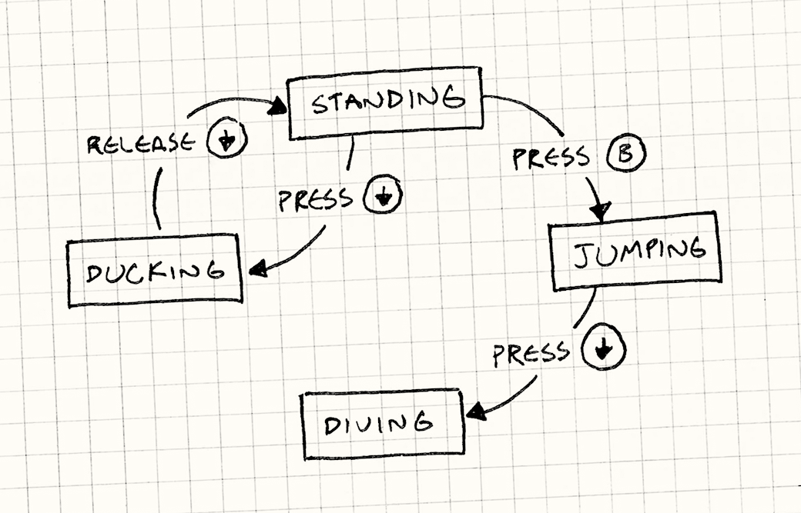
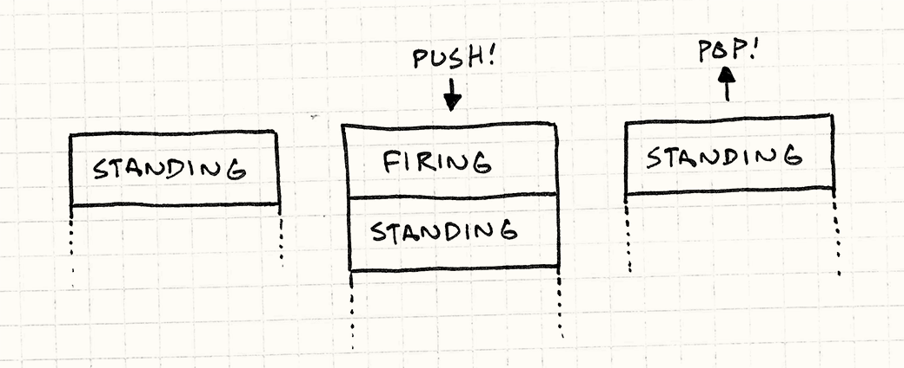

# 状态模式

> **重访设计模式**

坦白说：我有点贪多，把太多内容塞进了这一章。它表面上是在讲[状态（State）](http://en.wikipedia.org/wiki/State_pattern)设计模式，但我没办法只讲模式本身而不涉及更基础的概念——**有限状态机**（FSM，Finite State Machine）。然后既然讲到这里了，我又觉得不如顺带介绍**层次状态机**和**下推自动机**。

内容确实不少，为了尽量精简，这里的代码示例省略了一些细节，需要你自己补全。希望它们仍然足够清晰，让你看到全局图景。

如果你从没听说过状态机，别难过。它虽然在 AI 和编译器领域广为人知，在其他编程圈子里却并不那么熟悉。我认为它值得更广泛地被了解，所以我准备把它用在一个不同类型的问题上。

> 这两个领域的并列，让人想起人工智能的早期岁月。五六十年代，AI 研究大量聚焦于语言处理。编译器如今用于解析编程语言的许多技术，最初是为解析人类语言而发明的。

## 我们都经历过这种事

我们正在做一款横版平台跳跃游戏，任务是实现游戏世界中作为玩家化身的女主角，让她响应玩家输入。按下 B 键她就应该跳跃，听起来很简单：

```cpp
void Heroine::handleInput(Input input)
{
  if (input == PRESS_B)
  {
    yVelocity_ = JUMP_VELOCITY;
    setGraphics(IMAGE_JUMP);
  }
}
```

发现 bug 了吗？

没有任何东西阻止"空中跳跃"——在她腾空时一直猛按 B，她就会永远飘着。简单的修法是给 `Heroine` 添加一个 `isJumping_` 布尔字段来追踪跳跃状态，然后改成这样：

```cpp
void Heroine::handleInput(Input input)
{
  if (input == PRESS_B)
  {
    if (!isJumping_)
    {
      isJumping_ = true;
      // 跳跃……
    }
  }
}
```

> 还应该有代码在女主角落地时把 `isJumping_` 重置为 `false`，这里为了简洁省略了。

接下来，我们想让女主角在地面上按下方向键时下蹲，松开时站起来：

```cpp
void Heroine::handleInput(Input input)
{
  if (input == PRESS_B)
  {
    // 没有跳跃时才能跳……
  }
  else if (input == PRESS_DOWN)
  {
    if (!isJumping_)
    {
      setGraphics(IMAGE_DUCK);
    }
  }
  else if (input == RELEASE_DOWN)
  {
    setGraphics(IMAGE_STAND);
  }
}
```

这次的 bug 在哪？

有了这段代码，玩家可以：

1. 按下方向键下蹲。
2. 在下蹲状态按 B 起跳。
3. 还在空中时松开方向键。

女主角会在跳跃到一半时切换到站立动画。又需要一个标志……

```cpp
void Heroine::handleInput(Input input)
{
  if (input == PRESS_B)
  {
    if (!isJumping_ && !isDucking_)
    {
      // 跳跃……
    }
  }
  else if (input == PRESS_DOWN)
  {
    if (!isJumping_)
    {
      isDucking_ = true;
      setGraphics(IMAGE_DUCK);
    }
  }
  else if (input == RELEASE_DOWN)
  {
    if (isDucking_)
    {
      isDucking_ = false;
      setGraphics(IMAGE_STAND);
    }
  }
}
```

接下来，如果玩家在跳跃途中按下方向键，女主角能做一个俯冲攻击就很酷了：

```cpp
void Heroine::handleInput(Input input)
{
  if (input == PRESS_B)
  {
    if (!isJumping_ && !isDucking_)
    {
      // 跳跃……
    }
  }
  else if (input == PRESS_DOWN)
  {
    if (!isJumping_)
    {
      isDucking_ = true;
      setGraphics(IMAGE_DUCK);
    }
    else
    {
      isJumping_ = false;
      setGraphics(IMAGE_DIVE);
    }
  }
  else if (input == RELEASE_DOWN)
  {
    if (isDucking_)
    {
      // 站起来……
    }
  }
}
```

又到找 bug 的时候了。找到了吗？

我们检查了跳跃中不能再次跳跃，但没有检查俯冲中不能跳跃。又得再加一个字段……

我们的方法显然有什么地方**不对**了。每次动这几行代码，就会搞坏什么东西。我们还有一大堆动作没加——连**行走**都还没实现——照这个速度，还没完工就会崩溃成一堆 bug。

> 那些你崇拜的、仿佛总能写出无懈可击代码的程序员，并不是因为他们拥有超人的能力。他们是对哪**类**代码容易出错有直觉，并懂得绕开它们。
>
> 复杂的分支逻辑和可变状态——随时间改变的字段——是两类最容易出错的代码，而上面的例子两者兼有。

## 有限状态机出手相救

在一阵沮丧中，你把桌上的东西统统扫开，只留下一支笔和一张纸，开始画流程图。你为女主角能做的每件事画一个方框：站立、跳跃、下蹲、俯冲。当她在某个状态能响应按键时，你从那个方框画一条箭头，标上按键名称，连接到她会转换到的状态。



恭喜，你刚刚创建了一个**有限状态机**。它来自计算机科学中一个叫做**自动机理论**（automata theory）的分支，这个分支的数据结构家族还包括大名鼎鼎的图灵机（Turing machine）。有限状态机是这个家族中最简单的成员。

要点是：

- **状态机有一组固定的*状态***，机器只能处于其中之一。在我们的例子里，就是站立、跳跃、下蹲和俯冲。

- **状态机同一时间只能处于*一个*状态。** 女主角不能同时处于跳跃和站立状态。事实上，防止这种情况正是我们使用有限状态机的理由之一。

- ***输入*或*事件*序列被发送给状态机。** 在我们的例子里，就是按键按下和松开的原始输入。

- **每个状态有一组*转换（transition）*，每个转换关联一个输入并指向一个状态。** 当输入到来时，如果它匹配当前状态的某个转换，状态机就切换到那个转换指向的状态。

  例如，在站立状态下按下方向键转换到下蹲状态；在跳跃状态下按下方向键转换到俯冲状态。如果当前状态没有为某个输入定义转换，该输入就被忽略。

在纯粹形式下，这就是全部：状态、输入和转换。你可以像小流程图一样画出来。遗憾的是，编译器不认识我们的涂鸦，那么我们怎么**实现**它呢？四人帮的状态模式是一种方法——我们很快就会讲到——但先从简单的开始。

> 我最喜欢的有限状态机类比，是 Zork（一款 1977 年的经典文字冒险游戏）这样的老式文字冒险游戏。你有一个由出口相互连接的房间构成的世界，通过输入"go north"这样的命令来探索。
>
> 这和状态机直接对应：每个房间是一个状态；你所在的房间是当前状态；每个房间的出口是它的转换；导航命令是输入。

## 枚举和 switch

`Heroine` 类的问题之一，是那几个布尔字段的某些组合是无效的：`isJumping_` 和 `isDucking_` 永远不应该同时为真。当你有一批标志、同一时间只有一个为 `true`，这是一个信号——你真正需要的是 `enum`。

在这个情况下，那个 `enum` 恰好就是我们的有限状态机的状态集合，那么定义如下：

```cpp
enum State
{
  STATE_STANDING,
  STATE_JUMPING,
  STATE_DUCKING,
  STATE_DIVING
};
```

`Heroine` 不再有一堆标志，只需要一个 `state_` 字段。我们也调换了分支的顺序——之前的代码先 switch 输入，再 switch 状态，这把处理同一个按键的代码归拢在一起，却把处理同一个状态的代码分散开了。我们希望把后者归拢，所以先 switch 状态：

```cpp
void Heroine::handleInput(Input input)
{
  switch (state_)
  {
    case STATE_STANDING:
      if (input == PRESS_B)
      {
        state_ = STATE_JUMPING;
        yVelocity_ = JUMP_VELOCITY;
        setGraphics(IMAGE_JUMP);
      }
      else if (input == PRESS_DOWN)
      {
        state_ = STATE_DUCKING;
        setGraphics(IMAGE_DUCK);
      }
      break;

    case STATE_JUMPING:
      if (input == PRESS_DOWN)
      {
        state_ = STATE_DIVING;
        setGraphics(IMAGE_DIVE);
      }
      break;

    case STATE_DUCKING:
      if (input == RELEASE_DOWN)
      {
        state_ = STATE_STANDING;
        setGraphics(IMAGE_STAND);
      }
      break;
  }
}
```

看起来微不足道，但这确实是对前面代码的真正改进。我们仍然有一些条件分支，但把可变状态简化成了单个字段，处理单个状态的所有代码现在整齐地归在一处。这是实现状态机最简单的方式，对某些场景来说已经足够了。

> 特别是，女主角不再可能处于**无效**状态。用布尔标志时，某些值的组合是可能的但毫无意义；用枚举，每个值都是有效的。

不过，你的问题可能会超出这个方案的能力范围。假设我们想加一个动作：女主角可以下蹲一段时间来蓄力，然后释放一个特殊攻击。在下蹲期间，我们需要追踪蓄力时间。

我们给 `Heroine` 加一个 `chargeTime_` 字段来记录攻击蓄力了多久。假设我们已经有一个每帧调用的 `update()`，在其中添加：

```cpp
void Heroine::update()
{
  if (state_ == STATE_DUCKING)
  {
    chargeTime_++;
    if (chargeTime_ > MAX_CHARGE)
    {
      superBomb();
    }
  }
}
```

> 如果你猜到这就是[更新方法](update-method.html)模式，你赢了一个奖品！

我们还需要在她开始下蹲时重置计时器，所以修改 `handleInput()`：

```cpp
void Heroine::handleInput(Input input)
{
  switch (state_)
  {
    case STATE_STANDING:
      if (input == PRESS_DOWN)
      {
        state_ = STATE_DUCKING;
        chargeTime_ = 0;
        setGraphics(IMAGE_DUCK);
      }
      // 处理其他输入……
      break;

      // 其他状态……
  }
}
```

总的来说，为了加这个蓄力攻击，我们不得不修改两个方法，还要给 `Heroine` 添加一个 `chargeTime_` 字段——尽管这个字段只在下蹲状态下有意义。我们更希望把所有那些代码和数据整齐地包裹在同一个地方。四人帮为此备好了方案。

## 状态模式

对于深陷面向对象思维的人来说，每一个条件分支都是使用动态分派（在 C++ 里就是虚函数调用）的机会。我认为走那条路容易走过头。有时候一个 `if` 就够了。

> 这有其历史背景。许多早期面向对象的布道者，如《设计模式》的四人帮和《重构》的 Martin Fowler，都来自 Smalltalk。在那门语言里，`ifThen:` 只是一个你在条件上调用的方法，由 `true` 和 `false` 对象各自实现。

但在我们的例子里，我们已经到了一个临界点，面向对象的方式更合适了。这就引出了状态模式。用四人帮的话来说：

> 允许一个对象在其内部状态改变时改变自身的行为。对象看起来好像修改了它的类。

这说的不多。咱们的 `switch` 也做到了这件事。他们描述的具体模式，应用到我们的女主角上长这样：

### 状态接口

首先，我们为状态定义一个接口。每一段依赖状态的行为——之前所有有 `switch` 的地方——都变成接口里的一个虚方法。对我们而言，就是 `handleInput()` 和 `update()`：

```cpp
class HeroineState
{
public:
  virtual ~HeroineState() {}
  virtual void handleInput(Heroine& heroine, Input input) {}
  virtual void update(Heroine& heroine) {}
};
```

### 每个状态对应一个类

对于每个状态，我们定义一个实现该接口的类，其方法定义了女主角在该状态下的行为。换句话说，把之前 `switch` 语句里的每个 `case` 搬进对应状态的类里。例如：

```cpp
class DuckingState : public HeroineState
{
public:
  DuckingState()
  : chargeTime_(0)
  {}

  virtual void handleInput(Heroine& heroine, Input input) {
    if (input == RELEASE_DOWN)
    {
      // 切换到站立状态……
      heroine.setGraphics(IMAGE_STAND);
    }
  }

  virtual void update(Heroine& heroine) {
    chargeTime_++;
    if (chargeTime_ > MAX_CHARGE)
    {
      heroine.superBomb();
    }
  }

private:
  int chargeTime_;
};
```

注意我们也把 `chargeTime_` 从 `Heroine` 移到了 `DuckingState` 类里。这很棒——那份数据只在这个状态下有意义，而现在我们的对象模型把这件事明确地体现出来了。

### 委托给状态

接下来，给 `Heroine` 一个指向当前状态的指针，去掉那些庞大的 `switch`，改为委托给状态：

```cpp
class Heroine
{
public:
  virtual void handleInput(Input input)
  {
    state_->handleInput(*this, input);
  }

  virtual void update()
  {
    state_->update(*this);
  }

  // 其他方法……
private:
  HeroineState* state_;
};
```

要"切换状态"，只需让 `state_` 指向另一个 `HeroineState` 对象，这就是状态模式的全部。

> 这看起来像[策略（Strategy）](http://en.wikipedia.org/wiki/Strategy_pattern)和[类型对象](type-object.html)模式。三者都有一个主对象委托给另一个下级对象。区别在于**意图**：
>
> - 策略模式的目标是将主类与其部分行为**解耦**。
> - 类型对象的目标是让一**批**对象通过**共享**对同一个类型对象的引用来表现相似。
> - 状态模式的目标是让主对象通过**更换**它委托给的对象来**改变**自身行为。

## 状态对象从哪里来？

我在这里略过了一件事。要切换状态，我们需要让 `state_` 指向新的状态对象，但这个对象从哪来？用枚举的实现里，这不是问题——枚举值像数字一样是基本类型。但现在状态是类，意味着我们需要一个实际的实例。通常有两种做法：

### 静态状态

如果状态对象没有其他字段，那么它存储的唯一数据就是一个指向内部虚函数表的指针，用于调用它的方法。在这种情况下，没有理由拥有多于一个实例——所有实例反正都是相同的。

> 如果你的状态没有字段，且只有**一个**虚方法，你可以把这个模式进一步简化：用一个状态**函数**代替每个状态**类**——就是一个普通的顶层函数。这样主类里的 `state_` 字段就变成了一个简单的函数指针。

这种情况下，你可以做一个单一的**静态**实例。即便同时有一大批有限状态机都处于同一状态，它们都可以指向**同一个实例**，因为这个实例里没有任何特定于某台状态机的内容。

> 这就是[享元模式](flyweight.html)。

把那个静态实例放在哪里由你决定，找一个合理的地方。就随便放在基类状态里吧：

```cpp
class HeroineState
{
public:
  static StandingState standing;
  static DuckingState ducking;
  static JumpingState jumping;
  static DivingState diving;

  // 其他代码……
};
```

每个静态字段都是游戏使用的那个状态的唯一实例。要让女主角跳跃，站立状态可以这样做：

```cpp
if (input == PRESS_B)
{
  heroine.state_ = &HeroineState::jumping;
  heroine.setGraphics(IMAGE_JUMP);
}
```

### 实例化状态

但有时候这行不通。静态状态不适合下蹲状态——它有一个 `chargeTime_` 字段，那是特定于正在下蹲的那个女主角的。如果游戏只有一个女主角，这可能碰巧能用，但如果我们试图加入双人合作、屏幕上同时有两个女主角，就会出问题。

这时，我们必须在转换到新状态时**创建**一个状态对象。这让每个有限状态机都有自己的状态实例。当然，如果我们在分配**新**状态，就意味着需要释放**当前**状态。这里需要小心，因为触发切换的代码是在当前状态的方法里——我们不想在自身下面把 `this` 给 delete 掉。

替代方案是让 `HeroineState` 的 `handleInput()` 可选地返回一个新状态。当它这样做时，`Heroine` 就删除旧状态并换入新状态：

```cpp
void Heroine::handleInput(Input input)
{
  HeroineState* state = state_->handleInput(*this, input);
  if (state != NULL)
  {
    delete state_;
    state_ = state;
  }
}
```

这样，我们在从方法返回之后才删除旧状态。现在，站立状态可以通过创建新实例来转换到下蹲状态：

```cpp
HeroineState* StandingState::handleInput(Heroine& heroine,
                                         Input input)
{
  if (input == PRESS_DOWN)
  {
    // 其他代码……
    return new DuckingState();
  }

  // 留在当前状态。
  return NULL;
}
```

只要可以，我偏好使用静态状态，因为它们不会在每次状态切换时浪费内存和 CPU 时钟周期来分配对象。对于那些更"有状态"的状态，这种方式才是正确的选择。

> 动态分配状态时，可能需要担心内存碎片问题。[对象池](object-pool.html)模式可以帮上忙。

## 进入动作和退出动作

状态模式的目标是把一个状态的所有行为和数据封装进单个类。我们快到了，但还有几处散落的尾巴。

女主角切换状态时，我们也要切换她的精灵图。现在，那段代码由她要**离开**的状态持有。当她从下蹲到站立时，下蹲状态设置她的图像：

```cpp
HeroineState* DuckingState::handleInput(Heroine& heroine,
                                        Input input)
{
  if (input == RELEASE_DOWN)
  {
    heroine.setGraphics(IMAGE_STAND);
    return new StandingState();
  }

  // 其他代码……
}
```

我们真正想要的是让每个状态控制自己的图形。可以通过给状态增加一个**进入动作（entry action）**来实现：

```cpp
class StandingState : public HeroineState
{
public:
  virtual void enter(Heroine& heroine)
  {
    heroine.setGraphics(IMAGE_STAND);
  }

  // 其他代码……
};
```

在 `Heroine` 里，我们修改处理状态切换的代码，在新状态上调用它：

```cpp
void Heroine::handleInput(Input input)
{
  HeroineState* state = state_->handleInput(*this, input);
  if (state != NULL)
  {
    delete state_;
    state_ = state;

    // 在新状态上调用进入动作。
    state_->enter(*this);
  }
}
```

这让我们可以把下蹲代码简化成：

```cpp
HeroineState* DuckingState::handleInput(Heroine& heroine,
                                        Input input)
{
  if (input == RELEASE_DOWN)
  {
    return new StandingState();
  }

  // 其他代码……
}
```

它所做的只是切换到站立状态，站立状态自己负责图形。现在我们的状态真正实现了封装。进入动作有一个特别好的地方：无论你从**哪个**状态进入，它都会执行。

大多数现实中的状态图，都有多条转换通往同一个状态。例如，我们的女主角落地后，无论是跳跃还是俯冲后落地，都会回到站立状态。这意味着每处发生这种转换的地方都要重复同样的代码。进入动作给了我们一个统一处理的地方。

当然，我们也可以把这扩展到支持**退出动作（exit action）**——在我们切换到新状态前，在正在**离开**的状态上调用的一个方法。

## 有什么问题吗？

我花了这么多篇幅向你推销有限状态机，现在要把地毯从你脚下抽走了。我说的一切都是真的，有限状态机对某些问题确实是好的选择。但它的最大优点也是它的最大缺陷。

状态机通过对代码施加极为**受限**的结构，帮助你理清混乱的代码。你只有固定的状态集合、单一的当前状态和一些硬编码的转换。

> 有限状态机甚至不是**图灵完备**的。自动机理论用一系列抽象模型来描述计算，每个比前一个更复杂。图灵机是其中表达能力最强的模型之一。
>
> "图灵完备"意味着一个系统（通常是编程语言）强大到足以在其中实现图灵机——这意味着所有图灵完备的语言在某种程度上表达能力相同。有限状态机没有足够的灵活性加入这个俱乐部。

如果你试着把状态机用于更复杂的事情，比如游戏 AI，就会正面撞上这个模型的局限。幸好，前人已经找到了一些绕开部分限制的方法。我用本章最后的篇幅带你看看其中几种。

## 并发状态机

我们决定让女主角能够携带枪械。当她持枪时，她仍然能做之前能做的一切：跑步、跳跃、下蹲等等。但她还需要能在做这些动作的同时开枪。

如果我们坚守有限状态机的边界，就必须把状态数量**翻倍**。对于每个已有的状态，我们需要另一个对应"携带武器时做同样的事"的状态：站立、持枪站立、跳跃、持枪跳跃……以此类推。

再加几种武器，状态数量就会组合爆炸。不仅状态数量庞大，冗余也极多：非武装和武装状态几乎完全相同，只是多了一小块处理开枪的代码。

问题在于我们把两份状态——她**在做什么**和她**携带着什么**——塞进了同一台状态机。要对所有可能的组合建模，我们需要为每个**对**设立一个状态。解法显而易见：用两台独立的状态机。

> 如果我们想把"她在做什么"的 *n* 个状态和"她携带着什么"的 *m* 个状态塞进一台状态机，我们需要 *n × m* 个状态。用两台状态机，只需 *n + m*。

我们保留原来关于"她在做什么"的状态机，不动它。然后定义一台关于"她携带着什么"的独立状态机。`Heroine` 将有**两个**"状态"引用，各一个：

```cpp
class Heroine
{
  // 其他代码……

private:
  HeroineState* state_;
  HeroineState* equipment_;
};
```

> 为了便于说明，我们对她的装备使用了完整的状态模式。实践中，由于只有两个状态，一个布尔标志也管用。

当女主角把输入分发给状态时，她把输入发给两者：

```cpp
void Heroine::handleInput(Input input)
{
  state_->handleInput(*this, input);
  equipment_->handleInput(*this, input);
}
```

> 更完整的系统可能需要一种方式让一台状态机**消费**输入，让另一台收不到。这能防止两台状态机都错误地响应同一个输入。

此后，每台状态机可以独立地响应输入、产生行为、改变自身状态。当两组状态大体上互不相关时，这种方式运作良好。

实践中，你会发现有几种情况两台状态机确实需要交互。例如，也许她跳跃时不能开枪，或者她持枪时不能做俯冲攻击。处理这些情况时，你大概只需在一台状态机的代码里对**另一台**状态机的状态做一些粗糙的 `if` 检查来协调它们。这不是最优雅的方案，但能完成任务。

## 层次状态机

把女主角的行为进一步充实之后，她可能会有一批相似的状态：站立、行走、奔跑和滑行。在任意一种状态下，按 B 都会跳跃，按下方向键都会下蹲。

用简单的状态机实现，我们必须在每个状态里重复那段代码。如果能实现一次、在所有这些状态间复用，就更好了。

如果这只是面向对象的代码而不是状态机，在这些状态间共享代码的方式之一是使用**继承**。我们可以定义一个"在地面上"状态的类来处理跳跃和下蹲，然后站立、行走、奔跑和滑行都从它继承，并添加各自额外的行为。

> 这有好的一面，也有不好的一面。继承是一种强大的代码复用手段，但也在两段代码之间产生非常强的耦合。这是把大锤，要谨慎挥动。

事实上，这是一种叫做**层次状态机（hierarchical state machine）**的常见结构。一个状态可以有**超状态（superstate）**（使自身成为**子状态（substate）**）。当事件到来时，如果子状态不处理它，它就沿着超状态链向上传递。换句话说，工作方式就像重写继承方法。

实际上，如果我们用状态模式来实现有限状态机，就可以用类继承来实现层次结构。为超状态定义一个基类：

```cpp
class OnGroundState : public HeroineState
{
public:
  virtual void handleInput(Heroine& heroine, Input input)
  {
    if (input == PRESS_B)
    {
      // 跳跃……
    }
    else if (input == PRESS_DOWN)
    {
      // 下蹲……
    }
  }
};
```

然后每个子状态继承它：

```cpp
class DuckingState : public OnGroundState
{
public:
  virtual void handleInput(Heroine& heroine, Input input)
  {
    if (input == RELEASE_DOWN)
    {
      // 站起来……
    }
    else
    {
      // 没有处理输入，沿层次向上传递。
      OnGroundState::handleInput(heroine, input);
    }
  }
};
```

当然，这不是实现层次的唯一方式。如果你没有使用四人帮的状态模式，这种方法就行不通。替代方案是用主类里的状态**栈**（而不是单个状态），显式地对当前状态的超状态链建模。

当前状态是栈顶的那个，它下面是其直接超状态，然后是那个状态的超状态，如此往下。当你分发某个特定于状态的行为时，从栈顶开始向下，直到某个状态处理它为止（如果没有，就忽略）。

## 下推自动机

还有另一种常见的有限状态机扩展，同样使用状态栈。容易让人困惑的是，这里的栈代表完全不同的东西，用于解决不同的问题。

问题在于有限状态机没有**历史**的概念。你知道自己**处于**什么状态，但不记得你**曾经**处于什么状态。没有简单的方式回到前一个状态。

举个例子：之前，我们让勇敢的女主角武装到了牙齿。当她开枪时，我们需要一个新状态来播放射击动画、生成子弹和各种视觉特效。于是我们拼凑了一个 `FiringState`，让所有她能开枪的状态，在按下开火键时都转换到它。

棘手的部分是射击结束后她转换到**哪个**状态。她可以在站立、奔跑、跳跃或下蹲时射击，射击序列完成后，应该转换回她之前在做的事。

如果坚守普通的有限状态机，她进入射击状态时就已经忘了之前的状态。为了追踪它，我们必须定义一大堆几乎相同的状态——"站立时射击"、"奔跑时射击"、"跳跃时射击"等——只是为了让每个状态能有一个硬编码的转换，在结束时回到正确的状态。

我们真正需要的是一种在射击前**存储**所处状态、之后再**召回**它的方式。再一次，自动机理论来帮忙了。相关的数据结构叫做[**下推自动机（pushdown automaton）**](http://en.wikipedia.org/wiki/Pushdown_automaton)。

有限状态机对状态只有**单个**指针，下推自动机有一个状态的**栈**。在有限状态机里，转换到新状态会**替换**旧状态。下推自动机允许你这样做，但同时还给了你两个额外的操作：

1. 你可以把新状态**推入（push）**栈。"当前"状态始终是栈顶的那个，所以这就转换到了新状态。但它把上一个状态直接留在它下面，而不是丢弃它。

2. 你可以把栈顶状态**弹出（pop）**。那个状态被丢弃，它下面的状态成为新的当前状态。



这正是我们射击所需要的。我们创建一个**单一的**射击状态。在任何其他状态下按下开火键时，我们就把射击状态**推入**栈。射击动画结束后，我们把那个状态**弹出**，下推自动机自动把我们带回到之前所处的状态。

## 它们到底多有用？

即便有这些对状态机的常见扩展，它们仍然相当有限。当今游戏 AI 的趋势更倾向于令人兴奋的东西，比如**[行为树（behavior trees）][behavior trees]**和**[规划系统（planning systems）][planning systems]**。如果你对复杂 AI 感兴趣，这一章所做的不过是勾起你的食欲，还需要读其他的书来满足它。

[behavior trees]: http://web.archive.org/web/20140402204854/http://www.altdevblogaday.com/2011/02/24/introduction-to-behavior-trees/
[planning systems]: http://web.media.mit.edu/~jorkin/goap.html

但这并不意味着有限状态机、下推自动机和其他简单系统没有价值。它们是某类问题的好的建模工具。有限状态机在以下情况适用：

- 你有一个行为随某些内部状态改变的实体。
- 那个状态可以被明确地划分为数量相对较少的若干独立选项。
- 实体随时间响应一系列输入或事件。

在游戏里，它们最广为人知的用途是 AI，但在用户输入处理、菜单界面导航、文本解析、网络协议以及其他异步行为的实现里，它们同样很常见。
