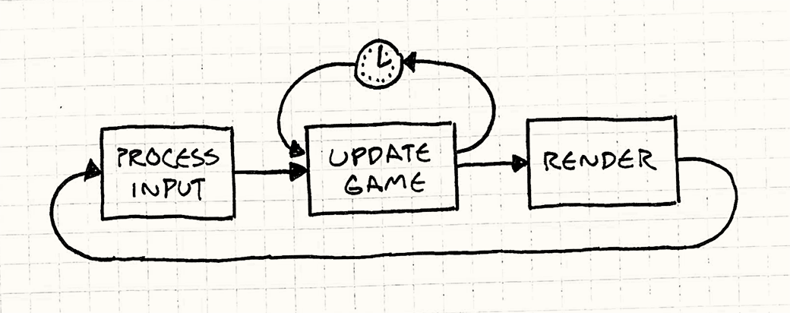
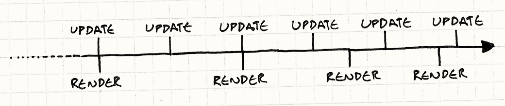
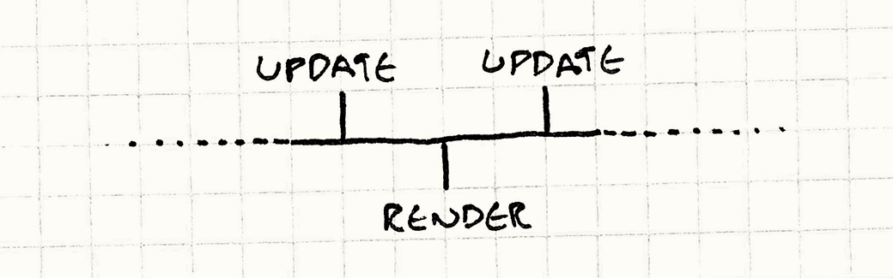

# 游戏循环

**时序模式**

## 意图

*将游戏时间的推进与用户输入及处理器速度解耦。*

## 动机

如果说本书离不开哪一个模式，那非游戏循环莫属。游戏循环是"游戏编程模式"最典型的代表。几乎每款游戏都有它，没有两个完全相同的，而游戏之外的程序用到它的则寥寥无几。

为了理解它的价值，让我们一起做个简短的历史回顾。在计算机编程的早年岁月里，人人都留着大胡子，程序的工作方式就像你家的洗碗机。你把一批代码塞进去，按下按钮，等着，然后拿出结果。完事儿。这些叫做*批处理模式*程序——工作一旦完成，程序就停止。

> 埃达·洛芙莱斯（Ada Lovelace）和海军少将格蕾丝·霍珀（Grace Hopper）有着名誉上的大胡子。

今天我们仍能见到这类程序，好在已经不用在穿孔卡片上编程了。Shell 脚本、命令行程序，甚至把一堆 Markdown 文件转成本书的那个小 Python 脚本，都是批处理模式程序。

### 与 CPU 的对话

最终，程序员们意识到，把一批代码送到计算中心、几个小时后再来取结果，是调试程序最慢的方式。他们想要即时反馈。*交互式*程序由此诞生。最早的交互式程序中有一些就是游戏：

> 这是 `Colossal Cave Adventure`（第一款文字冒险游戏），第一款文字冒险游戏。

```
你站在一条路的尽头，面前是一座小砖楼。
四周是一片树林，一条小溪从楼里流出，
蜿蜒流入一道沟壑。

> 进入
你在楼里面，这是一口大泉眼的泵房。
```

你可以和程序来一场实时对话。它等着你的输入，然后给你回应。你们轮流发言，就像你在幼儿园时学的那样。轮到你的时候，它就静静坐在那里什么也不干。大致如下：

> 这个循环永远不会结束，所以没有办法退出游戏。实际的游戏会用类似 `while (!done)` 的写法，并通过设置 `done` 来退出。这里为了简洁省略了这部分。

```cpp
while (true)
{
  char* command = readCommand();
  handleCommand(command);
}
```

### 事件循环

现代图形界面应用程序，一旦剥去华丽的外皮，与古老的文字冒险游戏出奇地相似。你的文字处理器通常就坐在那里一动不动，直到你按下某个键或点击某处：

```cpp
while (true)
{
  Event* event = waitForEvent();
  dispatchEvent(event);
}
```

主要区别在于，程序等待的不是*文本命令*，而是*用户输入事件*——鼠标点击和按键消息。它的工作方式本质上与旧式文字冒险游戏一样：程序会*阻塞*，等待用户输入。这就带来了一个问题。

与绝大多数软件不同，游戏即便用户不提供输入，也会持续运转。如果你发呆盯着屏幕，游戏不会冻结。动画持续播放，视觉特效翩翩舞动。运气不好的话，那只怪物还在啃你的英雄。

> 大多数事件循环确实有"空闲"事件，让你能够在没有用户输入时间歇性地做些事情。这对于闪烁的光标或进度条已经够用，但对游戏来说还远远不够。

这就是真实游戏循环的第一个关键要素：*处理用户输入，但不等待它*。循环始终保持转动：

```cpp
while (true)
{
  processInput();
  update();
  render();
}
```

我们之后还会完善这段代码，但基本要素已经在这里了。`processInput()` 处理上次调用以来发生的所有用户输入。然后，`update()` 将游戏模拟推进一步，运行 AI 和物理（通常按这个顺序）。最后，`render()` 绘制游戏画面，让玩家看到刚才发生的事情。

> 顾名思义，`update()` 是使用[更新方法](update-method.html)模式的好地方。

### 失去时间感的世界

如果这个循环不阻塞在输入上，那随之而来的显而易见的问题就是：它转得有多*快*？每次游戏循环的迭代，都会将游戏状态推进某个量。从游戏世界居民的角度来看，他们时钟上的指针向前拨动了一格。

> 游戏循环转一圈的常用术语是"tick"（帧）和"frame"（帧）。

与此同时，*玩家*的实际时钟也在滴答作响。如果我们以真实时间来衡量游戏循环的运转速度，就得到了游戏的"每秒帧数"（FPS）。游戏循环转得越快，FPS 越高，游戏运行就越流畅、越快速。如果它很慢，游戏就会像定格动画一样一顿一顿的。

以我们现在这个尽可能快速运转的粗糙循环为例，帧率由两个因素决定。第一是*每帧需要做多少工作*。复杂的物理运算、大量的游戏对象和丰富的图形细节都会让 CPU 和 GPU 忙得团团转，完成一帧就需要更长时间。

第二是*底层平台的速度*。更快的芯片能在同样时间内处理更多代码。多核、GPU、专用音频硬件以及操作系统的调度器，都会影响你在一个 tick 内能完成多少工作。

### 每秒多少秒

在早期视频游戏中，第二个因素是固定的。如果你为 NES（任天堂红白机）或 Apple IIe（苹果公司于 1983 年推出的个人计算机）编写游戏，你*确切*知道游戏跑在什么 CPU 上，你可以（也确实会）专门针对那个 CPU 编码。你唯一需要担心的就是每个 tick 做多少工作。

那时的游戏经过精心编码，确保每帧恰好完成足够的工作，使游戏以开发者期望的速度运行。但如果你试图在更快或更慢的机器上运行同一款游戏，游戏本身就会随之加速或减速。

> 这就是为什么旧 PC 曾经有"[turbo（涡轮）](http://en.wikipedia.org/wiki/Turbo_button)"按钮。新 PC 速度更快，旧游戏跑起来会太快而无法正常游玩。按下 turbo 按钮*关闭*加速，会降低机器速度，让旧游戏重新变得可玩。

然而如今，很少有开发者能奢侈地确切知道游戏将运行在什么硬件上。我们的游戏必须聪明地适应各种设备。

这就是游戏循环的另一个关键职责：*尽管底层硬件存在差异，仍要让游戏以一致的速度运行。*

## 模式详解

**游戏循环**在游戏过程中持续运行。每次循环，它都会在不阻塞的情况下**处理用户输入**，**更新游戏状态**，并**渲染游戏画面**。它追踪时间的流逝，以**控制游戏进行的速率**。

## 适用场景

用错模式比不用更糟，所以这一节通常是用来警告过度热情的。设计模式的目标不是往代码库里塞越多越好。

但这个模式有些特别。我可以相当有把握地说，你*一定会*用到它。如果你在使用游戏引擎，你不需要自己编写，但它仍然在那里。

> 对我而言，这就是"引擎"和"库"的区别。使用库时，你拥有主游戏循环，调用库的接口。引擎拥有循环，调用*你*的代码。

你可能觉得如果做回合制游戏就不需要它。但即便如此，尽管*游戏状态*要等到玩家行动才推进，游戏的*视觉*和*听觉*状态通常仍在持续变化。即使游戏在"等待"你行动，动画和音乐也照常运行。

## 注意事项

我们谈论的这个循环是游戏中最重要的代码之一。人们说程序会把 90% 的时间花在 10% 的代码上。你的游戏循环必然在那 10% 里。请仔细对待这段代码，时刻留意其效率。

> 这种杜撰出来的统计数据，正是为什么机械、电气等领域的"真正"工程师不把我们当回事的原因。

### 你可能需要与平台的事件循环协调

如果你的游戏构建于一个带有图形 UI 和内置事件循环的操作系统或平台之上，那么你就有*两个*应用程序循环同时运行。它们需要和平共处。

有时，你可以取得主动权，让自己的循环成为唯一的循环。例如，如果你在古老的 Windows API（微软视窗程序接口）上编写游戏，你的 `main()` 里可以直接放一个游戏循环。在循环内部，你可以调用 `PeekMessage()` 来处理和分发来自操作系统的事件。与 `GetMessage()` 不同，`PeekMessage()` 不会阻塞等待用户输入，所以你的游戏循环可以持续运转。

另一些平台则不那么容易让你摆脱事件循环。如果你的目标平台是 Web 浏览器，事件循环已经深深嵌入浏览器的执行模型中。在那里，事件循环掌控着全局，你要把它当作游戏循环来用。你需要调用类似 `requestAnimationFrame()` 的接口，它会回调你的代码来保持游戏运行。

## 示例代码

对于这么长的引言，游戏循环的代码其实相当直白。我们来看几种变体，分析各自的优缺点。

游戏循环驱动着 AI、渲染和其他游戏系统，但这些不是模式本身的重点，所以我们只是调用一些虚构的方法。实际实现 `render()`、`update()` 等函数，留给读者作为（极具挑战性的！）练习。

### 能跑多快跑多快

我们已经见过最简单可能的游戏循环了：

```cpp
while (true)
{
  processInput();
  update();
  render();
}
```

它的问题是你完全无法控制游戏的运行速度。在快速机器上，这个循环会飞速旋转，用户根本来不及看清发生了什么。在慢速机器上，游戏则会爬行。如果游戏的某个部分内容繁多，或者执行了更多 AI 和物理运算，那里的游戏速度就会实际变慢。

### 小憩一会儿

我们要看的第一个变体加入了一个简单的修复。假设你希望游戏以 60 FPS 运行。这给了你每帧约 16 毫秒的时间。只要你能可靠地在更少的时间内完成所有游戏处理和渲染，就能保持稳定帧率。你要做的就是处理完这一帧，然后*等待*到下一帧的时间，如下所示：


代码大致如下：

> *1000 ms / FPS = 每帧毫秒数*。

```cpp
while (true)
{
  double start = getCurrentTime();
  processInput();
  update();
  render();

  sleep(start + MS_PER_FRAME - getCurrentTime());
}
```

如果一帧处理得很快，这里的 `sleep()` 确保游戏不会跑得太*快*。但如果游戏跑得太*慢*，它就帮不上忙了。如果更新和渲染一帧花了超过 16ms，休眠时间就变成了*负数*。要是有能穿越回过去的计算机，很多事情都会容易得多，可惜我们没有。

此时游戏就会变慢。你可以通过每帧少做些工作来应对——削减图形效果，或者简化 AI。但这会影响所有用户的游戏质量，哪怕他们用的是快机器。

### 一小步，一大步

让我们尝试一些稍微复杂的方案。我们面临的问题本质上可以归结为：

1. 每次更新将游戏时间推进一定量。
2. 处理这次更新需要一定量的*真实*时间。

如果第二步花的时间比第一步更长，游戏就会变慢。如果推进游戏时间 16ms 需要超过 16ms 的处理时间，那就根本追不上了。但如果我们能在单步内将游戏时间推进*超过* 16ms，就可以降低更新频率，同时仍然追得上。

思路是：根据上一帧以来经过了多少*真实*时间，来选择推进的时间步长。帧耗时越长，游戏迈出的步子就越大。它始终能跟上真实时间，因为它会用越来越大的步子来赶上去。这叫做*可变*或*流体*时间步长：

```cpp
double lastTime = getCurrentTime();
while (true)
{
  double current = getCurrentTime();
  double elapsed = current - lastTime;
  processInput();
  update(elapsed);
  render();
  lastTime = current;
}
```

每一帧，我们计算自上次游戏更新以来经过了多少*真实*时间（`elapsed`）。更新游戏状态时，把这个值传入。引擎随即负责将游戏世界向前推进相应的时间量。

假设有颗子弹飞过屏幕。使用固定时间步长，每帧你按其速度移动它。使用可变时间步长，你*把速度乘以经过的时间*。时间步长越大，子弹每帧移动越远。无论经历二十次小而快的步子，还是四次大而慢的步子，子弹穿越屏幕所需的*真实*时间都是一样的。看起来很美妙：

- 游戏在不同硬件上以一致的速率运行。
- 机器更快的玩家能得到更流畅的游戏体验。

然而，遗憾的是，前方潜伏着一个严重的问题：我们让游戏变得*非确定性*且不稳定。下面是一个我们给自己埋下的陷阱：

> "确定性"是指每次运行程序时，只要给定相同的输入，就能得到完全相同的输出。可以想象，在确定性程序中追踪 bug 要容易得多——找到第一次触发 bug 的输入，就能每次都复现它。
>
> 计算机天生是确定性的，它们机械地执行程序。非确定性来自于混乱的真实世界的渗入。例如，网络、系统时钟和线程调度都依赖于程序控制之外的外部世界的某些部分。

假设我们有一款双人联网游戏，Fred 用的是超强的游戏机器，而 George 用的是他奶奶那台老古董 PC。前面提到的那颗子弹在他们俩的屏幕上同时飞行。在 Fred 的机器上，游戏跑得超快，每个时间步长都很小。子弹穿越屏幕的那一秒，我们能塞进大约 50 帧。可怜的 George 的机器只能跑出大约五帧。

这意味着在 Fred 的机器上，物理引擎更新了子弹的位置 50 次，而 George 的只更新了 5 次。大多数游戏使用浮点数，而浮点数存在*舍入误差*。每次将两个浮点数相加，得到的结果可能会有微小偏差。Fred 的机器做了十倍多的运算，积累的误差也更大。*同一颗*子弹最终会在两台机器上落在*不同的位置*。

这只是可变时间步长会引发的一个棘手问题，还有更多。为了能实时运行，游戏物理引擎是对真实力学定律的近似。为了防止这些近似*失控*，需要引入阻尼。而阻尼是针对特定时间步长精心调校的。一旦时间步长变化，物理就变得不稳定。

> "失控"在这里是字面意义。物理引擎出问题时，物体可能获得完全错误的速度，把自己弹射到空中。

这种不稳定性已经严重到，这个例子存在的意义仅仅是作为一个警示故事，引领我们走向更好的方案……

### 亡羊补牢

引擎中通常*不*受可变时间步长影响的部分是*渲染*。由于渲染引擎捕捉的是某一时刻的快照，它不在乎自上次渲染以来经过了多少时间。它把物体渲染在此刻它们所在的位置。

> 这在大多数情况下是对的。运动模糊之类的效果可能受时间步长影响，但如果稍有偏差，玩家通常不会注意到。

我们可以利用这一点。对于物理和 AI，我们使用*固定*时间步长来*更新*游戏，因为这让一切都更简单、更稳定。但我们允许*渲染*的时机有弹性，以便释放一部分处理器时间。

具体做法如下：自上次游戏循环迭代以来，经过了一定量的真实时间。这就是我们需要模拟的游戏时间量，让游戏的"现在"追上玩家的"现在"。我们通过一系列*固定*时间步长来完成。代码大致如下：

```cpp
double previous = getCurrentTime();
double lag = 0.0;
while (true)
{
  double current = getCurrentTime();
  double elapsed = current - previous;
  previous = current;
  lag += elapsed;

  processInput();

  while (lag >= MS_PER_UPDATE)
  {
    update();
    lag -= MS_PER_UPDATE;
  }

  render();
}
```

这里有几个关键部分。每帧开始时，我们根据经过的真实时间更新 `lag`，它衡量的是游戏时钟相比真实世界落后了多少。然后我们有一个内部循环，每次以固定步长更新游戏，直到追上为止。追上之后，我们渲染画面，然后重新开始。你可以大致这样理解这个过程：



注意，这里的时间步长不再是*可见*的帧率了。`MS_PER_UPDATE` 只是我们用来更新游戏的*粒度*。这个步长越短，追上真实时间所需的处理时间就越多。越长，游戏画面就越卡顿。理想情况下，你希望它相当短，通常快于 60 FPS，这样游戏在快速机器上模拟的精度很高。

但要小心，别让它*太*短。你需要确保时间步长大于处理一次 `update()` 所需的时间，哪怕是在最*慢*的硬件上。否则，你的游戏根本追不上。

> 这里我省略了，但你可以通过让内部更新循环在达到最大迭代次数后退出来保护自己。届时游戏会变慢，但这比完全锁死要好得多。

好在，我们给自己留了一些喘息的空间。诀窍在于，我们*将渲染从更新循环中抽离出来*。这释放了大量 CPU 时间。最终效果是：游戏使用安全的固定时间步长，在各种硬件上以恒定速率进行*模拟*。只不过在慢速机器上，玩家看到的游戏*画面窗口*会更加卡顿。

### 卡在中间

还剩下一个问题：残余延迟（residual lag）。我们以固定时间步长更新游戏，却在任意时间点渲染。这意味着从用户的角度来看，游戏往往会显示两次更新之间某个时间点的状态。

来看一条时间线：



如你所见，我们以紧密、固定的间隔进行更新。与此同时，我们只要能渲染就渲染。渲染比更新更不频繁，而且也不规律。这两点都还好。糟糕的是，我们不总是在更新时刻正好渲染。看第三个渲染时间点，它恰好夹在两次更新之间：



想象一颗子弹飞过屏幕。第一次更新时，它在左侧。第二次更新把它移到了右侧。游戏在这两次更新之间的某个时间点渲染，所以用户期待看到子弹在屏幕中央。但以我们当前的实现，它仍然在左侧。这意味着运动看起来参差不齐，发生抖动。

方便的是，渲染时我们实际上*确切地知道*自己处于两帧更新之间的哪个位置：它存在 `lag` 里。我们在 `lag` 小于更新时间步长时退出更新循环，而不是等到它变为*零*。那个剩余量，就是我们进入下一帧多少的度量。

渲染时，我们把它传入：

> 这里除以 `MS_PER_UPDATE` 是为了*归一化*这个值。无论更新时间步长是多少，传给 `render()` 的值都在 0（恰好在上一帧）到略小于 1.0（恰好在下一帧）之间变化。这样，渲染器不必担心帧率，只需处理 0 到 1 之间的值即可。

```cpp
render(lag / MS_PER_UPDATE);
```

渲染器知道每个游戏对象的位置*以及当前速度*。假设子弹距屏幕左侧 20 像素，每帧向右移动 400 像素。如果我们处于帧间的一半，传给 `render()` 的值就是 0.5。于是它把子弹画在半帧之后的位置，即 220 像素处。完美，运动流畅了。

当然，这种外推可能会出错。计算下一帧时，我们可能发现子弹撞到了障碍物，或者减速了什么的。我们渲染的是插值在上一帧实际位置和我们*预计*下一帧位置之间的状态。但在完整地跑完物理和 AI 之前，我们无法确知。

所以外推是一种猜测，有时确实会猜错。不过幸运的是，这类修正通常不明显。至少，它比完全不做外推时的抖动要不明显得多。

## 设计决策

尽管本章篇幅已经不短，但我省略的内容比包含的还要多。一旦加入与显示器刷新率同步、多线程和 GPU 等内容，真实的游戏循环可能会变得相当复杂。但在高层次上，有几个问题你很可能需要回答：

### 游戏循环归你还是归平台？

这与其说是你的选择，不如说是替你做的选择。如果你在 Web 浏览器中制作游戏，你几乎*无法*编写经典的游戏循环。浏览器基于事件的本质决定了这一点。同样，如果你在使用现成的游戏引擎，你很可能要依赖它的游戏循环，而不是自己造轮子。

**使用平台的事件循环：**

- *简单。* 你不必操心编写和优化游戏的核心循环。
- *与平台和谐共处。* 你不必担心显式地将时间让给宿主以处理自己的事件、缓存事件，或者以其他方式处理平台输入模型与你的模型之间的阻抗失配。
- *你失去了对时机的控制。* 平台会在它认为合适的时候调用你的代码。如果不够频繁或不够流畅，那也没办法。更糟糕的是，大多数应用程序事件循环并非为游戏设计，通常又慢又卡。

**使用游戏引擎的循环：**

- *你不用写它。* 编写游戏循环可能相当棘手。由于核心代码每帧都要执行，微小的 bug 或性能问题都可能对游戏产生重大影响。高效的游戏循环是考虑使用现成引擎的理由之一。
- *你没法写它。* 当然，另一面是，如果你的需求恰好不适配这个引擎，你就失去了控制权。

**自己编写：**

- *完全控制。* 你可以随心所欲地设计它，专门针对游戏的需求量身打造。
- *你必须与平台打交道。* 应用框架和操作系统通常期望有一段时间来处理事件和做其他工作。如果你拥有应用的核心循环，它得不到任何时间。你必须定期显式地让出控制权，确保框架不会挂起或出错。

### 如何管理功耗？

五年前这不是个问题。游戏跑在插电的设备上，或专用手持设备上。但随着智能手机、笔记本电脑和移动游戏的兴起，你很可能现在就要考虑这个问题。一款画面精彩却在耗尽三十分钟电量之前把玩家手机烤成暖手宝的游戏，不会让人满意。

现在，你可能不仅要考虑让游戏看起来好看，还要尽量少用 CPU。可能会有一个*上限*——如果你在一帧内完成了所有需要做的工作，就让 CPU 休眠。

**尽可能快地运行：**

这是你在 PC 游戏上可能会做的事（尽管它们也越来越多地在笔记本上运行）。你的游戏循环永远不会显式地告诉操作系统休眠。相反，任何闲置的 CPU 周期都用来提升 FPS 或图形质量。

这为你提供了尽可能好的游戏体验，但也会尽可能多地耗电。如果玩家用的是笔记本，他们将拥有一个贴心的膝盖暖手炉。

**限制帧率：**

移动游戏通常更注重游戏体验质量，而不是最大化图形细节。许多移动游戏会设置帧率上限（通常是 30 或 60 FPS）。如果游戏循环在该时间片用完之前就处理完了，就直接休眠到时间用完为止。

这给玩家一个"足够好"的体验，此后省着点用电。

### 如何控制游戏速度？

游戏循环有两个关键部分：非阻塞的用户输入，以及对时间流逝的适应。输入部分很直白。魔法在于如何处理时间。游戏可以运行的平台几乎有无穷多种，而任何一款游戏都可能运行在其中相当多的平台上。如何适应这种多样性是关键所在。

> 游戏创作似乎是人类的本能，因为每次我们造出能计算的机器，最早做的事情之一就是在上面做游戏。PDP-1（一种早期数字计算机）是一台 2 kHz、只有 4096 个字存储的机器，史蒂夫·罗素（Steve Russell）和他的朋友们却在上面创造出了 `Spacewar!`（一款 1962 年的经典太空射击游戏）。

**固定时间步长，无同步：**

这就是我们的第一个示例代码。你只管让游戏循环尽可能快地运行。

- *简单。* 这是它的主要（好吧，唯一）优点。
- *游戏速度直接受硬件和游戏复杂度影响。* 主要缺点是，任何变化都会直接影响游戏速度。它是游戏循环里的固定齿轮自行车。

**固定时间步长，带同步：**

复杂度阶梯上的下一级：以固定时间步长运行游戏，但在循环末尾加入延迟或同步点，防止游戏跑得太快。

- *仍然相当简单。* 比上一个例子只多了一行代码。在大多数游戏循环中，你很可能*本来就要*做同步——你可能会对图形进行[双缓冲](double-buffer.html)，并将缓冲区切换同步到显示器的刷新率。
- *节能友好。* 对移动游戏来说这是一个出乎意料的重要考量。你不想白白耗尽用户的电量。只是休眠几毫秒，而不是试图在每个 tick 里塞进更多处理，就能省电。
- *游戏不会跑得太快。* 这解决了固定循环一半的速度问题。
- *游戏可能跑得太慢。* 如果更新和渲染一帧花了太长时间，播放速度就会变慢。由于这种风格不将更新与渲染分离，它比更高级的方案更早遇到这个问题。游戏玩法会变慢，而不是仅仅丢弃*渲染*帧来追赶进度。

**可变时间步长：**

我把这个列在这里作为解决方案空间中的一个选项，但要声明一点：我认识的大多数游戏开发者都不推荐它。记住*为什么*它是个坏主意还是有价值的。

- *能同时适应跑得太慢和太快的情况。* 如果游戏跟不上真实时间，它只会采用越来越大的时间步长直到追上。
- *使游戏玩法变为非确定性且不稳定。* 这才是真正的问题所在。物理和网络在可变时间步长下变得尤其困难。

**固定更新时间步长，可变渲染：**

示例代码中介绍的最后一个方案是最复杂的，但也是最具适应性的。它以固定时间步长更新，但如果需要追上玩家的时钟，可以丢弃*渲染*帧。

- *能同时适应跑得太慢和太快的情况。* 只要游戏能实时完成*更新*，就不会落后。如果玩家的机器是顶配，它会以更流畅的游戏体验作为回报。
- *更复杂。* 主要缺点是实现上要多考虑一些。你需要把更新时间步长调校得足够短以满足高端需求，同时在低端设备上又不至于太慢。

## 另请参阅

- 关于游戏循环的经典文章是 Glenn Fiedler 的《[Fix Your Timestep](http://gafferongames.com/game-physics/fix-your-timestep/)》。没有这篇文章，本章就大不一样了。
- Witters 关于[游戏循环](http://www.koonsolo.com/news/dewitters-gameloop/)的文章紧随其后。
- `Unity`（一款主流游戏引擎）框架有一个复杂的游戏循环，在[这里][unity]有一幅精美的图示。

[unity]: http://docs.unity3d.com/Manual/ExecutionOrder.html
