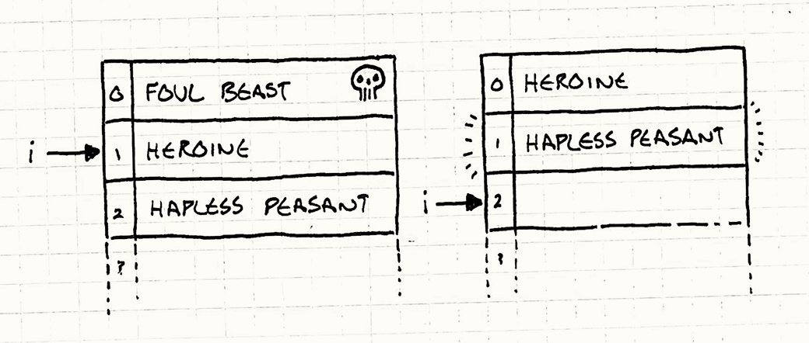
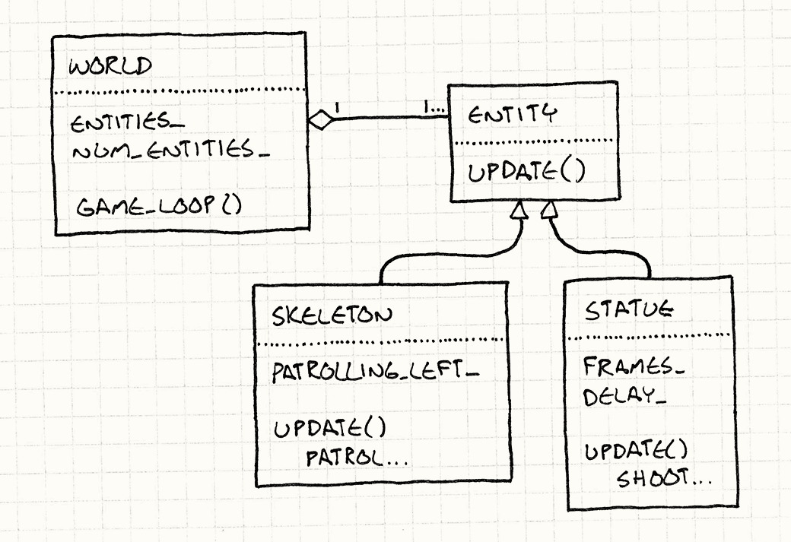

# 更新方法

**时序模式**

## 意图

*通过逐帧告知每个对象处理一帧的行为，来模拟一组独立对象。*

## 动机

玩家操控的强大女武神踏上了一段征途——去盗取沉睡于古代巫师王骸骨上的荣耀宝石。她小心翼翼地走向那座宏伟地下墓穴的入口，遭遇的却是……*虚无*。没有被诅咒的雕像朝她射出闪电，也没有不死战士在入口处巡逻。她就这么大摇大摆地走进去，拿走了战利品。游戏结束。你赢了。

好吧，这可不行。

这座地下墓穴需要些守卫——让我们的勇敢女主角有点挑战的敌人。首先，我们要一个复活的骷髅战士在门口来回巡逻。如果你无视你对游戏编程可能已经掌握的一切，让那副骷髅来回踱步的最简单代码大概长这样：

> 如果那位巫师王想要更聪明的行为，他就应该复活一个还保留着脑组织的东西。

```cpp
while (true)
{
  // 向右巡逻。
  for (double x = 0; x < 100; x++)
  {
    skeleton.setX(x);
  }

  // 向左巡逻。
  for (double x = 100; x > 0; x--)
  {
    skeleton.setX(x);
  }
}
```

当然，这里的问题是骷髅虽然来回移动，但玩家永远看不到。程序陷入了无限循环，这可算不上什么有趣的游戏体验。我们真正想要的是让骷髅每*帧*只移动一步。

我们必须去掉那些循环，依靠外层的[游戏循环](game-loop.html)来推进迭代。这确保了游戏在卫兵来回巡逻的同时，仍能响应用户输入并正常渲染。大概是这样：

> 自然而然地，[游戏循环](game-loop.html)是本书中的另一个模式。

```cpp
Entity skeleton;
bool patrollingLeft = false;
double x = 0;

// 主游戏循环：
while (true)
{
  if (patrollingLeft)
  {
    x--;
    if (x == 0) patrollingLeft = false;
  }
  else
  {
    x++;
    if (x == 100) patrollingLeft = true;
  }

  skeleton.setX(x);

  // 处理用户输入并渲染游戏……
}
```

我在这里放了前后对比，是为了展示代码变得有多复杂。向左向右巡逻以前只是两个简单的 `for` 循环，靠当前执行哪个循环来隐式追踪骷髅的移动方向。现在为了每帧都要把控制权让还给外层游戏循环然后再从断点恢复，我们不得不用 `patrollingLeft` 变量来显式追踪方向。

但这多少能用，所以我们继续。一堆没有脑子的骨头对那位北欧少女的挑战实在有限，接下来我们要添加几尊魔法雕像。它们会不时地向她发射闪电，让她保持警觉。

沿着"最简单的实现方式"的思路，我们得到了：

```cpp
// 骷髅相关变量……
Entity leftStatue;
Entity rightStatue;
int leftStatueFrames = 0;
int rightStatueFrames = 0;

// 主游戏循环：
while (true)
{
  // 骷髅相关代码……

  if (++leftStatueFrames == 90)
  {
    leftStatueFrames = 0;
    leftStatue.shootLightning();
  }

  if (++rightStatueFrames == 80)
  {
    rightStatueFrames = 0;
    rightStatue.shootLightning();
  }

  // 处理用户输入并渲染游戏……
}
```

你可以看出这并不是我们乐于维护的代码。游戏循环里堆积着越来越多的变量和命令式代码，每一块都在处理游戏中的某个具体实体。为了让它们同时运转，我们把它们的代码搅和在了一起。

> 任何时候，如果"搅和在一起"能准确描述你的架构，你大概就有麻烦了。

我们将要使用的模式简单到你可能已经想到了：*游戏中的每个实体应当封装自己的行为。*这样可以保持游戏循环的整洁，并让添加和移除实体变得容易。

为此，我们需要一个*抽象层*，方法是定义一个抽象的 `update()` 方法。游戏循环维护一个对象集合，但它不知道这些对象的具体类型。它只知道这些对象可以被更新。这将每个对象的行为与游戏循环，以及与其他对象都分离开来。

每帧，游戏循环遍历集合，对每个对象调用 `update()`。这给了每个对象执行一帧行为的机会。由于每帧都对所有对象调用它，它们的行为看起来就是*同时发生*的。

> 如果有较真的读者要挑毛病，是的，它们并不是*真正并发*地运行。当一个对象在更新时，其他对象都没有在更新。我们稍后会详细讨论这个问题。

游戏循环持有一个动态的对象集合，因此从关卡中添加和移除对象变得容易——只需在集合中添加或移除它们即可。不再有任何硬编码，我们甚至可以通过某种数据文件来填充关卡，这正是关卡设计师想要的。

## 模式详解

**游戏世界**维护一个**对象集合**。每个对象实现一个**更新方法**，用来**模拟该对象一帧的行为**。每帧，游戏更新集合中的每一个对象。

## 适用场景

如果说[游戏循环](game-loop.html)模式是切片面包问世以来的最伟大发明，那么更新方法模式就是抹在上面的黄油。大量以玩家可以互动的活跃实体为主体的游戏，都以某种形式使用了这个模式。如果游戏里有太空陆战队员、龙、火星人、幽灵或运动员，很可能就用了这个模式。

然而，如果游戏更加抽象，活动的棋子不像活生生的角色，更像棋盘上的棋子，这个模式往往并不适合。在国际象棋这样的游戏里，你不需要同时模拟所有棋子，也可能不需要每帧都告诉兵卒更新自身。

> 你可能不需要每帧更新它们的*行为*，但即使在棋类游戏中，你可能仍然想每帧更新它们的*动画*。这个模式对此也有帮助。

更新方法在以下情况下效果良好：

- 游戏中有若干对象或系统需要同时运行。
- 每个对象的行为大体上独立于其他对象。
- 对象需要随时间进行模拟。

## 注意事项

这个模式相当简单，所以没有太多隐藏的惊喜。不过，每一行代码都有其连锁反应。

### 将代码切分成单帧片段会使其更复杂

对比前两段代码，第二段明显更复杂。两者都只是让骷髅卫兵来回行走，但第二段在每帧都要把控制权让还给游戏循环。

这种改变几乎总是处理用户输入、渲染以及游戏循环负责的其他事务所必须付出的代价，所以第一个例子并不实用。但值得记住的是，把行为代码像这样切成薄片，前期要付出相当大的复杂度代价。

> 我说"几乎"，是因为有时候你可以鱼与熊掌兼得。你可以让对象行为用一条直线贯通的代码来书写，永不返回，同时让若干对象并发运行并与游戏循环协调。
>
> 你需要一个允许多个"执行线程"同时进行的系统。如果对象的代码可以在执行过程中暂停和恢复，而不必完全*返回*，就可以用更命令式的风格来编写。
>
> 真实的线程通常太重量级，难以胜任这项工作。但如果你的语言支持生成器（generator）、协程（coroutine）或纤程（fiber）这类轻量级并发构造，也许可以用上它们。
>
> [字节码](bytecode.html)模式是另一个选择，它在应用层创建执行线程。

### 你必须存储状态，以便每帧从上次离开的地方恢复

在第一段代码中，我们没有任何变量来指示卫兵是向左还是向右移动。这是由当前正在执行哪段代码隐式决定的。

当我们将其改为每帧一步的形式时，我们不得不创建 `patrollingLeft` 变量来追踪方向。当我们从代码返回时，执行位置丢失了，所以我们需要显式存储足够的信息，以便在下一帧恢复。

[状态](state.html)模式在这里通常很有帮助。状态机之所以在游戏中普遍存在，部分原因正是（顾名思义）它们存储了你从上次离开之处继续所需的那种状态。

### 对象每帧都模拟，但并非真正并发

在这个模式中，游戏循环遍历对象集合，逐一更新每个对象。在 `update()` 调用内部，大多数对象都可以与游戏世界的其他部分交互，包括正在被更新的其他对象。这意味着对象的更新*顺序*很重要。

如果 A 在对象列表中排在 B 之前，那么当 A 更新时，它看到的是 B 的上一帧状态。但当 B 更新时，它看到的是 A 的*新*状态，因为 A 已经在本帧更新过了。尽管从玩家的角度来看，一切都在同时移动，但游戏的核心仍然是回合制的——只不过一个完整的"回合"只有一帧那么长。

> 如果出于某种原因，你决定*不*希望游戏像这样顺序执行，你就需要使用[双缓冲](double-buffer.html)之类的模式。那样的话，A 和 B 的更新顺序就无关紧要了，因为它们*都*能看到上一帧的状态。

就游戏逻辑而言，这在大多数情况下是好事。并行更新对象会带来一些令人不快的语义问题。想象一盘黑白双方同时落子的国际象棋。两者都试图走一步，把棋子放到同一个当前为空的格子上。这该如何解决？

顺序更新解决了这个问题——每次更新都以增量方式将世界从一个有效状态推进到下一个，期间没有模糊不清、需要调和的时间段。

> 顺序更新对联网游戏也有帮助，因为你有一组可以通过网络发送的序列化操作。

### 更新时修改对象列表须格外小心

使用这个模式时，游戏的大量行为最终会嵌套在这些更新方法中。这往往包括从游戏中添加或移除可更新对象的代码。

比如，假设一个骷髅卫兵被击杀时会掉落物品。对于新对象，通常可以把它追加到列表末尾，不会有太大问题。你将继续迭代该列表，最终到达末尾的新对象并更新它。

但这意味着新对象在它被生成的那一帧就有机会行动，玩家甚至还没来得及看到它。如果你不希望这种情况发生，一个简单的解决方案是在更新循环开始时缓存列表中的对象数量，只更新那么多个对象后就停下：

```cpp
int numObjectsThisTurn = numObjects_;
for (int i = 0; i < numObjectsThisTurn; i++)
{
  objects_[i]->update();
}
```

这里，`objects_` 是游戏中可更新对象的数组，`numObjects_` 是其长度。每当添加新对象时，它就自增。我们在循环开始时将长度缓存在 `numObjectsThisTurn` 中，这样迭代就会在到达当前帧新添加的对象之前停止。

更棘手的问题是在迭代过程中*移除*对象。你打倒了某只邪恶的野兽，现在需要把它从对象列表中拽出来。如果它恰好在列表中位于你当前正在更新的对象之前，就可能意外跳过一个对象：

```cpp
for (int i = 0; i < numObjects_; i++)
{
  objects_[i]->update();
}
```

这个简单的循环每次迭代都会递增当前更新对象的索引。下面插图的左侧展示了我们更新女主角时数组的样子：



由于我们正在更新她，`i` 是 1。她击杀了邪恶野兽，于是后者从数组中被移除。女主角移到位置 0，可怜的农民移到位置 1。更新完女主角后，`i` 递增到 2。如右侧所示，可怜的农民被*跳过*了，永远没有机会更新。

> 一个取巧的解决方案是在更新时*倒序*遍历列表。这样移除一个对象只会移动那些已经更新过的条目。

一种修复方法是移除对象时仔细处理，更新所有迭代变量以反映移除操作。另一种方法是推迟移除，等到遍历完列表再执行。把对象标记为"已死"，但暂时保留原位。更新期间，跳过所有已死对象。等遍历结束后，再次遍历列表，清除这些"尸体"。

> 如果有多个线程在处理更新循环中的条目，你就更应该推迟对它的任何修改，以避免更新过程中代价高昂的线程同步。

## 示例代码

这个模式如此简单，示例代码几乎要喋喋不休地说明同一件事了。但这不意味着这个模式没有*用处*。它的价值部分就在于它的简单：一个没有太多装饰的干净解决方案。

不过为了让事情具体一些，我们来走一遍基本实现。从一个代表骷髅和雕像的 `Entity` 类开始：

```cpp
class Entity
{
public:
  Entity()
  : x_(0), y_(0)
  {}

  virtual ~Entity() {}
  virtual void update() = 0;

  double x() const { return x_; }
  double y() const { return y_; }

  void setX(double x) { x_ = x; }
  void setY(double y) { y_ = y; }

private:
  double x_;
  double y_;
};
```

我在里面放了一些东西，但只是我们之后会用到的最低限度。在真实代码中，自然还会有图形、物理等许多其他内容。对于这个模式而言，重要的是它有一个抽象的 `update()` 方法。

游戏维护这些实体的集合。在我们的示例中，我们将其放在一个代表游戏世界的类中：

> 在实际程序中，你大概会使用真正的集合类，但这里为了简单起见，我只用了一个普通数组。

```cpp
class World
{
public:
  World()
  : numEntities_(0)
  {}

  void gameLoop();

private:
  Entity* entities_[MAX_ENTITIES];
  int numEntities_;
};
```

一切就绪后，游戏通过每帧更新每个实体来实现这个模式：

> 顾名思义，这是[游戏循环](game-loop.html)模式的一个示例。

```cpp
void World::gameLoop()
{
  while (true)
  {
    // 处理用户输入……

    // 更新每个实体。
    for (int i = 0; i < numEntities_; i++)
    {
      entities_[i]->update();
    }

    // 物理和渲染……
  }
}
```

### 继承实体？！

此刻有些读者可能觉得浑身不舒服，因为我在主要的 `Entity` 类上用继承来定义不同的行为。如果你没看出问题所在，我来提供一些背景。

当游戏行业从 6502 汇编代码（一种经典的 8 位处理器指令集）和 VBLANK（显示器垂直消隐信号）的原始汤泥中爬上面向对象语言的岸边时，开发者们陷入了软件架构的时髦风潮。其中最大的一个就是大量使用继承。他们建起了高耸而错综复杂的类层次结构，庞大到足以遮天蔽日。

事实证明这是个糟糕的想法，没有人能维护一个庞大的类层次结构而不让它崩溃坍塌。就连"四人帮"（设计模式领域的奠基作者）早在 1994 年就明白这一点：

> 优先使用"对象组合"而非"类继承"。

> 说句悄悄话，我觉得钟摆已经摆得有点过于*远离*子类化了。我通常避免使用继承，但对*不用*继承抱有教条式的偏执，和对使用继承抱有教条式的偏执一样糟糕。适度地使用它完全不需要成为禁酒主义者。

当这一认识在游戏行业渐渐渗透，涌现出的解决方案是[组件](component.html)模式。使用这个模式，`update()` 会放在实体的*组件*上，而不是放在 `Entity` 本身上。这样你就可以避免创建复杂的实体类层次结构来定义和复用行为，而是通过混合搭配组件来实现。

如果我在做一款真实的游戏，我也会这么做。但[本章](component.html)讲的不是组件，而是 `update()` 方法。展示它们最简单的方式——用尽可能少的活动部件——就是直接把这个方法放在 `Entity` 上，并派生几个子类。

> [这章](component.html)才是讲组件的。

### 定义实体

好了，回到正题。我们最初的动机是能够定义一个来回巡逻的骷髅卫兵，以及几尊能释放闪电的魔法雕像。先从我们的骨质朋友开始。为了定义它的巡逻行为，我们创建一个新实体，适当实现 `update()`：

```cpp
class Skeleton : public Entity
{
public:
  Skeleton()
  : patrollingLeft_(false)
  {}

  virtual void update()
  {
    if (patrollingLeft_)
    {
      setX(x() - 1);
      if (x() == 0) patrollingLeft_ = false;
    }
    else
    {
      setX(x() + 1);
      if (x() == 100) patrollingLeft_ = true;
    }
  }

private:
  bool patrollingLeft_;
};
```

如你所见，我们基本上就是把本章早些时候游戏循环里的那段代码剪切出来，粘贴到 `Skeleton` 的 `update()` 方法里。唯一的小改动是 `patrollingLeft_` 变成了字段而不是局部变量。这样它的值就能在 `update()` 的历次调用之间保持。

来对雕像做同样的事：

```cpp
class Statue : public Entity
{
public:
  Statue(int delay)
  : frames_(0),
    delay_(delay)
  {}

  virtual void update()
  {
    if (++frames_ == delay_)
    {
      shootLightning();

      // 重置计时器。
      frames_ = 0;
    }
  }

private:
  int frames_;
  int delay_;

  void shootLightning()
  {
    // 发射闪电……
  }
};
```

同样，大部分改动就是把代码从游戏循环移进类里，顺带改了一些命名。不过在这种情况下，我们实际上让代码库变得更简单了。在原来那段糟糕的命令式代码中，每尊雕像都有独立的局部变量来存储帧计数和射击频率。

现在这些已经被移进 `Statue` 类本身，你可以随意创建多少个实例，每个实例都有自己的小计时器。这正是这个模式背后的动机——现在向游戏世界添加新实体容易多了，因为每个实体都带着它自我管理所需的一切。

这个模式让我们能够将*填充*游戏世界与*实现*游戏世界分离。这反过来给了我们灵活性，可以通过独立的数据文件或关卡编辑器来填充世界——这正是关卡设计师梦寐以求的。

> 人们还在乎 UML 吗？如果是的话，这就是我们刚刚创建的东西。



### 传递时间

以上是这个模式的核心，我还要简单提一个常见的改进。迄今为止，我们假设每次调用 `update()` 都将游戏世界状态推进相同的固定时间单元。

我个人倾向于这种方式，但许多游戏使用*可变时间步长*。在那类游戏中，游戏循环的每次迭代模拟的时间长短取决于处理和渲染上一帧花了多长时间。

> [游戏循环](game-loop.html)章节对固定和可变时间步长的优缺点有更多讨论。

这意味着每次 `update()` 调用都需要知道虚拟时钟的指针转过了多大角度，因此你经常会看到经过的时间被作为参数传入。例如，我们可以让巡逻的骷髅这样处理可变时间步长：

```cpp
void Skeleton::update(double elapsed)
{
  if (patrollingLeft_)
  {
    x -= elapsed;
    if (x <= 0)
    {
      patrollingLeft_ = false;
      x = -x;
    }
  }
  else
  {
    x += elapsed;
    if (x >= 100)
    {
      patrollingLeft_ = true;
      x = 100 - (x - 100);
    }
  }
}
```

现在，骷髅移动的距离会随着经过时间的增长而增加。你也可以看到，处理可变时间步长带来了额外的复杂性——骷髅在一个较大的时间切片内可能会越过巡逻范围的边界，我们必须小心处理这种情况。

## 设计决策

对于这样简单的模式，变体并不多，但仍有几个旋钮可以调节。

### 更新方法放在哪个类上？

你要做的最明显也最重要的决策，是把 `update()` 放在哪个类上。

**实体类：**

如果你已经有一个实体类，这是最简单的选项，不需要引入额外的类。如果实体种类不太多，这或许可行，但业界普遍在从这条路上转向。

每次想要新行为就要对 `Entity` 进行子类化，在实体种类繁多时既脆弱又痛苦。你最终会发现自己想要复用代码，却无法优雅地映射到单一继承层次结构上，那时就会陷入困境。

**组件类：**

如果你已经在使用[组件](component.html)模式，这是显而易见的选择。它让每个组件能够独立更新自身。就像更新方法模式总体上让你把游戏实体彼此解耦一样，这让你能够将*单一实体内的各个部分*彼此解耦。渲染、物理和 AI 各自管好自己的事。

**委托类：**

还有一些模式涉及把类的部分行为委托给另一个对象。[状态](state.html)模式这么做是为了让你通过更换委托对象来改变行为。[类型对象](type-object.html)模式这么做是为了让你在同一"类型"的一批实体之间共享行为。

如果你在使用这些模式之一，把 `update()` 放在那个被委托的类上是很自然的。这种情况下，主类上可能仍有 `update()` 方法，但它是非虚函数，只是简单地转发给被委托对象。类似这样：

```cpp
void Entity::update()
{
  // 转发给状态对象。
  state_->update();
}
```

这样做让你可以通过替换被委托的对象来定义新的行为。与使用组件类似，它赋予你改变行为的灵活性，而不必定义全新的子类。

### 如何处理休眠对象？

游戏世界中常常有一些对象，出于各种原因，暂时不需要更新。它们可能被禁用了，或者不在屏幕范围内，或者尚未解锁。如果有大量对象处于这种状态，每帧都遍历它们却什么也不做，会浪费 CPU 周期。

一种替代方案是维护一个单独的集合，只包含确实需要更新的"活跃"对象。当一个对象被禁用时，将其从集合中移除；当它重新启用时，再将其加回来。这样，你只遍历真正有实际工作要做的条目。

**如果你使用一个包含非活跃对象在内的单一集合：**

- *浪费时间。* 对于非活跃对象，你最终要么检查某个"是否启用"标志，要么调用一个什么都不做的方法。

  除了浪费 CPU 周期检查对象是否启用并跳过它，无意义地遍历对象还会破坏数据缓存。CPU 通过将内存从 RAM 加载到速度快得多的片上缓存来优化读取。它们推测性地这样做，假设你很可能会读取刚刚访问的内存之后的内容。
  
  当你跳过一个对象时，可能会跳出缓存范围，迫使缓存从主内存慢慢拉入另一块数据。

**如果你使用一个只包含活跃对象的独立集合：**

- *需要额外内存来维护第二个集合。* 通常仍有另一个包含所有实体的主集合以备不时之需。在那种情况下，这个集合在技术上是冗余的。当速度比内存更紧张时（这种情况很常见），这仍然可能是值得的权衡。
  
  另一个减轻这一问题的选项是维护两个集合，但让另一个集合只包含*非活跃*实体，而不是全部实体。

- *你必须保持两个集合同步。* 当对象被创建或彻底销毁（而不只是暂时禁用）时，你必须记得同时修改主集合和活跃对象集合。

指导你做选择的指标，是你通常有多少非活跃对象。非活跃对象越多，在核心游戏循环中使用一个独立集合来跳过它们就越有价值。

## 另请参阅

- 这个模式与[游戏循环](game-loop.html)和[组件](component.html)一起，构成了游戏引擎核心的三位一体。
- 当你开始关注每帧在循环中更新大量实体或组件的缓存性能时，[数据局部性](data-locality.html)模式可以帮助提速。
- Unity（游戏引擎）框架在多个类中使用了这个模式，包括 [`MonoBehaviour`](http://docs.unity3d.com/Documentation/ScriptReference/MonoBehaviour.Update.html)（Unity 中脚本的基类）。
- 微软的 XNA（微软的游戏开发框架）平台在 [`Game`](http://msdn.microsoft.com/en-us/library/microsoft.xna.framework.game.update.aspx) 和 [`GameComponent`](http://msdn.microsoft.com/en-us/library/microsoft.xna.framework.gamecomponent.update.aspx) 两个类中都使用了这个模式。
- `Quintus`（一款 JavaScript 游戏引擎）在其主要的 [`Sprite`](http://html5quintus.com/guide/sprites.md) 类上使用了这个模式。
