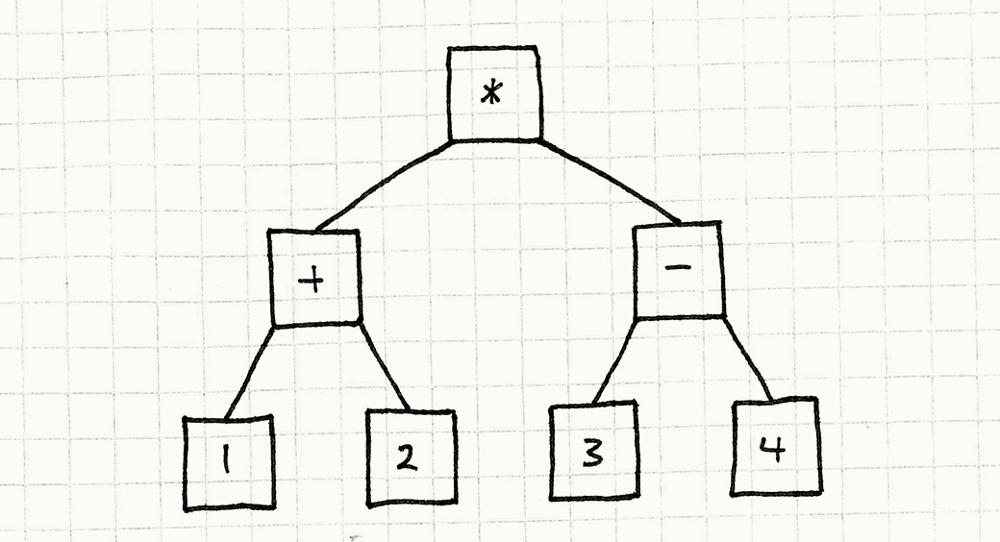
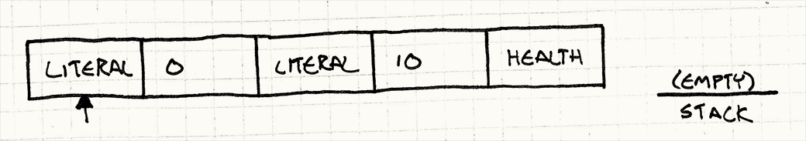
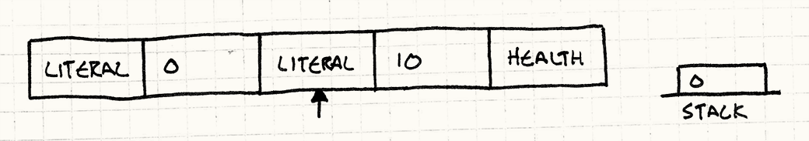
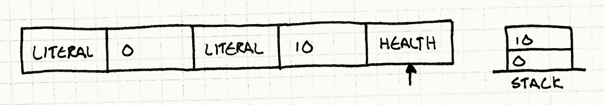
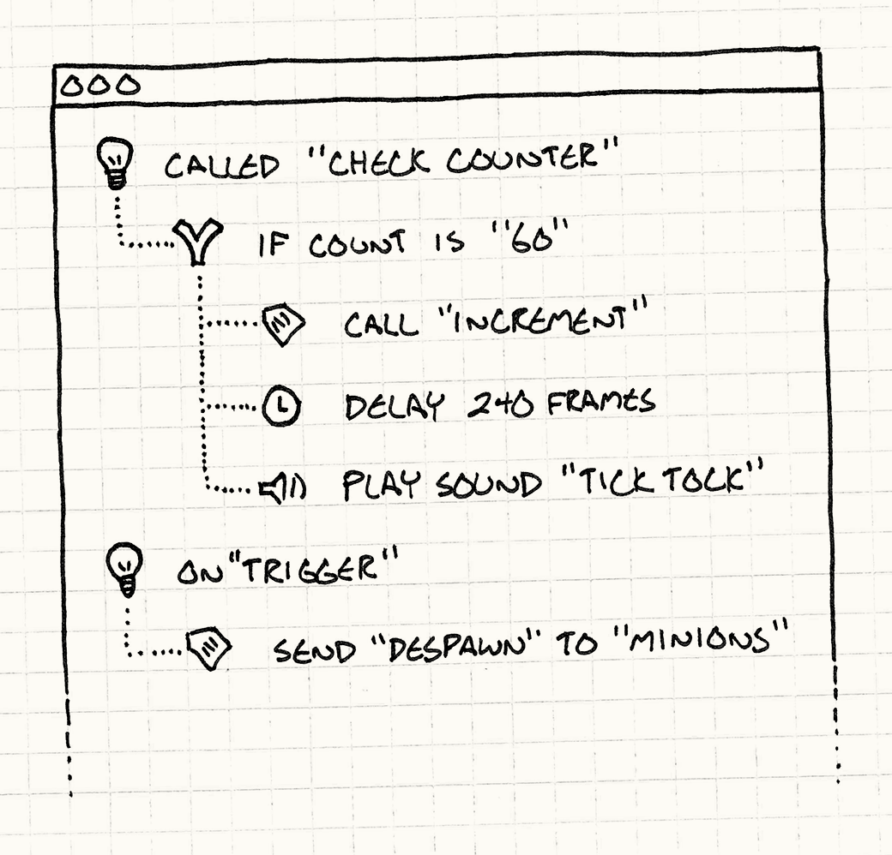

# 字节码

**行为模式**

## 意图

*将行为编码为虚拟机的指令，赋予它数据般的灵活性。*

## 动机

做游戏也许很有趣，但绝对不轻松。现代游戏需要庞大而复杂的代码库。主机厂商和应用商店的守门人有着严苛的质量要求，一个崩溃 bug 就能让你的游戏无法上架。

> 我曾参与开发一款有六百万行 C++ 代码的游戏。相比之下，控制火星好奇号探测车的软件还不到这个数的一半。

与此同时，我们还要从平台上榨取每一滴性能。游戏对硬件的榨取程度无与伦比，为了跟上竞争对手，我们必须不懈地优化。

为了应对这些对稳定性和性能的高要求，我们选用了 C++ 这样的重量级语言——它既有充分发挥硬件能力的底层表达力，又有丰富的类型系统来预防或至少约束 bug。

我们以这方面的技能为傲，但它也有代价。成为一名熟练的程序员需要多年专注的磨炼，之后你还要应对代码库的庞大规模。大型游戏的编译时间轻则"去泡杯咖啡"，重则"去自己烘豆、手磨、拉一杯浓缩、打奶泡、在泡沫上练拉花艺术"。

在这些挑战之上，游戏还有一个更令人头疼的约束：*趣味性*。玩家既渴望新鲜体验，又要求精心调校的平衡。这需要不断迭代；但如果每次调整都要麻烦工程师在一堆底层代码里折腾，然后等待漫长的重新编译，创意之流早就断了。

### 法术对决！

假设我们在开发一款以魔法为核心的格斗游戏。两位巫师对决，互相施展魔法，直到分出胜负。我们可以在代码里定义这些法术，但这意味着每次修改都需要工程师介入。当设计师想调几个数值试试效果时，他们必须重新编译整个游戏，重启，再回到战斗场景。

和现在大多数游戏一样，我们还需要在发布后能够更新游戏——既修复 bug，也添加新内容。如果所有法术都硬编码，更新它们就意味着给实际的游戏可执行文件打补丁。

让我们再进一步：假设我们还想支持*模组（mod）*。我们希望*用户*能够创建自己的法术。如果法术在代码里，那每个 mod 制作者都需要一整套编译工具链才能构建游戏，而且我们还得开放源代码。更糟的是，如果他们的法术有 bug，可能会在其他玩家的机器上造成崩溃。

### 数据 > 代码

很显然，我们引擎的实现语言并不适合这个任务。我们需要法术能被安全地沙箱化，与核心游戏隔离。我们希望它们易于修改、易于热重载，且在物理上与可执行文件的其余部分分离。

在我看来，这听起来很像是*数据*。如果我们能把行为定义在独立的数据文件中，由游戏引擎加载并以某种方式"执行"，就能实现所有这些目标。

我们只需要搞清楚"执行"对于数据意味着什么。如何让文件里的几个字节表达行为？方法有几种。我认为，通过与另一个模式做对比，能帮你更清楚地看到*这个*模式的优缺点：四人帮的[解释器](http://en.wikipedia.org/wiki/Interpreter_pattern)（Interpreter）模式。

### 解释器模式

我本可以专门写一章来讲这个模式，但四位前辈已经替我做过了。我在这里只做最简短的介绍。它从一门语言开始——想想*编程*语言——你想要执行它。比如，它支持这样的算术表达式：

```
(1 + 2) * (3 - 4)
```

然后，你把表达式的每个组成部分、语言语法中的每条规则，都转化为一个*对象*。数字字面量会成为对象：


基本上，它们是对原始值的轻量封装。运算符也会成为对象，并持有对其操作数的引用。考虑括号和优先级之后，那个表达式就神奇地变成了一棵小小的对象树：



> 这里的"神奇"是什么？很简单——*解析*。解析器读入一串字符，生成一棵*抽象语法树*（AST）——一组代表文本语法结构的对象。写出这样一个工具，你就完成了半个编译器。

解释器模式的重点不在于*创建*这棵树，而在于*执行*它。它的工作方式相当巧妙：树中的每个对象都是一个表达式或子表达式。遵循纯粹的面向对象风格，我们让表达式自行求值。

首先，我们定义所有表达式都要实现的基础接口：

```cpp
class Expression
{
public:
  virtual ~Expression() {}
  virtual double evaluate() = 0;
};
```

然后，我们为语言语法中的每种表达式定义一个实现该接口的类。最简单的是数字：

```cpp
class NumberExpression : public Expression
{
public:
  NumberExpression(double value)
  : value_(value)
  {}

  virtual double evaluate()
  {
    return value_;
  }

private:
  double value_;
};
```

数字字面量表达式直接求值为它的值。加法和乘法稍微复杂一些，因为它们包含子表达式。在自行求值之前，它们需要递归地对子表达式求值，就像这样：

> 乘法的实现长什么样，我相信你能猜到。

```cpp
class AdditionExpression : public Expression
{
public:
  AdditionExpression(Expression* left, Expression* right)
  : left_(left),
    right_(right)
  {}

  virtual double evaluate()
  {
    // 对操作数求值。
    double left = left_->evaluate();
    double right = right_->evaluate();

    // 相加。
    return left + right;
  }

private:
  Expression* left_;
  Expression* right_;
};
```

> `Ruby`（一种动态编程语言）就是这样实现了大约 15 年的。在 1.9 版本中，它切换到了本章所描述的字节码方式。看看我为你省了多少时间！

这是个漂亮而简洁的模式，但也有一些问题。看看上面那幅插图——你看到了什么？许多小方框，方框之间有许多箭头。代码被表示为一棵由微小对象构成的蔓延分形树。这带来了一些令人不快的后果：

- 从磁盘加载它需要实例化并连接大量这样的小对象。
- 这些对象以及它们之间的指针占用大量*内存*。在 32 位机器上，上面那个小小的算术表达式至少要占 68 字节，还不算填充。

  > 如果你想在家里试试，别忘了把虚表指针也算进去。

- 顺着指针进入子表达式，会对你的*数据缓存*造成致命打击。与此同时，所有那些虚方法调用也会对指令缓存大打出手。

  > 关于缓存是什么以及它如何影响性能，请参见[数据局部性](data-locality.html)一章。

把这些加在一起，拼出来的是什么？S-L-O-W（慢）。广泛使用的编程语言中，大多数并不基于解释器模式，是有原因的——它实在太慢，内存占用也太大。

### 虚拟机器码

想想我们的游戏。运行它时，玩家的计算机在运行时并不遍历一堆 C++ 语法树结构。相反，我们提前将它编译成机器码，由 CPU 直接执行。机器码有什么过人之处？

- *密集。* 它是一坨紧凑、连续的二进制数据，没有任何一位被浪费。
- *线性。* 指令紧密排列，一条接着一条执行。在内存中没有东跳西跑（当然，除非你在执行实际的控制流）。
- *底层。* 每条指令只做一件相对简单的事，有趣的行为来自于将它们*组合*起来。
- *快速。* 由于以上所有特性（当然还因为它直接在硬件上实现），机器码跑起来如风一般。

这听起来很美，但我们不想让法术使用真正的机器码。允许用户提供由游戏执行的机器码，无异于主动邀请*安全漏洞*。我们需要的是机器码的性能与解释器模式的安全性之间的折中方案。

> 这正是许多游戏主机和 iOS 不允许程序在运行时执行加载或动态生成的机器码的原因。这很令人沮丧，因为最快的编程语言实现恰恰就是这么做的——它们内置了"即时编译器"（JIT），能够即时将语言翻译为优化过的机器码。

如果我们不加载真正的机器码并直接执行，而是定义我们自己的*虚拟*机器码呢？我们可以在游戏里为它写一个小型模拟器。它与机器码类似——密集、线性、相对底层——但完全由我们的游戏来处理，因此可以安全地将其沙箱化。

> 在编程语言圈子里，"虚拟机"和"解释器"是同义词，我在这里会交替使用。当我指代四人帮的解释器模式时，会加上"模式"二字以示区分。

我们把这个小型模拟器称为*虚拟机*（简称"VM"），它运行的合成二进制机器码叫做*字节码*。它兼具在数据中定义行为的灵活性和易用性，同时性能也优于解释器模式等更高层次的表示。

这听起来令人生畏。本章后半部分的目标，是向你展示：只要控制住功能列表，它其实相当平易近人。即使最终你自己不用这个模式，至少也能更好地理解 `Lua`（一种轻量级脚本语言）和许多其他通过它实现的语言。

## 模式详解

**指令集**定义了可执行的底层操作。一系列指令被编码为**字节序列**。**虚拟机**逐一执行这些指令，并使用**栈来存储中间值**。通过组合指令，可以定义出复杂的高级行为。

## 适用场景

这是本书中最复杂的模式，不要轻率地将它引入你的游戏。当你需要定义大量行为，而游戏的实现语言又不合适时，可以考虑使用它，具体原因可能有：

- 它太底层，用它编程繁琐且容易出错。
- 由于编译时间过长或其他工具问题，迭代速度太慢。
- 它的权限过于宽泛。如果你想确保正在定义的行为无法破坏游戏，就需要将其与代码库的其他部分沙箱隔离。

当然，这份清单描述的正是你游戏的大部分情况。谁不想要更快的迭代循环或更高的安全性呢？然而，这些并非免费获得。字节码比原生代码慢，所以它并不适合引擎中对性能敏感的部分。

## 注意事项

创造自己的语言或系统中的系统，有一种让人着迷的魔力。我这里只会展示一个极简示例，但在现实世界中，这类东西往往像藤蔓一样蔓延生长。

> 对我来说，游戏开发同样如此。两者都是在努力为他人创造一个可以玩耍和创作的虚拟空间。

每次我看到有人定义一门小语言或脚本系统，他们都会说："放心，它会很小的。"然后，不可避免地，他们一点一点地添加越来越多的小功能，直到它变成一门羽翼丰满的*语言*。只不过，与其他某些语言不同，它是以临时拼凑、有机生长的方式成形的，架构的优雅程度堪比一座棚屋。

> 比如，看看有史以来的每一门模板语言。

当然，做出一门完整的语言并没有什么*错*。只要确保这是你有意为之的。否则，一定要严格控制你的字节码所能表达的范围。在它逃出你的掌控之前，给它套上一根短短的皮带。

### 你需要一个前端工具

底层字节码指令在性能上无懈可击，但二进制字节码格式*并不是*你的用户会去编写的东西。我们把行为从代码中移出，正是为了能以*更高*的层次来表达它。如果 C++ 太底层，让用户实际上是在写*汇编语言*——哪怕是你自己设计的汇编——那也不算任何进步！

> 对这个断言发起挑战的，是著名游戏 `RoboWar`（一款机器人格斗游戏）。在那款游戏里，*玩家*编写小程序来控制机器人，使用的语言非常类似于汇编，就像我们这里要讨论的指令集。那是我第一次接触类汇编语言。

就像四人帮的解释器模式一样，这里假定你还有某种方式来*生成*字节码。通常，用户以某种高层次格式编写行为，再由工具将其转化为虚拟机可以理解的字节码。换句话说，就是一个编译器。

我知道，听起来很吓人。这正是我在这里提及它的原因。如果你没有资源来构建创作工具，字节码就不适合你。但正如我们稍后会看到的，这也许没你想象的那么难。

### 你会想念你的调试器

编程很难。我们知道想让机器做什么，却不总是能准确地传达——于是写出了 bug。为了找到并修复这些 bug，我们积累了一大堆工具来理解代码的哪里出了问题、如何纠正。我们有调试器、静态分析器、反编译器等等。所有这些工具都被设计为与某种现有语言配合使用，无论是机器码还是更高层次的语言。

当你定义自己的字节码虚拟机时，你就把这些工具甩在了身后。当然，你可以在调试器里一步步跟踪虚拟机的执行，但那告诉你的是虚拟机*本身*在做什么，而不是它所解释的字节码在干什么。它当然也无法帮你把字节码映射回编译前的高层次形式。

如果你要定义的行为比较简单，没有太多工具辅助调试也能凑合。但随着内容规模的增长，要计划投入真正的时间，来开发帮助用户看清字节码在做什么的功能。这些功能也许不会*随游戏发布*，但它们对于确保你真的*能够发布*游戏至关重要。

> 当然，如果你想让游戏支持 mod，那你*就会*随游戏发布这些功能，而且它们会更加重要。

## 示例代码

经历了前面几节的铺垫，你可能会惊讶于实现有多么直白。首先，我们需要为虚拟机设计一套指令集。在考虑字节码和这些东西之前，先把它想成一套 API。

### 魔法 API

如果我们直接用 C++ 代码定义法术，那段代码需要调用什么样的 API？构成法术的游戏引擎基础操作是什么？

大多数法术最终都会改变巫师的某个属性，所以我们从几个这样的函数开始：

```cpp
void setHealth(int wizard, int amount);
void setWisdom(int wizard, int amount);
void setAgility(int wizard, int amount);
```

第一个参数指定影响哪位巫师，比如 `0` 代表玩家的巫师，`1` 代表对手。这样，治疗法术可以作用于玩家自己的巫师，而攻击法术则伤害对手。这三个小函数涵盖了相当广泛的魔法效果。

如果法术只是静悄悄地改改属性，游戏逻辑倒是没问题，但玩起来会无聊得要命。我们来解决这个问题：

```cpp
void playSound(int soundId);
void spawnParticles(int particleType);
```

这些不影响游戏逻辑，但会大大提升游戏*体验*的强度。我们还可以添加镜头震动、动画等，但这已经够我们入门了。

### 魔法指令集

现在来看看如何把这套*程序性* API 转化为可以从数据控制的东西。我们从小处着手，然后逐步扩展到整套体系。目前，我们先去掉这些函数的所有参数。规定 `set___()` 函数始终作用于玩家自己的巫师，且始终将属性提升到最大值。类似地，特效操作始终播放一个固定的音效和粒子效果。

基于这些限制，一个法术就是一系列指令。每条指令标识你想执行哪个操作。我们可以用枚举来列举：

```cpp
enum Instruction
{
  INST_SET_HEALTH      = 0x00,
  INST_SET_WISDOM      = 0x01,
  INST_SET_AGILITY     = 0x02,
  INST_PLAY_SOUND      = 0x03,
  INST_SPAWN_PARTICLES = 0x04
};
```

为了在数据中编码一个法术，我们存储一个 `enum` 值的数组。我们的原语只有几个，所以 `enum` 值的范围轻松容纳在一个字节里。这意味着法术的代码就是一个*字节*列表——故称"字节码"。


> 有些字节码虚拟机每条指令用超过一个字节，解码规则也更复杂。x86 等常见芯片上的实际机器码要复杂得多。
>
> 但单字节对于 `Java 虚拟机`（JVM，Java 程序的运行环境）和微软的 `CLR`（通用语言运行时，.NET 平台的核心）来说已经足够，对我们也足够。

要执行单条指令，我们判断它是哪种原语，然后分发到对应的 API 方法：

```cpp
switch (instruction)
{
  case INST_SET_HEALTH:
    setHealth(0, 100);
    break;

  case INST_SET_WISDOM:
    setWisdom(0, 100);
    break;

  case INST_SET_AGILITY:
    setAgility(0, 100);
    break;

  case INST_PLAY_SOUND:
    playSound(SOUND_BANG);
    break;

  case INST_SPAWN_PARTICLES:
    spawnParticles(PARTICLE_FLAME);
    break;
}
```

就这样，我们的解释器在代码世界和数据世界之间搭起了一座桥梁。我们可以把它包进一个能执行整个法术的小型虚拟机：

```cpp
class VM
{
public:
  void interpret(char bytecode[], int size)
  {
    for (int i = 0; i < size; i++)
    {
      char instruction = bytecode[i];
      switch (instruction)
      {
        // 每条指令对应的 case……
      }
    }
  }
};
```

把这些敲进去，你就写出了你的第一个虚拟机。不幸的是，它的灵活性很差。我们没法定义影响对手巫师或降低属性的法术，也只能播放一种音效！

要让它开始具有真正语言的表达力，我们需要引入参数。

### 栈式机器

要执行一个复杂的嵌套表达式，你从最内层的子表达式开始。计算它们，结果向外流作为包含它们的表达式的参数，直到整个表达式被求完值。

解释器模式把这个过程明确地建模为嵌套对象树，但我们想要扁平指令列表的速度。我们仍然需要确保子表达式的结果流向正确的外层表达式。但由于我们的数据是扁平的，必须用指令的*顺序*来控制这一点。方法和 CPU 一样——用*栈*。

> 这种架构不加修饰地被称为[*栈式机器*](http://en.wikipedia.org/wiki/Stack_machine)。`Forth`（一种基于栈的编程语言）、`PostScript`（一种页面描述编程语言）和 `Factor`（一种基于栈的函数式编程语言）等编程语言直接将这种模型暴露给用户。

```cpp
class VM
{
public:
  VM()
  : stackSize_(0)
  {}

  // 其他内容……

private:
  static const int MAX_STACK = 128;
  int stackSize_;
  int stack_[MAX_STACK];
};
```

虚拟机维护一个内部值栈。在我们的例子中，指令只处理数字类型的值，所以可以用一个简单的 `int` 数组。每当一块数据需要从一条指令传递到另一条指令，都通过这个栈来完成。

顾名思义，值可以压入栈或从栈弹出，所以我们添加几个方法：

```cpp
class VM
{
private:
  void push(int value)
  {
    // 检查栈是否溢出。
    assert(stackSize_ < MAX_STACK);
    stack_[stackSize_++] = value;
  }

  int pop()
  {
    // 确保栈不为空。
    assert(stackSize_ > 0);
    return stack_[--stackSize_];
  }

  // 其他内容……
};
```

当某条指令需要接收参数时，它从栈顶弹出它们：

```cpp
switch (instruction)
{
  case INST_SET_HEALTH:
  {
    int amount = pop();
    int wizard = pop();
    setHealth(wizard, amount);
    break;
  }

  case INST_SET_WISDOM:
  case INST_SET_AGILITY:
    // 同上……

  case INST_PLAY_SOUND:
    playSound(pop());
    break;

  case INST_SPAWN_PARTICLES:
    spawnParticles(pop());
    break;
}
```

为了把一些值*放到*栈上，我们还需要一种指令：字面量（literal）。它代表一个原始整数值。但它的值从*哪里*来？我们怎么避免"无限龟背"式的无穷倒退？

诀窍是利用我们的指令流是字节序列这一事实——可以直接把数字塞进字节数组里。我们为数字字面量定义另一种指令类型：

> 这里我只读取单个字节作为值，以避免解码多字节整数所需的繁琐代码。但在真正的实现中，你会希望支持覆盖完整数值范围的字面量。

```cpp
case INST_LITERAL:
{
  // 从字节码流中读取下一个字节，将其作为数字。
  int value = bytecode[++i];
  push(value);
  break;
}
```


它把字节码流中的下一个字节作为*数字*读取，并压入栈。

我们把几条这样的指令串在一起，观察解释器执行它们的过程，感受一下栈是如何工作的。我们从空栈开始，解释器指向第一条指令：



首先，执行第一条 `INST_LITERAL`。它从字节码中读取下一个字节（`0`），并将其压入栈：



然后，执行第二条 `INST_LITERAL`。它读取 `10` 并压入栈：



最后，执行 `INST_SET_HEALTH`。它弹出 `10` 存入 `amount`，再弹出 `0` 存入 `wizard`，然后用这两个参数调用 `setHealth()`。

好了！我们有了一个将玩家巫师生命值设为十点的法术。现在，我们已经有了足够的灵活性，可以定义将任意巫师的任意属性设为任意值的法术，也可以播放不同的音效和召唤粒子效果。

但……这仍然感觉像一种*数据*格式。我们还没办法，比如，将巫师的生命值提升为其智慧的一半。设计师们希望能表达法术的*规则*，而不只是*数值*。

### 行为 = 组合

如果把我们的小型虚拟机看作一门编程语言，它目前支持的只有几个内置函数和常量参数。要让字节码真正具有*行为*的感觉，缺少的是*组合*能力。

设计师需要能创建以有趣方式组合不同值的表达式。举个简单的例子：他们想要能让属性*增加*某个量，而不是*设置*为某个量。

这需要考虑属性的当前值。我们有*写*属性的指令，还需要添加几个*读*属性的指令：

```cpp
case INST_GET_HEALTH:
{
  int wizard = pop();
  push(getHealth(wizard));
  break;
}

case INST_GET_WISDOM:
case INST_GET_AGILITY:
  // 以此类推……
```

如你所见，这些指令与栈的交互是双向的：它们弹出参数来确定要获取哪位巫师的属性，然后查找属性值并将其压回栈。

这让我们能够编写复制属性的法术。我们可以创建一个将巫师敏捷设为其智慧的法术，或者创建一个让一位巫师的生命值镜像对手的奇怪咒语。

更进一步，但仍然相当有限。接下来，我们需要算术运算——是时候让我们的小型虚拟机学会计算 1 + 1 了。我们再添加几条指令。到现在你大概已经掌握了规律，可以猜到它们长什么样。我只展示加法：

```cpp
case INST_ADD:
{
  int b = pop();
  int a = pop();
  push(a + b);
  break;
}
```

和其他指令一样，它弹出几个值，做一点工作，然后把结果压回栈。到目前为止，每条新指令都给我们带来了表达力的渐进提升，但这次我们迈出了一大步。这不那么显而易见，但我们现在已经能处理各种复杂的、深度嵌套的算术表达式了。

让我们看一个稍微复杂的例子。假设我们想要一个将玩家巫师的生命值提升其敏捷与智慧平均值的法术。用代码表示就是：

```cpp
setHealth(0, getHealth(0) +
    (getAgility(0) + getWisdom(0)) / 2);
```

你可能以为我们需要专门处理括号给出的显式分组的指令，但栈已经隐式地支持了这一点。下面是你可以手动推演这个过程的方法：

1. 获取巫师当前生命值，记住它。
2. 获取巫师的敏捷，记住它。
3. 对智慧做同样的事。
4. 取出后两个值，相加，记住结果。
5. 除以 2，记住结果。
6. 调出巫师的生命值，与该结果相加。
7. 取该结果，将巫师的生命值设为该值。

你看到所有那些"记住"和"调出"了吗？每个"记住"对应一次压栈，"调出"对应弹栈。这意味着我们可以相当容易地把这个过程翻译成字节码。例如，获取巫师当前生命值的第一行是：

```
LITERAL 0
GET_HEALTH
```

这段字节码将巫师的生命值压入栈。如果我们机械地翻译每一行，就能得到一段对原始表达式求值的字节码。为了让你感受指令是如何组合的，我在下面这样做了。

为了展示栈如何随时间变化，我们将走一遍样例执行过程，假设巫师当前属性为生命值 45、敏捷 7、智慧 11。每条指令后面是执行完该指令后栈的状态，以及一条说明指令用途的小注释：

```text
LITERAL 0    [0]            # 巫师索引
LITERAL 0    [0, 0]         # 巫师索引
GET_HEALTH   [0, 45]        # getHealth()
LITERAL 0    [0, 45, 0]     # 巫师索引
GET_AGILITY  [0, 45, 7]     # getAgility()
LITERAL 0    [0, 45, 7, 0]  # 巫师索引
GET_WISDOM   [0, 45, 7, 11] # getWisdom()
ADD          [0, 45, 18]    # 敏捷加智慧
LITERAL 2    [0, 45, 18, 2] # 除数
DIVIDE       [0, 45, 9]     # 敏捷与智慧的平均值
ADD          [0, 54]        # 平均值加上当前生命值
SET_HEALTH   []             # 将生命值设为结果
```

如果你观察每一步的栈状态，就能看到数据几乎像变魔术一样在其中流动。我们一开始压入 `0` 作为巫师索引，它就静静地待在栈底，直到最后 `SET_HEALTH` 时才用上它。

> 也许我对"魔术"的判断标准有点太低了。

### 一台虚拟机

我可以继续下去，添加越来越多的指令，但现在是个合适的停顿点。就现在的状态而言，我们已经拥有了一个漂亮的小型虚拟机，可以用简单、紧凑的数据格式定义相当开放的行为。虽然"字节码"和"虚拟机"听起来令人生畏，但你可以看到它们往往就是一个栈、一个循环和一个 switch 语句那么简单。

还记得我们最初让行为被良好沙箱化的目标吗？现在你已经看到了虚拟机的具体实现，显然我们已经做到了。字节码无法做任何恶意的事，也无法伸手触碰游戏引擎的奇怪角落，因为我们只定义了少数几条与游戏其余部分交互的指令。

我们通过栈的大小来控制它使用多少内存，并小心确保它不会溢出。我们甚至可以控制它使用多少*时间*——在指令循环中，可以追踪执行了多少条指令，超过某个上限就退出。

> 在我们的示例中，控制执行时间并非必须，因为我们没有任何循环指令。我们可以通过限制字节码的总大小来限制执行时间。这也意味着我们的字节码不是图灵完备的。

只剩下最后一个问题：如何实际创建字节码。到目前为止，我们一直是把伪代码手工编译成字节码。除非你有*大量*的空闲时间，否则这在实践中行不通。

### 施法工具

我们最初的目标之一，是拥有一种*更高层*的行为编写方式，结果却搞出了一种比 C++ *更底层*的东西。它有我们想要的运行时性能和安全性，但完全没有对设计师友好的易用性。

为了填补这一空缺，我们需要一些工具。我们需要一个程序，让用户定义法术的高层行为，然后将其生成相应的底层栈机字节码。

这听起来可能比实现虚拟机难多了。许多程序员在大学里被编译原理课程折磨过，留下的记忆无非是一看到封面印有龙图案的*书*，或是听到"`lex`（一款词法分析器生成器）"和"`yacc`（一款语法分析器生成器）"这两个词就犯 PTSD。

> 我指的当然是经典教材[《编译原理》](http://en.wikipedia.org/wiki/Compilers:_Principles,_Techniques,_and_Tools)（又称龙书）。

说实话，编译一门基于文本的语言并没有那么可怕，只不过这个话题太宽泛，没办法塞进这里。但你并不一定要那么做。我说我们需要的是一个*工具*——它不必是一个输入格式为*文本文件*的*编译器*。

恰恰相反，我鼓励你考虑构建一个图形界面，让用户可视化地定义他们的行为，尤其当使用者技术水平不高时。对于没有多年在编译器的咆哮声中历练的人来说，写出没有语法错误的文本是非常困难的。

你可以构建一个应用，让用户通过点击拖拽小方块、从菜单中选择选项，或任何其他对他们想创建的行为类型有意义的方式来"脚本化"。

> 我为 `Henry Hatsworth in the Puzzling Adventure`（一款 DS 平台解谜冒险游戏）编写的脚本系统就是这样工作的。



这样做的好处是，你的 UI 可以让用户完全无法创建"无效"的程序。你可以主动禁用按钮或提供默认值，而不是给他们抛出一堆错误信息，确保他们创建的东西在任何时刻都是有效的。

> 我想强调错误处理有多重要。作为程序员，我们倾向于把人为错误视为一种羞耻的性格缺陷，并努力在自己身上消除它。
>
> 要打造用户喜爱的系统，你必须拥抱用户的人性，*包括他们的易错性*。犯错是人的本能，也是创意过程的基本组成部分。用撤销等功能优雅地处理错误，能让你的用户更有创造力，做出更好的作品。

这让你免于为一门小语言设计语法、编写解析器。但我知道，有些人对 UI 编程同样抗拒。好吧，对于这类人，我没有什么好消息。

归根结底，这个模式是关于以对用户友好的高层方式表达行为。你必须打磨用户体验。为了高效地执行行为，你还需要将其翻译为更底层的形式。这是真正的工作，但如果你能够迎接挑战，回报是丰厚的。

## 设计决策

我努力让本章保持简洁，但我们实际上在做的是创造一门语言。这是一个相当开放的设计空间。探索它会非常有趣，所以一定要记得别忘了把游戏做完。

> 既然这是书中最长的章节，看来我没能完成这个任务。

### 指令如何访问栈？

字节码虚拟机主要有两种风格：基于栈（stack-based）和基于寄存器（register-based）。在栈式虚拟机中，指令始终从栈顶取值，就像我们的示例代码一样。例如，`INST_ADD` 弹出两个值，相加，然后将结果压回栈。

寄存器式虚拟机仍然有栈，唯一的区别是指令可以从栈的更深处读取输入。`INST_ADD` 不是总是*弹出*操作数，而是在字节码中存储了两个索引，指明从栈的哪个位置读取操作数。

**栈式虚拟机：**

- *指令更小。* 由于每条指令隐式地从栈顶获取参数，你不需要在指令中编码任何额外数据。这意味着每条指令可以很小，通常只有一个字节。
- *代码生成更简单。* 当你着手编写输出字节码的编译器或工具时，你会发现生成基于栈的字节码更简单。由于每条指令隐式地从栈顶取值，你只需以正确的顺序输出指令，参数就会在它们之间正确传递。
- *你需要更多指令。* 每条指令只能看到栈顶。这意味着要为 `a = b + c` 这样的表达式生成代码，你需要单独的指令将 `b` 和 `c` 移到栈顶、执行运算，然后将结果移入 `a`。

**寄存器式虚拟机：**

- *指令更大。* 由于指令需要栈偏移量作为参数，单条指令需要更多位。例如，`Lua`（一种轻量级脚本语言）中的指令——可能是最知名的寄存器式虚拟机——完整地使用 32 位：6 位用于指令类型，其余位用于参数。

  > Lua 的团队并未规范 Lua 的字节码格式，它会随版本变化。我这里描述的是 Lua 5.1 的情况。如果想深入了解 Lua 的内部实现，可以阅读[这篇文章](http://luaforge.net/docman/83/98/ANoFrillsIntroToLua51VMInstructions.pdf)。

- *你需要的指令更少。* 由于每条指令能做更多工作，所需指令数量更少。有人说这能带来性能提升，因为在栈中来回搬移值的操作少了。

那么该选哪种？我的建议是坚持使用栈式虚拟机。它们实现更简单，代码生成也简单得多。寄存器式虚拟机在 Lua 切换到这种风格后获得了"速度稍快"的名声，但这*深度依赖*于你的具体指令集和虚拟机的许多其他细节。

### 你有哪些指令？

你的指令集定义了字节码能够表达和不能表达的边界，也对你的虚拟机性能有重大影响。以下是你可能需要的各类指令清单：

**外部原语（External primitives）：** 这些指令跳出虚拟机，深入游戏引擎的其他部分，执行用户可见的操作。它们控制了字节码中能表达哪些真实行为。没有这些，你的虚拟机除了空耗 CPU 周期什么也做不了。

**内部原语（Internal primitives）：** 这些在虚拟机内部操作值——比如字面量、算术运算、比较运算符，以及整理栈的指令。

**控制流（Control flow）：** 我们的示例没有涉及这些，但当你需要命令式的、条件执行指令或循环执行指令多次的行为时，就需要控制流。在字节码这种底层语言中，它们出奇地简单：跳转（jump）。

在我们的指令循环中，我们有一个索引追踪当前执行到字节码的哪个位置。跳转指令做的就是修改这个变量，改变我们当前执行的位置。换句话说，就是一个 `goto`。你可以用它构建各种高层次的控制流结构。

**抽象（Abstraction）：** 如果你的用户开始在数据里定义*大量*内容，最终他们会想要复用字节码片段，而不是反复复制粘贴。你可能需要类似可调用过程的东西。

最简单形式的过程，比跳转复杂不了多少。唯一的区别是虚拟机维护第二个*返回*栈。执行"调用"指令时，它把当前指令索引压入返回栈，然后跳转到被调用的字节码。碰到"返回"时，虚拟机从返回栈弹出索引，跳转回去。

### 如何表示值？

我们的示例虚拟机只处理一种值：整数。这让回答这个问题变得容易——栈就是一个 `int` 的栈。功能更完整的虚拟机会支持不同的数据类型：字符串、对象、列表等。你必须决定如何在内部存储它们。

**单一数据类型：**

- *简单。* 你不必担心类型标签、转换或类型检查。
- *无法处理不同的数据类型。* 这是显而易见的缺点。把不同类型强行挤进单一表示——比如把数字存储为字符串——是在自找麻烦。

**带标记的联合体（Tagged variant）：**

这是动态类型语言的常见表示方式。每个值由两部分组成：第一部分是类型标签——一个 `enum`，标识正在存储的数据类型；其余位根据该类型进行解释，例如：

```cpp
enum ValueType
{
  TYPE_INT,
  TYPE_DOUBLE,
  TYPE_STRING
};

struct Value
{
  ValueType type;
  union
  {
    int    intValue;
    double doubleValue;
    char*  stringValue;
  };
};
```

- *值知道自己的类型。* 这种表示方式的好处是可以在运行时检查值的类型。这对于动态分发以及确保不对不支持某操作的类型执行该操作非常重要。
- *占用更多内存。* 每个值都要携带几个额外的位来标识其类型。在虚拟机这种底层环境中，零零碎碎的几位积累起来很快。

**无标记联合体（Untagged union）：**

与前一种形式一样使用 union，但*没有*附带的类型标签。你有一小块可以代表多种类型的位，靠你自己确保不会误读它们。

这就是静态类型语言在内存中表示事物的方式。由于类型系统在编译时确保你不会误解值，运行时不需要验证。

> 这也是汇编和 Forth 这样的*无类型*语言存储值的方式。这些语言把不写出误解值类型的代码的责任留给*用户*。不是给胆小者准备的！

- *紧凑。* 无法比只存储值本身所需的位更高效了。
- *快速。* 没有类型标签意味着运行时也不用花周期去检查它们。这是静态类型语言往往比动态语言更快的原因之一。
- *不安全。* 这才是真正的代价。一块错误的字节码导致你误读一个值，把数字当成指针处理（反之亦然），可能会破坏游戏的安全性或使其崩溃。

  > 如果你的字节码是从静态类型语言编译而来，你可能觉得自己是安全的，因为编译器不会生成不安全的字节码。这也许是真的，但请记住，恶意用户可能会手工构造恶意字节码，完全绕过你的编译器。
  >
  > 这就是为什么 Java 虚拟机加载程序时必须做*字节码验证*。

**接口（Interface）：**

面向对象的解决方案，对于可能是多种不同类型之一的值，通过多态来处理。接口为各种类型检查和转换提供虚方法，大致如下：

```cpp
class Value
{
public:
  virtual ~Value() {}

  virtual ValueType type() = 0;

  virtual int asInt() {
    // 只能在整数上调用。
    assert(false);
    return 0;
  }

  // 其他转换方法……
};
```

然后为每种具体数据类型定义一个具体类，例如：

```cpp
class IntValue : public Value
{
public:
  IntValue(int value)
  : value_(value)
  {}

  virtual ValueType type() { return TYPE_INT; }
  virtual int asInt() { return value_; }

private:
  int value_;
};
```

- *可扩展。* 只要实现了基础接口，你可以在核心虚拟机之外定义新的值类型。
- *面向对象。* 如果你坚守面向对象原则，这以"正确"的方式做事——使用多态分发来处理类型特定的行为，而不是切换类型标签之类的做法。
- *冗长。* 每种数据类型都必须定义一个单独的类，连同所有相关的样板代码。注意，在前几个例子中，我们展示了*全部*值类型的完整定义；这里，我们只覆盖了一种！
- *低效。* 为了获得多态性，你必须通过指针间接访问，这意味着即使是布尔值和数字这样的小值也要被包装成堆上分配的对象。每次访问一个值，都要做一次虚方法调用。

在类似虚拟机核心这样的环境里，这样的小性能损耗会迅速累积。事实上，这遭受着与促使我们放弃解释器模式同样的许多问题，只不过现在问题出在我们的*值*上，而不是*代码*上。

我的建议是：如果你能坚持使用单一数据类型，就那么做。否则，使用带标记的联合体。世界上几乎每一种语言解释器都是这么做的。

### 字节码如何生成？

我把最重要的问题留到最后。我带你走过了*消费*和*解释*字节码的代码，但如何*生成*字节码则由你来构建。通常的解决方案是写一个编译器，但这不是唯一的选择。

**如果你定义了基于文本的语言：**

- *你必须定义语法。* 业余和专业语言设计者都会系统性地低估这有多难。定义让解析器满意的语法很容易，定义让*用户*满意的语法则*很难*。语法设计就是用户界面设计，把用户界面约束为一串字符，这个过程不会变得容易。
- *你必须实现解析器。* 尽管名声不好，这部分其实相当容易。使用 `ANTLR`（一款解析器生成器工具）或 `Bison`（一款语法分析器生成器工具）这样的解析器生成器，或者像我一样手写一个小型递归下降解析器，就可以了。
- *你必须处理语法错误。* 这是整个过程中最重要也最困难的部分之一。当用户出现语法或语义错误——他们会不断地犯——你有责任引导他们回到正确的路上。当你的解析器卡在某个意外的标点符号上时，提供有用的反馈并不容易。
- *这可能会让非技术用户望而却步。* 我们程序员喜欢文本文件。结合强大的命令行工具，我们把它们视为计算世界的乐高积木——简单，却能以无数种方式轻松组合。大多数非程序员不这么看待纯文本。对他们来说，文本文件就像在给一台愤怒的机器人税务审计员填写税表——漏了一个分号就要被大吼。

**如果你定义了图形创作工具：**

- *你必须实现用户界面。* 按钮、点击、拖拽，诸如此类。有些人一听就皱眉，但我个人很喜欢。如果走这条路，重要的是把设计用户界面当作做好工作的核心部分——而不仅仅是一项需要应付过去的不愉快任务。你在这里多付出一点努力，就能让你的工具更易用更愉快，这直接带来游戏内容的质量提升。如果你看看你喜爱的许多游戏背后，往往会发现其中的秘诀是有趣的创作工具。
- *错误情况更少。* 由于用户是一步一步交互式地构建行为，你的应用可以在错误发生的第一时间引导他们远离失误。使用基于文本的语言时，工具直到用户把一整个文件扔过来才能看到任何内容，这让预防和处理错误变得更难。
- *可移植性更差。* 文本编译器的好处在于文本文件是通用的。一个简单的编译器只需读入一个文件，写出一个文件，跨操作系统移植轻而易举。

  > 当然，除了行尾格式。还有编码。

  构建 UI 时，你必须选择使用哪个框架，而许多框架是针对特定操作系统的。也有跨平台 UI 工具包，但它们往往以牺牲熟悉感来换取普遍性——在所有平台上都同样显得格格不入。

## 另请参阅

- 这个模式的近亲是四人帮的[解释器](http://en.wikipedia.org/wiki/Interpreter_pattern)模式。两者都提供了一种用数据来表达可组合行为的方式。实际上，你往往会*同时*使用这两个模式。用于生成字节码的工具内部会有一棵表示代码的对象树，这正是解释器模式所期望的。为了将其编译为字节码，你会递归地遍历这棵树，就像用解释器模式对其求值一样。唯一的区别在于，不是立即执行一个基础行为，而是输出相应的字节码指令以供稍后执行。
- `Lua`（一种轻量级脚本语言）是游戏中使用最广泛的脚本语言，其内部实现为一个非常紧凑的寄存器式字节码虚拟机。
- `Kismet`（Unreal Editor 中的图形化脚本工具）是内置于 Unreal 引擎编辑器 UnrealEd 中的一款图形化脚本工具。
- 作者自己的小型脚本语言 `Wren`（作者编写的一门小型栈式字节码脚本语言）是一个简单的栈式字节码解释器。
