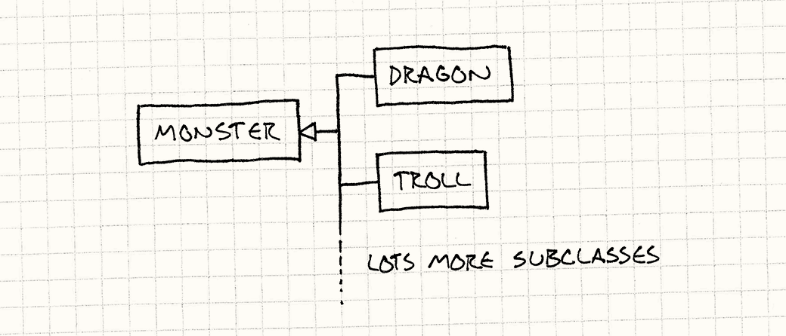
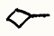

# 类型对象

**行为模式**

## 意图

*通过创建单一类，让其每个实例代表一种不同类型的对象，从而灵活地创建新"类"。*

## 动机

想象我们正在开发一款奇幻角色扮演游戏。我们的任务是为那些一心想杀死英勇主角的成群怪物编写代码。怪物有许多不同的属性：生命值、攻击方式、图形、音效等等，但为了举例方便，我们只关心前两个。

游戏中每只怪物都有一个当前生命值，从满血开始，每次受伤就减少。怪物还有一个攻击字符串——当怪物攻击主角时，这段文字会以某种方式显示给玩家（具体怎么显示这里不管）。

设计师告诉我们，怪物有各种不同的*种族*，比如"龙"或"巨魔"。每种种族描述了游戏中存在的一*类*怪物，同一种族可以有多只怪物同时在地牢里游荡。

种族决定了怪物的初始生命值——龙比巨魔的初始生命值更高，因此更难被消灭。种族也决定了攻击字符串——同一种族的所有怪物攻击方式完全相同。

### 典型的 OOP 答案

带着这样的游戏设计，我们打开文本编辑器开始编码。按照设计，龙"是一种"怪物，巨魔是另一种，其他种族以此类推。从面向对象的角度考虑，这引导我们设计一个 `Monster` 基类：

> 这就是所谓的"is-a"（是一种）关系。在传统的 OOP 思维中，由于龙"is-a"怪物，我们通过让 `Dragon` 成为 `Monster` 的子类来建模。正如我们将看到的，子类化只是把这种概念关系固化进代码的方式之一。

```cpp
class Monster
{
public:
  virtual ~Monster() {}
  virtual const char* getAttack() = 0;

protected:
  Monster(int startingHealth)
  : health_(startingHealth)
  {}

private:
  int health_; // 当前生命值。
};
```

公开的 `getAttack()` 函数让战斗代码获取怪物攻击主角时应显示的字符串。每个派生种族类都会覆写它以提供不同的消息。

构造函数是受保护的，接收怪物的初始生命值。我们为每种种族创建派生类，提供各自的公开构造函数，调用这个基类构造函数并传入该种族适合的初始生命值。

现在看看几个种族子类：

> 感叹号让一切都更刺激！

```cpp
class Dragon : public Monster
{
public:
  Dragon() : Monster(230) {}

  virtual const char* getAttack()
  {
    return "The dragon breathes fire!";
  }
};

class Troll : public Monster
{
public:
  Troll() : Monster(48) {}

  virtual const char* getAttack()
  {
    return "The troll clubs you!";
  }
};
```

每个从 `Monster` 派生的类都传入初始生命值，并覆写 `getAttack()` 以返回该种族的攻击字符串。一切按预期运作，不久后，我们的英雄就在各种怪兽之间穿梭厮杀了。代码越写越多，转眼间我们已经有了几十个怪物子类，从酸液史莱姆到僵尸山羊应有尽有。

然后，奇怪的是，事情开始陷入僵局。我们的设计师最终想要*数百种*种族，而我们发现自己把所有时间都花在编写这些七行的小子类和重新编译上。情况越来越糟——设计师想开始调整我们已经编码的种族。我们曾经高效的工作日退化为：

1. 收到设计师的邮件，要求把巨魔的生命值从 48 改成 52。
2. 检出并修改 `Troll.h`。
3. 重新编译游戏。
4. 提交修改。
5. 回复邮件。
6. 重复以上步骤。

我们整天郁闷不已，因为自己沦为了数据搬运工。设计师也沮丧不已，因为调整一个简单的数字要耗费他们漫长的等待时间。我们需要能够在不每次重新编译整个游戏的情况下修改种族属性。更理想的是，我们希望设计师能够在完全不需要程序员介入的情况下创建和调整种族。

### 用一个类来代表类

从高层次来看，我们试图解决的问题很简单。游戏中有一堆不同的怪物，我们希望在它们之间共享某些属性。一群怪物正在痛揍英雄，我们希望其中一些使用相同的攻击文字。我们通过说所有那些怪物属于同一"种族"来定义这一点，而种族决定了攻击字符串。

我们决定用继承来实现这个概念，因为它符合我们对类的直觉。龙是一种怪物，游戏中每条龙都是这个龙"类"的实例。把每种种族定义为抽象基类 `Monster` 的子类，游戏中每只怪物是对应派生种族类的实例，这是对该直觉的镜像映射。我们最终得到这样的类层次结构：

> 这里， 表示"继承自"。



游戏中每只怪物实例都属于某个派生怪物类型。种族越多，类层次结构越大。问题当然就在这里：添加新种族意味着添加新代码，每种种族都必须作为独立类型编译进去。

这能用，但不是唯一的选择。我们也可以把代码架构成：每只怪物*持有*一个种族。不是为每种种族子类化 `Monster`，我们有一个单一的 `Monster` 类和一个单一的 `Breed`（种族）类：

> 这里， 表示"被……引用"。


就是这样。两个类，没有任何继承。在这套系统中，游戏中的每只怪物都是 `Monster` 类的一个普通实例。`Breed` 类包含同一种族所有怪物共享的信息：初始生命值和攻击字符串。

为了把怪物与种族关联起来，我们给每个 `Monster` 实例一个指向包含该种族信息的 `Breed` 对象的引用。要获取攻击字符串，怪物只需在其种族对象上调用一个方法。`Breed` 类本质上定义了怪物的"类型"。每个种族实例是一个代表不同概念*类型*的*对象*，这正是该模式名字的由来：类型对象（Type Object）。

这个模式特别强大之处在于，现在我们可以定义新的*类型*而完全不使代码库复杂化。我们实际上把类型系统的一部分从硬编码的类层次结构中提升出来，变成了可在运行时定义的数据。

我们可以通过用不同值实例化更多 `Breed` 实例来创建数百种不同的种族。如果我们通过从某个配置文件读取的数据来初始化种族，就能完全在数据中定义新的怪物类型。简单到连设计师都能做到！

## 模式详解

定义一个**类型对象**类和一个**被类型化的对象**类。每个类型对象实例代表一种不同的逻辑类型。每个被类型化的对象存储**对描述其类型的类型对象的引用**。

特定于实例的数据存储在被类型化的对象实例中，应在同一概念类型所有实例之间共享的数据或行为存储在类型对象中。引用同一类型对象的对象将表现得好像它们是同一类型一样。这让我们能够在一组相似对象之间共享数据和行为，就像子类化能做到的那样，但不必有一组固定的硬编码子类。

## 适用场景

每当你需要定义各种不同"种类"的事物，但把种类固化进语言的类型系统又过于死板时，这个模式就很有用。尤其是当以下任一情况成立时：

- 你预先不知道需要哪些类型。（例如，如果游戏需要支持下载包含新怪物种族的内容呢？）
- 你希望能够修改或添加新类型，而无需重新编译或修改代码。

## 注意事项

这个模式是关于把"类型"的定义从命令式但死板的代码语言，移入更灵活但行为性较弱的内存对象世界。灵活性是好的，但把类型提升到数据中，你也会失去一些东西。

### 类型对象必须手动追踪

使用 C++ 类型系统之类的东西有一个优点：编译器自动处理所有类的簿记工作。定义每个类的数据被自动编译进可执行文件的静态内存段，开箱即用。

使用类型对象模式后，我们不仅要负责管理内存中的怪物，还要管理它们的*类型*——我们必须确保所有种族对象都被实例化，并在怪物需要它们期间始终保留在内存中。每次创建新怪物，都要由我们确保它被正确地初始化，持有一个对有效种族的引用。

我们从编译器的某些限制中解放出来，代价是我们必须重新实现一些它曾经替我们做的事情。

> 在 C++ 内部，虚方法是通过一种叫做"虚函数表"（vtable）的东西实现的。vtable 是一个简单的结构体，包含一组函数指针，对应类中每一个虚方法。每个类在内存中有一个 vtable，类的每个实例都有一个指向其类 vtable 的指针。
>
> 调用虚函数时，代码首先查找对象的 vtable，然后调用表中对应函数指针所存储的函数。
>
> 听起来耳熟？vtable 就是我们的种族对象，指向 vtable 的指针就是怪物持有的对其种族的引用。C++ 类就是类型对象模式应用于 C 语言、由编译器自动处理的产物。

### 为每种类型定义*行为*更困难

使用子类化时，你可以覆写一个方法，随心所欲地做任何事——用程序计算值、调用其他代码，等等。天空才是极限。我们甚至可以定义一个怪物子类，让其攻击字符串根据月相变化。（对狼人来说挺方便的，我想。）

改用类型对象模式后，我们用成员变量取代了被覆写的方法。不再是拥有用不同*代码**计算*攻击字符串的怪物子类，而是拥有在不同*变量*中*存储*攻击字符串的种族对象。

这使得用类型对象定义特定类型的*数据*非常容易，但定义特定类型的*行为*则困难重重。比如，如果不同种族的怪物需要使用不同的 AI 算法，使用这个模式就变得更有挑战性。

我们有几种方法可以绕过这个限制。一个简单的方案是预先定义一组固定的行为，然后用类型对象中的数据来简单地*选择*其中之一。例如，假设我们的怪物 AI 总是"原地不动"、"追逐英雄"或"畏缩退怯"三者之一（没错，它们不可能全都是强大的龙）。我们可以定义函数来实现这些行为，然后通过在种族中存储对应函数的指针，将 AI 算法与种族关联起来。

> 又听起来耳熟了？现在我们实际上是在自己的类型对象中实现虚函数表。

另一个更强大的方案是支持完全在*数据*中定义行为。[解释器](http://c2.com/cgi-bin/wiki?InterpreterPattern)模式和[字节码](bytecode.html)模式都能让我们构建代表行为的对象。如果我们读入一个数据文件，并用它为这些模式之一创建数据结构，就把行为的定义完全从代码移到了内容中。

> 随着时间推移，游戏变得越来越数据驱动。硬件越来越强大，而我们发现自己受限于能创作多少内容，而不是能把硬件压榨到多极致。在 64K 卡带时代，挑战是把游戏内容*塞进去*；到了双面 DVD 时代，挑战是*填满*它。
>
> 脚本语言和其他更高层次的游戏行为定义方式，能以牺牲一些运行时性能为代价，给我们急需的生产力提升。既然硬件在持续进步而人类智力并不如此，这种权衡越来越合算。

## 示例代码

我们先从简单的开始，构建动机部分描述的基本系统，从 `Breed` 类开始：

```cpp
class Breed
{
public:
  Breed(int health, const char* attack)
  : health_(health),
    attack_(attack)
  {}

  int getHealth() { return health_; }
  const char* getAttack() { return attack_; }

private:
  int health_; // 初始生命值。
  const char* attack_;
};
```

非常简单——本质上就是两个数据字段的容器：初始生命值和攻击字符串。来看看怪物如何使用它：

```cpp
class Monster
{
public:
  Monster(Breed& breed)
  : health_(breed.getHealth()),
    breed_(breed)
  {}

  const char* getAttack()
  {
    return breed_.getAttack();
  }

private:
  int    health_; // 当前生命值。
  Breed& breed_;
};
```

构造怪物时，我们给它一个对种族对象的引用，以此代替之前使用的子类来定义怪物的种族。在构造函数中，`Monster` 使用种族来确定其初始生命值。要获取攻击字符串，怪物只是把调用转发给它的种族。

这段极简的代码就是该模式的核心思想。接下来的一切都是附赠内容。

### 让类型对象更像类型：构造函数

有了现在的设计，我们直接构造一只怪物，并负责传入其种族。这与大多数面向对象语言中普通对象的实例化方式有些相反——我们通常不会分配一块空白内存，然后*给它*一个类。相反，我们在类本身上调用构造函数，由它负责给我们一个新实例。

我们可以把同样的"模式"应用到类型对象上：

> "模式"用在这里恰如其分。我们谈论的正是《设计模式》中的经典模式之一：[工厂方法](http://c2.com/cgi/wiki?FactoryMethodPattern)（Factory Method）。
>
> 在某些语言中，这个模式被应用于*所有*对象的构造。在 Ruby、Smalltalk、Objective-C（苹果公司的面向对象编程语言）和其他类是对象的语言中，你通过在类对象本身上调用方法来构造新实例。

```cpp
class Breed
{
public:
  Monster* newMonster() { return new Monster(*this); }

  // 原有的 Breed 代码……
};
```

以及使用它的类：

```cpp
class Monster
{
  friend class Breed;

public:
  const char* getAttack() { return breed_.getAttack(); }

private:
  Monster(Breed& breed)
  : health_(breed.getHealth()),
    breed_(breed)
  {}

  int health_; // 当前生命值。
  Breed& breed_;
};
```

关键区别在于 `Breed` 中的 `newMonster()` 函数——这是我们的"构造函数"工厂方法。使用原来的实现，创建怪物是这样的：

> 这里还有一个小差别。由于示例代码是 C++，我们可以使用一个方便的小特性：*友元类*。我们把 `Monster` 的构造函数设为私有，阻止任何人直接调用它。友元类绕过这个限制，所以 `Breed` 仍然可以访问它。这意味着创建怪物的*唯一*途径是通过 `newMonster()`。

```cpp
Monster* monster = new Monster(someBreed);
```

修改之后，是这样的：

```cpp
Monster* monster = someBreed.newMonster();
```

那么，为什么这样做呢？创建一个对象有两个步骤：分配内存和初始化。`Monster` 的构造函数让我们完成所有需要的初始化。在我们的例子中，这只是存储种族，但真实的游戏会加载图形、初始化怪物的 AI 并做其他的准备工作。

然而，这些都发生在分配内存*之后*。在构造函数被调用之前，我们已经有了一块放置怪物的内存。在游戏中，我们通常也希望控制对象创建的这一方面：我们通常会使用自定义分配器或[对象池](object-pool.html)模式来控制对象在内存中的位置。

在 `Breed` 中定义一个"构造函数"函数，给了我们放置这些逻辑的地方。`newMonster()` 函数不是简单地调用 `new`，而是可以在把控制权交给 `Monster` 进行初始化之前，先从池或自定义堆中拉取内存。通过把这个逻辑放进 `Breed`——那个唯一有能力创建怪物的函数——我们确保了所有怪物都经过我们想要的内存管理方案。

### 通过继承共享数据

我们目前拥有的是一套完全可用的类型对象系统，但相当基础。我们的游戏最终会有*数百种*不同的种族，每种有几十个属性。如果设计师想调整所有三十种不同的巨魔种族，让它们稍微强一些，她面临的将是大量繁琐的数据输入工作。

有帮助的是：在多个*种族*之间共享属性，就像种族让我们在多只*怪物*之间共享属性一样。就像我们在最初的面向对象解决方案中所做的，我们可以用继承来解决这个问题。只是这次，我们不使用语言的继承机制，而是在类型对象内部自己实现它。

为了简单起见，我们只支持单继承。就像一个类可以有一个父基类一样，我们允许一个种族有一个父种族：

```cpp
class Breed
{
public:
  Breed(Breed* parent, int health, const char* attack)
  : parent_(parent),
    health_(health),
    attack_(attack)
  {}

  int         getHealth();
  const char* getAttack();

private:
  Breed*      parent_;
  int         health_; // 初始生命值。
  const char* attack_;
};
```

构造种族时，我们给它一个它继承自的父种族。对于没有祖先的基础种族，可以传入 `NULL`。

为了让这个功能有用，子种族需要能控制哪些属性从父种族继承，哪些属性自己覆写并指定。在我们的示例系统中，规定：如果种族的生命值非零，则覆写怪物的生命值；如果攻击字符串非 `NULL`，则覆写攻击方式。否则，该属性从父种族继承。

有两种方法可以实现这一点。一种是每次请求属性时动态委托，如下所示：

```cpp
int Breed::getHealth()
{
  // 覆写。
  if (health_ != 0 || parent_ == NULL) return health_;

  // 继承。
  return parent_->getHealth();
}

const char* Breed::getAttack()
{
  // 覆写。
  if (attack_ != NULL || parent_ == NULL) return attack_;

  // 继承。
  return parent_->getAttack();
}
```

这样做的优点是，如果种族在运行时被修改以不再覆写或不再继承某个属性，能正确处理。另一方面，它需要多一点内存（必须保留指向父种族的指针），而且更慢——每次查找属性都要沿着继承链向上走。

如果我们可以依赖种族属性不再改变，更快的方案是在*构造时*应用继承。这叫做"复制下传"（copy-down）委托，因为我们在派生类型创建时将继承的属性*向下复制*进去。它看起来是这样的：

```cpp
Breed(Breed* parent, int health, const char* attack)
: health_(health),
  attack_(attack)
{
  // 继承未被覆写的属性。
  if (parent != NULL)
  {
    if (health == 0) health_ = parent->getHealth();
    if (attack == NULL) attack_ = parent->getAttack();
  }
}
```

注意，我们不再需要存储父种族的字段。构造函数完成后，父种族就可以忘掉了，因为它的所有属性都已被复制进来。现在访问种族的属性，只需直接返回字段：

```cpp
int         getHealth() { return health_; }
const char* getAttack() { return attack_; }
```

简洁而快速！

假设我们的游戏引擎通过加载定义种族的 JSON 文件来创建种族，文件可能如下所示：

```json
{
  "Troll": {
    "health": 25,
    "attack": "The troll hits you!"
  },
  "Troll Archer": {
    "parent": "Troll",
    "health": 0,
    "attack": "The troll archer fires an arrow!"
  },
  "Troll Wizard": {
    "parent": "Troll",
    "health": 0,
    "attack": "The troll wizard casts a spell on you!"
  }
}
```

我们会有一段代码读取每个种族条目，并用其数据实例化一个新的种族对象。从 `"parent": "Troll"` 字段可以看出，`Troll Archer`（巨魔弓手）和 `Troll Wizard`（巨魔法师）种族继承自基础 `Troll`（巨魔）种族。

由于两者的生命值都是零，它们将从基础 `Troll` 种族继承。这意味着现在设计师只需在 `Troll` 里调整生命值，三个种族都会随之更新。随着种族数量和每种族属性数量的增加，这能节省大量时间。现在，用相当小的一段代码，我们拥有了一个开放式的系统，把控制权交到设计师手中，让他们的时间得到最充分的利用。与此同时，我们可以回去编写其他功能了。

## 设计决策

类型对象模式让我们能够构建类型系统，就好像我们在设计自己的编程语言。设计空间广阔开放，我们可以做各种有趣的事情。

在实践中，有几件事会约束我们的想象。时间和可维护性会阻止我们做任何特别复杂的事情。更重要的是，无论我们设计什么样的类型对象系统，我们的用户（通常是非程序员）都需要能够轻松理解它。我们能做得越简单，它就越好用。所以这里我们讨论的是经过充分检验的设计空间，把远处的疆域留给学者和探险者。

### 类型对象是封装的还是暴露的？

在我们的示例实现中，`Monster` 持有对种族的引用，但不公开暴露它。外部代码无法直接访问怪物的种族。从代码库的角度来看，怪物本质上是无类型的，它们拥有种族这一事实是实现细节。

我们可以轻松改变这一点，允许 `Monster` 返回其 `Breed`：

> 与本书中其他例子一样，我们遵循一个约定：通过引用而非指针返回对象，向用户表明永远不会返回 `NULL`。

```cpp
class Monster
{
public:
  Breed& getBreed() { return breed_; }

  // 现有代码……
};
```

这改变了 `Monster` 的设计——所有怪物都拥有种族这一事实，现在成为其 API 的公开可见部分。两种选择各有利弊。

**如果类型对象是封装的：**

- *类型对象模式的复杂性对代码库其余部分隐藏。* 它成为一个只有被类型化对象需要关心的实现细节。
- *被类型化的对象可以选择性地覆写类型对象的行为。* 假设我们想在怪物濒死时改变其攻击字符串。由于攻击字符串始终通过 `Monster` 访问，我们有了一个方便的地方来放置这段代码：

  ```cpp
  const char* Monster::getAttack()
  {
    if (health_ < LOW_HEALTH)
    {
      return "The monster flails weakly.";
    }

    return breed_.getAttack();
  }
  ```

  如果外部代码直接在种族上调用 `getAttack()`，我们就没有机会插入这段逻辑了。

- *我们必须为类型对象暴露的每一样东西编写转发方法。* 这是这种设计中繁琐的部分。如果我们的类型对象类有大量方法，对象类也必须为每个我们想公开的方法提供自己的方法。

**如果类型对象是暴露的：**

- *外部代码可以在没有被类型化对象实例的情况下与类型对象交互。* 如果类型对象是封装的，就无法在没有包裹它的被类型化对象的情况下使用它。例如，这阻止我们使用在种族上调用方法来创建新怪物的构造函数模式——如果用户无法直接访问种族，就无法调用它。
- *类型对象现在成为对象公开 API 的一部分。* 一般来说，窄接口比宽接口更容易维护——暴露给代码库其余部分的东西越少，需要处理的复杂度和维护量就越少。通过暴露类型对象，我们把对象的 API 扩展到包含类型对象提供的一切。

### 被类型化的对象如何创建？

使用这个模式，每个"对象"现在是一对对象：主对象和它使用的类型对象。那么我们如何创建并把两者绑定在一起？

**构造对象并传入其类型对象：**

- *外部代码可以控制内存分配。* 由于调用代码自己构造两个对象，它可以控制分配发生在内存的哪个位置。如果我们希望对象在各种不同的内存场景中都能使用（不同的分配器、在栈上等），这给了我们那种灵活性。

**在类型对象上调用"构造函数"函数：**

- *类型对象控制内存分配。* 这是另一面。如果我们*不*希望用户选择对象在内存中的创建位置，要求他们通过类型对象上的工厂方法来创建，就给了我们这方面的控制权。如果我们想确保所有对象都来自某个[对象池](object-pool.html)或其他内存分配器，这会很有用。

### 类型可以改变吗？

到目前为止，我们假设一旦对象被创建并与其类型对象绑定，这个绑定就永远不变。对象创建时是什么类型，死亡时也是什么类型。这并非严格必要——我们*可以*允许对象随时间改变其类型。

回到我们的例子。当怪物死亡时，设计师告诉我们有时希望它的尸体变成一只复活的僵尸。我们可以在怪物死亡时生成一只新的僵尸种族怪物，但另一个选项是直接获取现有怪物，把它的种族改为僵尸种族。

**如果类型不能改变：**

- *编写和理解都更简单。* 在概念层面，"类型"是大多数人可能不会预期会改变的东西，这把这一假设固化下来。
- *更容易调试。* 如果我们试图追踪怪物进入某种奇怪状态的 bug，如果我们可以想当然地认为我们现在看到的种族就是怪物一直拥有的种族，工作就简化了。

**如果类型可以改变：**

- *对象创建更少。* 在我们的例子中，如果类型不能改变，我们将被迫花 CPU 周期创建一个新的僵尸怪物，复制原怪物需要保留的属性，然后删除它。如果可以改变类型，所有这些工作都被一次简单的赋值所取代。
- *我们需要小心确保假设仍然成立。* 对象和其类型之间存在相当紧密的耦合。例如，种族可能假设怪物的*当前*生命值永远不高于来自种族的初始生命值。

  如果我们允许种族改变，就需要确保新类型的要求能被现有对象满足。改变类型时，我们可能需要执行一些验证代码，确保对象现在处于对新类型有意义的状态。

### 支持哪种继承？

**不支持继承：**

- *简单。* 简单往往是最好的。如果你的类型对象之间没有大量需要共享的数据，何必自找麻烦？
- *可能导致重复工作。* 我还没见过一个创作系统，其中设计师*不*希望某种继承。当你有五十种不同的精灵，不得不在五十个不同的地方修改同一个数字来调整它们的生命值时，真的很*痛苦*。

**单继承：**

- *仍然相对简单。* 实现起来容易，更重要的是，理解起来也相当容易。如果非技术用户要使用这个系统，活动部件越少越好。很多编程语言只支持单继承是有原因的——它似乎是能力与简单性之间的甜蜜点。
- *查找属性更慢。* 要从类型对象中获取某块数据，我们可能需要沿继承链向上走，找到最终决定该值的类型。如果处于性能关键的代码路径中，我们可能不想把时间花在这上面。

**多重继承：**

- *几乎所有数据重复都可以避免。* 有了好的多重继承系统，用户可以为其类型对象构建几乎没有冗余的层次结构。调整数值时，可以避免大量复制粘贴。
- *复杂。* 不幸的是，这方面的好处似乎更多是理论上的而非实践中的。多重继承难以理解和推理。

  如果我们的"僵尸龙"类型同时继承自"僵尸"和"龙"，哪些属性来自僵尸，哪些来自龙？为了使用这个系统，用户需要理解继承图是如何遍历的，并有远见地设计出合理的层次结构。

  今天我看到的大多数 C++ 编码规范都禁止多重继承，Java 和 C# 则完全不支持它。这是对一个悲哀事实的承认：它太难用对了，以至于往往最好根本不用。虽然值得考虑，但在游戏的类型对象中使用多重继承是罕见的。一如既往，越简单越好。

## 另请参阅

- 这个模式从高层次解决的问题是在多个对象之间共享数据和行为。以不同方式解决同一问题的另一个模式是[原型](prototype.html)模式。
- 类型对象与[享元](flyweight.html)（Flyweight）模式是近亲。两者都让你在实例之间共享数据。享元的重点是节省内存，共享的数据可能并不代表对象的任何概念性"类型"。而类型对象模式的重点在于组织和灵活性。
- 这个模式与[状态](state.html)模式之间有很多相似之处。两个模式都让对象把定义自身的一部分委托给另一个对象。对于类型对象，我们通常委托的是对象*是什么*：广泛描述对象的不变数据。对于状态，我们委托的是对象*此刻是什么*：描述对象当前配置的时态数据。

  当我们讨论允许对象改变其类型时，你可以把它看作让我们的类型对象同时承担状态的角色。
